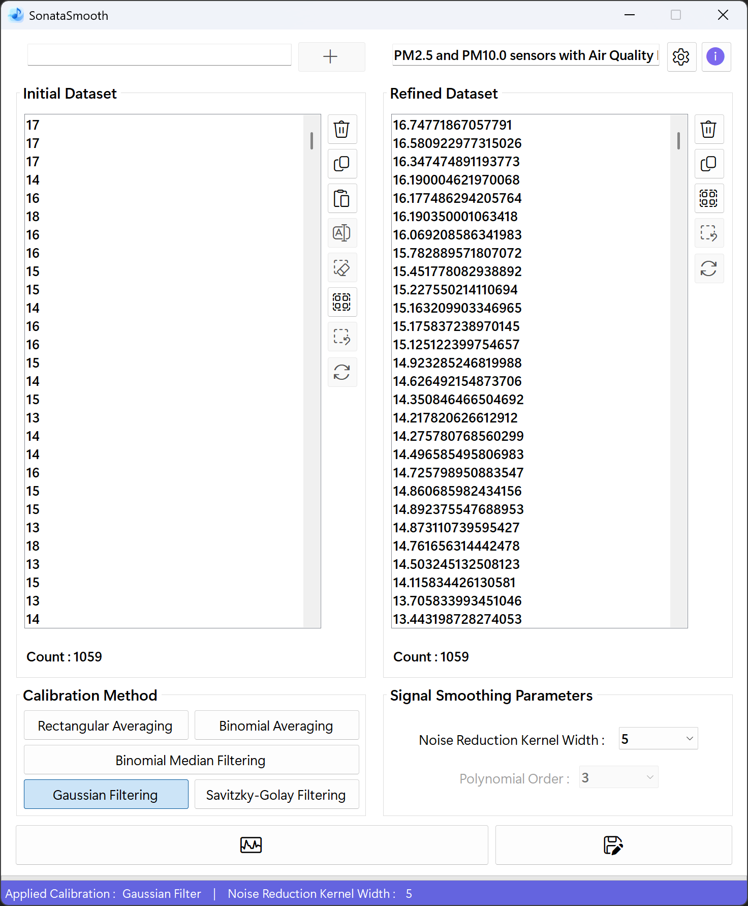
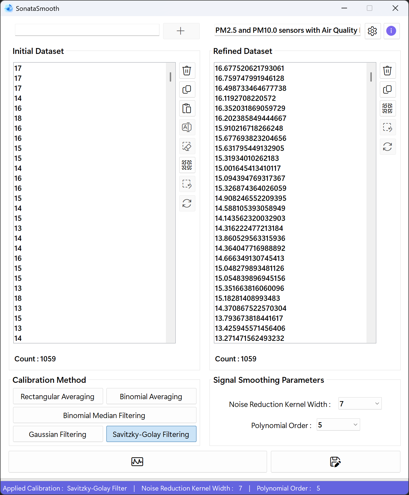
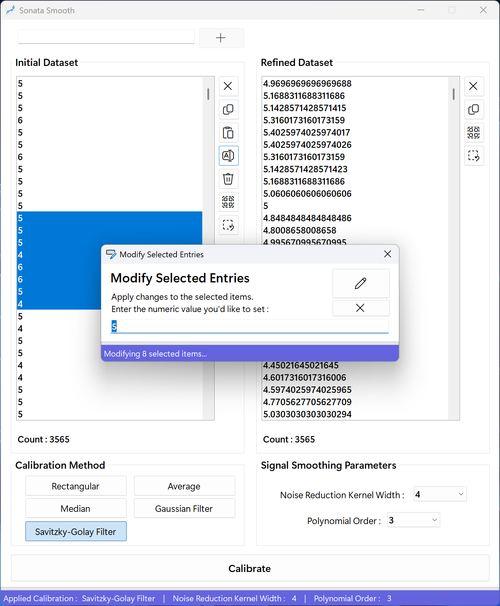
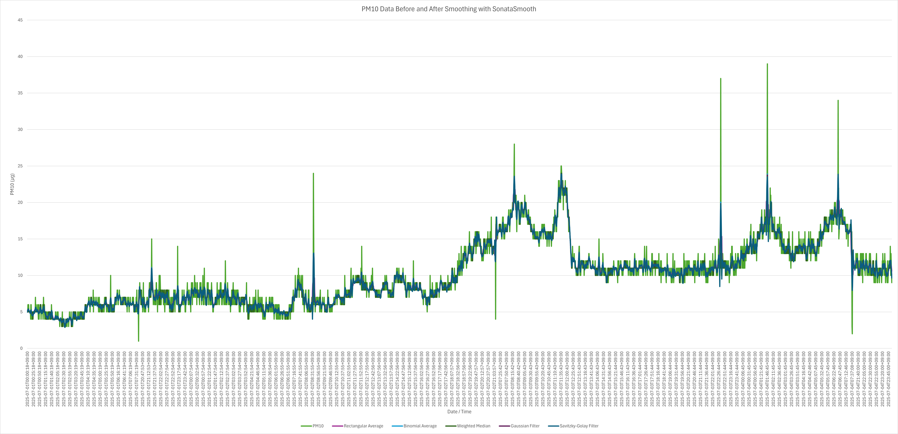

# SonataSmooth
## SonataSmooth : A Harmonious Approach to Data Smoothing
SonataSmooth is a compound of "sonata" and "smooth". A sonata is a musical form in which multiple movements blend into a single, harmonious whole-here serving as a metaphor for different smoothing algorithms working together in concert. "Smooth" highlights the sleek process of gently removing noise from data.

**Key components**
- **Sonata** : Evokes the idea of various movements (algorithms) uniting to produce a harmonious result
- **Smooth** : Emphasizes the smoothing function that gracefully eliminates data noise

True to its name, SonataSmooth embodies the philosophy of applying multiple techniques in harmony to process data as smoothly and clearly as a piece of music.

## Project Overview
**SonataSmooth** is a C# .NET Windows Forms application for efficient noise reduction and smoothing of numerical datasets. It supports multiple data input methods, including manual entry, clipboard paste, and drag-and-drop, with robust validation and parsing. Users can apply a variety of advanced filtering algorithms such as Rectangular Mean, Weighted Median, Binomial Average, Savitzky-Golay, and Gaussian filters, customizing parameters as needed. The application features a responsive, user-friendly interface with real-time progress feedback and batch editing capabilities. Designed for flexibility and performance.<br><br>

- **Rectangular (uniform) mean** :<br>
  computes a simple moving average over a fixed window of equal weights.<br><br>
  
- **Weighted median** :<br>
  selects the median value within the window after applying user-defined weights.<br><br>
   
- **Binomial (Gaussian-like) average** :<br>
  performs a moving average weighted by Pascal's triangle coefficients.<br><br>
  
- **Gaussian filter** :<br>
  convolves the data with a Gaussian kernel defined by a configurable standard deviation (sigma).<br><br>
  
- **Savitzky-Golay polynomial smoothing** :<br>
  fits a low-degree polynomial to each window via least-squares and replaces the center point with the fitted value.<br><br>

After processing is complete, the application writes the smoothed sequence to a separate output list and updates a progress bar in real-time to indicate the smoothing progress.<br><br>

<div align="center">
 


</div>

## What's New
<details>
<summary>Click to Expand</summary>
  
### v1.0.0.0
#### January 19, 2025
>[Initial release.](https://github.com/happybono/SonataSmooth/commit/1c9911992e2b0ec6b984828519ac78cbcb5a0a51)

### v1.0.1.0
#### January 19, 2025
> [Minor bugs fixed.](https://github.com/happybono/SonataSmooth/commit/a8a9cfd481aa7616bdbc14e27d71a9a6616d171b)<br><br>
> [Explained NoiseReductionKernelWidth and updated algorithm details in README.md.](https://github.com/happybono/SonataSmooth/commit/dbad0337d5c7534902db7f22f6dc23ff60a54a4e)

### v1.0.2.0
#### January 20, 2025
> [Bugs fixed.](https://github.com/happybono/SonataSmooth/commit/f7d0568b4ebf30ed7868885a9bff92960e757b13)

### v2.0.0.0
#### July 08, 2025
> Async & Parallel Processing<br><br>
> Batch UI Updates<br><br>
> Stepwise ProgressBar Feedback<br><br>
> True Symmetric Binomial-Weighted Median Filter<br><br>
> ListBox Selection & Deletion Optimization<br><br>
> Regex Performance Tuning<br><br>
> UI-Thread Responsiveness<br><br>
> Median Filter Bias (Fixed the original code's one-sided kernel bug to correctly include both left and right neighbors in the weighted median.)<br><br>
> Binomial Coefficient Indexing (Resolved mis-mapping by removing unnecessary sort / reverse and using symmetric indexing (binom[k + w]).<br><br>
> UI Flicker Prevention (Added BeginUpdate / EndUpdate around all ListBox modifications to eliminate redraw artifacts.)

### v3.0.0.0
#### July 17, 2025
> Overhauled the graphical user interface.<br><br>
> Fixed an issue where the application became unresponsive when calibrating large datasets (over 100,000 entries) with the Noise Reduction Kernel Width set to 7 or higher using the Weighted Median method.<br><br>
> Fixed an issue where the txtVariable textbox was not being cleared after its contents were added to the ListBox.<br><br>
> Reimplemented and optimized the weighted-median calibration algorithm's procedures, reducing processing time by more than a factor of 16.<br><br>
> Fixed a bug in the median-based calibration algorithm that prevented it from producing correct corrected values.<br><br>
> Minor bugs fixed.

### v3.0.0.1
#### July 18, 2025
> [Fixed a bug in AddItemsInBatches where existing ListBox items were being cleared. (New items are now appended without removing the originals and the scroll position updates correctly.)](https://github.com/happybono/SonataSmooth/commit/670762bf268f750dac77bf901c05366fdd78f814)

### v3.1.0.0
#### July 19, 2025
> Added Gaussian Filter mode that computes and applies a normalized 1D Gaussian kernel with mirror-mode boundary handling in parallel.<br><br>
> Improved tooltips and labels: clarified filter options and renamed "Clear Selection" to "Deselect All".<br><br>
> Fixed ListBox2 update to clear old items before adding new results, ensuring the correct order and smooth refresh.<br><br>
> Repositioned the listbox control buttons and added descriptive icons to each button.<br><br>
> Added required font files to the Resources / Fonts directory.

### v3.5.0.0
#### July 19, 2025
> Added functionality to edit selected items in the Initial Dataset/ (supports both single and multiple item edits)<br>
  (The number of selected items for editing is now displayed in the StatusBar.)<br><br>
> Updated copy behavior : even when items aren't fully selected, pressing the copy button or using the shortcut (Ctrl + C) will copy all entries.<br>
  (If only some items in the listbox are selected, only those selected items will be copied.)<br><br>
> Minor bugs fixed.

### v3.6.1.0
#### July 20, 2025
> Removed beep sound during various operations (such as adding or editing items) via keyboard input (e.g. Enter) in the listbox.<br><br>
> Improved processing and response speed when performing "Select All" followed by "Delete All".<br><br>
> Minor bugs fixed.

### v3.6.2.0
#### July 22, 2025
>	Improved bulk deletion performance in ListBox by optimizing the deletion logic for full selection scenarios.<br><br>
>	Added a fast path to instantly clear all items and reset the progress bar when all entries are selected.<br><br>
>	Ensured the progress bar and UI remain responsive during partial deletions of large datasets.

### v3.6.5.0
#### July 22, 2025
> Refactored `frmModify`'s `OK_Button_Click` to apply ListBox updates in configurable batches (default 1000) for improved bulk-edit performance.<br><br>
> Added `await Task.Yield()` between batches and InvokeRequired / Invoke checks to ensure smooth, thread-safe UI responsiveness during large updates.<br><br>
> Collapsed final reselection, EndUpdate, focus shift, progress-bar reset, and dialog close into a single synchronized UI call.

### v4.0.0.0
#### July 26, 2025
> Renamed all code elements, file names, and app metadata to reflect the 'SonataSmooth' project name.

### v4.1.2.0
#### August 1, 2025
> Implemented structured export initialization with improved parameter validation and error handling for both `.CSV` and `Excel (.xlsx)` modes.<br><br>
> Enhanced export logic to support large dataset segmentation and metadata embedding (title, kernel width, polynomial order, timestamp).<br><br>
> Integrated parallel filtering for all export modes using `Parallel.For`, significantly improving performance for large datasets.<br><br>
> Added automatic chart generation in Excel export to visualize filter results across multiple smoothing algorithms.<br><br>
> Improved UI responsiveness during export operations using `Task.Yield()` and progress reporting.<br><br>
> Added support for mirrored boundary handling in Gaussian and Savitzky-Golay filters during export.<br><br>
> Minor improvements to input parsing, filter selection logic, and export configuration synchronization.<br><br>
> Added `FrmAbout` displaying app version and copyright information.<br><br>
> Added `Buy Me a Coffee` feature via PayPal, integrated directly into the `FrmAbout` to support the developer.<br><br>
> Added execution instructions and initial setup requirements to the README.md, including `.NET Framework` version, platform dependencies, and environment configuration.<br><br>
> Minor bugs fixed.
</details>

## Required Components & Setup
### Prerequisites
- [.NET Framework 4.7.2](https://dotnet.microsoft.com/en-us/download/dotnet-framework/net472) or later ([.NET Framework 4.8](https://dotnet.microsoft.com/en-us/download/dotnet-framework/net48) recommended)
- Windows Operating System (Windows 10 or later recommended)
- [Visual Studio 2019 or newer](https://visualstudio.microsoft.com/) (for development)
- [Microsoft Office (Excel)](https://www.microsoft.com/en/microsoft-365/) - **Required for Microsoft Excel export functionality** via `Interop`

### Dependencies
- `System.Windows.Forms`
- `System.Threading.Tasks`
- `System.Linq`
- `Microsoft.Office.Interop.Excel` (for Excel export)

### Initial Setup
- Clone or download the repository.
- Open the solution file (`.sln`) in Visual Studio.
- Add necessary references if required.
- Build the project.
- Run the application.

## Execution Instructions
1. **Launch the Application** : Run the compiled `.exe` file or start the project from Visual Studio.
2. **Input Data** : Enter numeric values manually, paste from clipboard, or drag-and-drop text / HTML.
3. **Select Filter** : Choose a smoothing algorithm and configure kernel width and polynomial order.
4. **Calibrate** : Click the 'Calibrate' button to apply the selected filter.
5. **Review Results** : View the smoothed output in the second listbox.
6. **Export** : Click Export to save results as `.CSV` or `Excel (.xlsx)`, with optional chart visualization.

## Features & Algorithms
### 1. Initialization & Input Processing
#### How it works
When the user clicks **Calibrate**, the handler reads all numeric items from `listBox1`, parses the kernel size from a combo box, computes binomial weights, and sets up a progress reporter for the UI.

#### Principle
Prepare raw data and parameters before any heavy computation. Converting inputs to a simple `double[]`, determining the kernel "radius" **w**, and generating the binomial weight array ensures the parallel filtering step has everything it needs.

#### Code Implementation
```csharp
// Count input values
int n = listBox1.Items.Count;

// Copy and convert to double[]
var input = new double[n];
for (int i = 0; i < n; i++)
    input[i] = Convert.ToDouble(listBox1.Items[i], CultureInfo.InvariantCulture);

// Read kernel radius w (half-width)
int w = int.Parse(cbxKernelWidth.Text, CultureInfo.InvariantCulture);

// Generate binomial coefficients of length 2 × w + 1
int[] binom = CalcBinomialCoefficients(2 * w + 1);

// Set up a progress reporter for thread-safe UI updates
var progressReporter = new Progress<int>(pct =>
{
     progressBar1.Value = Math.Max(0, Math.Min(100, pct));
});
```

### 2. Parallel Kernel Filtering
#### How it works
All array indices [0 ... n - 1] are processed in parallel using PLINQ. For each position `i`, the code checks which radio button is selected (rectangular average, weighted median, or binomial average) and computes a filtered value.

When the user clicks "Calibrate", the application processes the input data using the selected filter. The computation is parallelized for performance using PLINQ.

#### Principle
Leverage all CPU cores to avoid blocking the UI. PLINQ's `.AsOrdered()` preserves the original order, and `.WithDegreeOfParallelism` matches the number of logical processors.

-	**Parallel Processing** : Uses all available CPU cores for fast computation.
-	**Kernel Filtering** : Applies the selected filter to each data point using a moving window.

#### Code Implementation
```csharp
results = await Task.Run(() =>
{
    // ... (filter coefficient preparation)
    return ParallelEnumerable
        .Range(0, n)
        .AsOrdered()
        .WithDegreeOfParallelism(Environment.ProcessorCount)
        .Select(i =>
        {
            // Filtering logic (see below)
        })
        .ToArray();
});
```

### 3. Rectangular (Uniform) Mean Filter
#### How it works
A simple sliding-window average over 2 × w + 1 points, ignoring out-of-bounds indices.

#### Principle
Every neighbor contributes equally (uniform weights).

-	**Uniform Weights** : Each value in the window contributes equally.
-	**Noise Reduction** : Smooths out short-term fluctuations.

#### Code Implementation
```csharp
if (useRect)
{
    double sum = 0;
    int cnt = 0;
    for (int k = -w; k <= w; k++)
    {
        int idx = i + k;
        if (idx >= 0 && idx < n)
        {
            sum += input[idx];
            cnt++;
        }
    }
    return cnt > 0 ? sum / cnt : 0;
}
```

### 4. Weighted Median Filter
#### How it works
Computes the median of values in the window, weighted by binomial coefficients, to reduce noise while preserving edges.

#### Principle
Median filtering is robust against outliers; binomial weights bias the median toward center points.

-	**Weighted Median** : Each value's influence is determined by its weight.
-	**Edge Preservation** : More robust to outliers than mean filters.

#### Code Implementation
```csharp
else if (useMed)
{
    return WeightedMedianAt(input, i, w, binom);
}

// WeightedMedianAt implementation :
private static double WeightedMedianAt(double[] data, int center, int w, int[] binom)
{
    var pairs = new List<(double Value, int Weight)>(2 * w + 1);
    for (int k = -w; k <= w; k++)
    {
        int idx = center + k;
        if (idx < 0 || idx >= data.Length) continue;
        pairs.Add((data[idx], binom[k + w]));
    }
    if (pairs.Count == 0)
        return 0;

    // Sort by value
    pairs.Sort((a, b) => a.Value.CompareTo(b.Value));

    long totalWeight = pairs.Sum(p => p.Weight);
    long half = totalWeight / 2;
    bool isEvenTotal = (totalWeight % 2 == 0);

    long accum = 0;
    for (int i = 0; i < pairs.Count; i++)
    {
        accum += pairs[i].Weight;
        if (accum > half)
        {
            return pairs[i].Value;
        }
        if (isEvenTotal && accum == half)
        {
            double nextVal = (i + 1 < pairs.Count)
                             ? pairs[i + 1].Value
                             : pairs[i].Value;
            return (pairs[i].Value + nextVal) / 2.0;
        }
    }
    return pairs[pairs.Count - 1].Value;
}
```

### 5. Binomial (Weighted) Average Filter
#### How it works
Averages values in the window, but each value is weighted according to binomial coefficients, giving more importance to central values.

#### Principle
A discrete approximation of Gaussian smoothing (binomial coefficients approximate a normal distribution).

-	**Binomial Weights** : Central values have higher influence.
-	**Smoother Output** : Reduces noise while maintaining signal shape.

#### Code Implementation
```csharp
else if (useAvg)
{
    double sum = 0;
    int cs = 0;
    for (int k = -w; k <= w; k++)
    {
        int idx = i + k;
        if (idx < 0 || idx >= n) continue;
        sum += input[idx] * binom[k + w];
        cs += binom[k + w];
    }
    return cs > 0 ? sum / cs : 0;
}
```

### 6. Savitzky-Golay Filter
#### How it works
A fixed-size window of length 2 × w + 1 slides over the 1D signal. At each position, out-of-bounds indices are "mirrored" back into the valid range, then each neighbor's value is multiplied by its precomputed Gaussian weight and summed to produce the smoothed output.

As a result, fits a low-degree polynomial to the data within the window and evaluates the central point, preserving features like peaks and edges.

#### Principle
Gaussian filtering performs a weighted moving average where weights follow the bell-shaped Gaussian curve. Central samples have higher influence, high-frequency noise is attenuated smoothly, and signal edges are preserved without abrupt distortion thanks to mirror boundary handling.

-	**Polynomial Fitting** : Least-squares fit within the window.
-	**Feature Preservation** : Maintains higher moments (e.g., slope, curvature).

#### Code Implementation
```csharp
else if (useSG)
{
    double sum = 0;
    for (int k = -w; k <= w; k++)
    {
        int mi = Mirror(i + k);
        sum += sgCoeffs[k + w] * input[mi];
    }
    return sum;
}

// Coefficient calculation :
private static double[] ComputeGolayCoefficients(int windowSize, int polyOrder)
{
    // ... (matrix construction and inversion)
}
```

### 7. Results Aggregation & UI Update
#### How it works
After filtering, the results array is handed to `AddItemsInBatches`, which inserts items into listBox2 in chunks. This avoids freezing the UI and allows incremental progress updates. Finally, controls are reset.

#### Principle
Batch updates and progress reporting keep the UI responsive. A finally block ensures the progressbar always resets on completion or error.

-	**Batch UI Update** : Efficiently updates the list box.
-	**Progress Feedback** : Shows operation progress to the user.
-	**Status Reporting** : Updates labels and enables/disables controls.

#### Code Implementation
```csharp
listBox2.BeginUpdate();
listBox2.Items.Clear();
await AddItemsInBatches(listBox2, results, progressReporter);
listBox2.EndUpdate();
lblCnt2.Text = $"Count : {listBox2.Items.Count}";

slblCalibratedType.Text = useRect ? "Rectangular Average"
                     : useMed ? "Weighted Median"
                     : useAvg ? "Binomial Average"
                     : useSG ? "Savitzky-Golay Filter"
                     : useGauss ? "Gaussian Filter"
                                : "Unknown";
slblKernelWidth.Text = w.ToString();
```

### 8. Pascal's Triangle (Binomial Coefficient Calculation)
#### How it works
Calculates binomial coefficients for a given window size, which are used as weights in the binomial average and weighted median filters.

#### Principle
-	**Pascal's Triangle** : Each coefficient is the sum of the two above it, or mathematically, C(n, k) = n! / (k! (n-k)!).
-	**Symmetry** : The coefficients are symmetric and always sum to a power of two.

#### Code Implementation
```csharp
private static int[] CalcBinomialCoefficients(int length)
{
    if (length < 1)
        throw new ArgumentException("length must be ≥ 1", nameof(length));

    var c = new int[length];
    c[0] = 1;
    for (int i = 1; i < length; i++)
        c[i] = c[i - 1] * (length - i) / i;
    return c;
}
```
-	This function generates the coefficients for the (length - 1) th row of Pascal's triangle, which are used as weights for the filters.

### 9. Savitzky-Golay Coefficients Computation
#### How it works
Constructs a Vandermonde matrix for the window, computes its normal equations, inverts the Gram matrix, and multiplies back by the transposed design matrix. The first row of the resulting "smoother matrix" yields the filter coefficients.

#### Principle
Savitzky-Golay filters derive from least‐squares polynomial fitting.
- Build matrix A where each row contains powers of the relative offset within the window.
- Form the normal equations (AᵀA), invert them, and multiply by Aᵀ to get the pseudoinverse.
- The convolution coefficients for smoothing (value at central point) are the first row of this pseudoinverse.

#### Code Implementation
```csharp
private static double[] ComputeSavitzkyGolayCoefficients(int windowSize, int polyOrder)
{
    int m    = polyOrder;
    int half = windowSize / 2;

    // Build Vandermonde matrix A (windowSize × (m + 1))
    double[,] A = new double[windowSize, m + 1];
    for (int i = -half; i <= half; i++)
        for (int j = 0; j <= m; j++)
            A[i + half, j] = Math.Pow(i, j);

    // Compute ATA = Aᵀ × A ((m + 1) × (m + 1))
    double[,] ATA = new double[m + 1, m + 1];
    for (int i = 0; i <= m; i++)
        for (int j = 0; j <= m; j++)
            for (int k = 0; k < windowSize; k++)
                ATA[i, j] += A[k, i] * A[k, j];

    // Invert ATA to get invATA
    double[,] invATA = InvertMatrix(ATA);

    // Compute AT = Aᵀ ((m + 1) × windowSize)
    double[,] AT = new double[m + 1, windowSize];
    for (int i = 0; i <= m; i++)
        for (int k = 0; k < windowSize; k++)
            AT[i, k] = A[k, i];

    // Compute filter coefficients h[k] = sum_j invATA[0, j] × AT[j, k]
    var h = new double[windowSize];
    for (int k = 0; k < windowSize; k++)
    {
        double sum = 0;
        for (int j = 0; j <= m; j++)
            sum += invATA[0, j] * AT[j, k];
        h[k] = sum;
    }

    return h;
}
```

### 10. CSV Export Functionality
#### How it works
When the user selects the CSV export option and clicks Export, the application:

- Reads the initial dataset and selected smoothing parameters.
- Applies all enabled filters (Rectangular, Binomial Average, Weighted Median, Gaussian, Savitzky-Golay).
- Splits the output into multiple CSV files if the dataset exceeds Excel's row limit.
- Writes metadata, parameters, and results to each file in a structured format.

#### Principle
- **Modular Export** : Each filter result is stored in a separate column.
- **Scalable Output** : Automatically splits large datasets across multiple files.
- **Metadata Embedding** : Includes kernel width, polynomial order, and timestamp for reproducibility.

#### Code Implementation
``` csharp
await sw.WriteLineAsync(txtExcelTitle.Text);
await sw.WriteLineAsync($"Part {part + 1} of {partCount}");
await sw.WriteLineAsync(string.Empty);
await sw.WriteLineAsync("Smoothing Parameters");
await sw.WriteLineAsync($"Kernel Width : {w}");
if (doSG)
    await sw.WriteLineAsync($"Polynomial Order : {polyOrder}");
await sw.WriteLineAsync($"Generated : {DateTime.Now.ToString("G", CultureInfo.CurrentCulture)}");
await sw.WriteLineAsync(string.Join(",", columns.Select(c => c.Header)));
for (int i = startRow; i < startRow + rowCount; i++)
{
    string line = string.Join(",", columns.Select(c => c.Data[i].ToString(CultureInfo.InvariantCulture)));
    await sw.WriteLineAsync(line);
}
```

### 11. Excel Export Functionality
#### How it works
When the user selects the Excel export option and clicks Export, the application:

- Applies all selected filters to the dataset.
- Writes each filter result to a separate column in an Excel worksheet.
- Adds a line chart visualizing the smoothed data.
- Embeds metadata and smoothing parameters at the top of the sheet.

#### Principle
- **Visual Feedback** : Automatically generates a chart comparing filter outputs.
- **Structured Layout** : Each filter result is placed in its own section.
- **Mirror Boundary Handling** : Ensures smooth filtering at data edges.

#### Code Implemenation
```csharp
ws.Cells[1, 1] = txtExcelTitle.Text;
ws.Cells[3, 1] = "Smoothing Parameters";
ws.Cells[4, 1] = $"Kernel Width : {w}";
ws.Cells[5, 1] = doSG ? $"Polynomial Order : {polyOrder}" : "Polynomial Order : N/A";

chart.ChartType = Excel.XlChartType.xlLine;
chart.ChartTitle.Text = "Refining Raw Signals with SonataSmooth";
chart.Axes(Excel.XlAxisType.xlValue).AxisTitle.Text = "Value";
chart.Axes(Excel.XlAxisType.xlCategory).AxisTitle.Text = "Sequence Number";
foreach (var (Title, StartCol, EndCol) in sections)
{
    Excel.Range unionRange = ...; // Union of all data ranges
    var series = chart.SeriesCollection().NewSeries();
    series.Name = Title;
    series.Values = unionRange;
}
```

### Implementation Details
#### Input Handling
- **Manual Entry** : Users can type numeric values into a textbox and press Enter or click the Add button to insert them into the dataset.
- **Clipboard Paste** : Pressing Ctrl + V or clicking the Paste button automatically parses and adds numeric values from the clipboard.
- **Drag & Drop** : Users can drag HTML or plain text into the list box; the application extracts and adds valid numeric entries.
- **Regex-Based Filtering** : Regular expressions are used to clean HTML tags and extract numbers, allowing flexible input formats.

#### Smoothing Workflow
When the user clicks **Calibrate** Button :
- All input values are converted to a double[] array.
- Kernel width and polynomial order are parsed from combo-boxes.
- The selected filter is applied using parallel processing (PLINQ).
- Results are added to the output list box in batches, with progress feedback.

#### Filter Algorithm Implementation
- **Rectangular Mean** : Computes the average of values within a fixed-size window.
- **Weighted Median** : Uses binomial coefficients as weights to compute a robust median.
- **Binomial Average** : Applies Pascal's triangle coefficients for a Gaussian-like smoothing.
- **Savitzky-Golay** : Constructs a Vandermonde matrix and performs least-squares polynomial fitting.
- **Gaussian Filter** : Generates a normalized Gaussian kernel and applies it with mirrored boundary handling.

#### Parallel Processing & UI Responsiveness
- All filtering operations are executed using `ParallelEnumerable` or `Parallel.For` to utilize all CPU cores.
- `Progress<T>` is used to update the UI progress bar in real-time.
- `BeginUpdate` / `EndUpdate` prevent flickering during listbox updates.
- `Task.Yield()` ensures the UI thread remains responsive during long operations.

#### Export Functionality
##### CSV & Excel Export
- Filtered results are saved in separate columns.
- Excel export includes automatic chart generation.
- Large datasets are split into multiple files if needed.

##### Export Settings
- Users can configure filters, kernel width, polynomial order, and automatically open the file after save options.

#### Keyboard Shortcuts
- **`Ctrl` + `C`** : Copy
- **`Ctrl` + `V`** : Paste
- **`Ctrl` + `A`** : Select All
- **`Ctrl` + `Delete`** : Delete All
- **`Delete`** : Delete selected items
- **`F2`** : Edit selected item(s)
- **`Esc`** : Deselect all
  
### Data Handling and Processing
-	Supports data input via manual entry, clipboard paste, and drag-and-drop.
-	Automatically parses and validates numeric data, removing non-numeric content (e.g., HTML tags).
-	Stores data as high-precision double values for accurate processing.
-	Implements multiple noise reduction algorithms: Rectangular Mean, Weighted Median, Binomial Average, Savitzky-Golay, and Gaussian filters.
-	Utilizes parallel processing (PLINQ) for efficient computation on large datasets.
-	Calculates binomial coefficients using Pascal's Triangle for weighted filters.
-	Displays processed results in a separate output list for further use.

### User Interface and Interaction
-	Intuitive Windows Forms interface with controls for data entry, editing, and deletion.
-	Provides options to select noise reduction algorithm and configure parameters (kernel width, polynomial order).
-	Supports keyboard shortcuts for common actions (delete, copy, paste, select all, etc.).
-	Real-time feedback through progress bars and status labels during operations.
-	Allows batch selection, editing, and clearing of data points.
-	Responsive UI with asynchronous updates to maintain smooth user experience.

### Customization and Configuration
-	Users can choose the filter type and adjust kernel width and polynomial order via combo boxes.
-	Input validation prevents invalid parameter configurations.
-	Modular code structure allows easy addition or extension of filters and configuration options.
-	UI is designed to accommodate future enhancements and custom settings.

### Conclusion
This application provides a robust and user-friendly environment for noise reduction analysis on numerical datasets. By combining flexible data input methods, a responsive and informative user interface, and efficient parallel processing of advanced filtering algorithms, it enables users to quickly and accurately process their data. The use of Pascal's Triangle for binomial weighting, along with support for a variety of filters, ensures both mathematical rigor and practical versatility. 

In particular :
- Uniform mean filtering provides a fast, simple way to suppress random fluctuations.  
- Weighted median filtering adds robustness against outliers by privileging central values.  
- Binomial averaging approximates a Gaussian blur, yielding gentle, natural-looking smoothing.  
- Savitzky-Golay smoothing fits a local low-order polynomial via least-squares, preserving peaks and higher-order signal characteristics while reducing noise.

Beyond the choice of filter, the implementation harnesses parallel processing (PLINQ) to maximize CPU utilization without blocking the UI, incremental batch updates with a progress reporter keep the application responsive even on large datasets. The adjustable kernel width and polynomial order give users fine-grained control over the degree and nature of smoothing.

Together, these design decisions ensure that noisy inputs are transformed into clearer, more consistent signals, empowering downstream analysis, visualization, or automated decision-making with higher confidence in the results.

## Demonstration
<br><br>
<br><br>
<br><br>


## License
This project is licensed under the MIT License. See the `LICENSE` file for details.

## Copyright 
Copyright ⓒ HappyBono 2025. All Rights Reserved.
