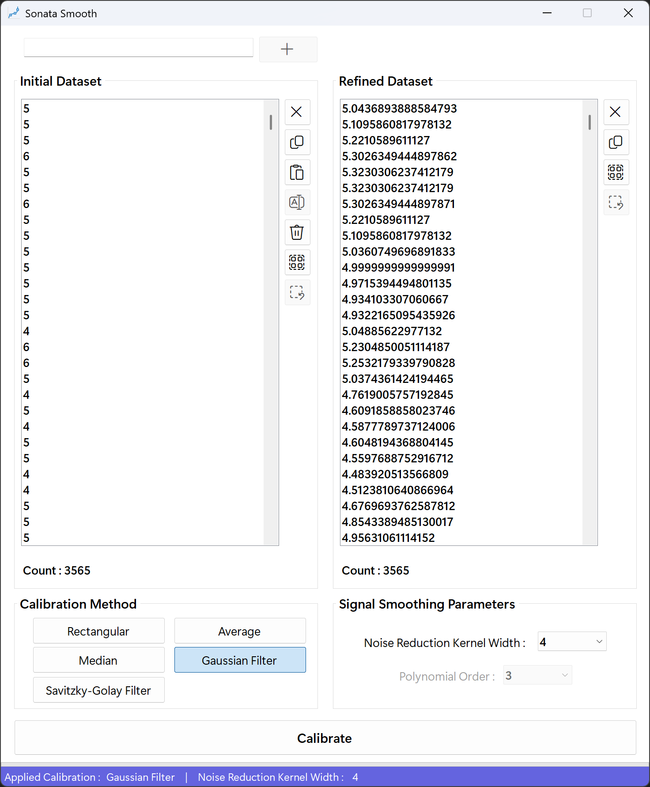

# SonataSmooth
This tool implements three different noise reduction algorithms for smoothing data : Rectangular Averaging, Binomial Median Filtering, and Binomial Averaging. It processes data from a list and displays the results in another list.

<div align="center">
 


</div>

## What's New
<details>
<summary>Click to Expand</summary>
  
### v1.0.0.0
#### January 19, 2025
>[Initial release.](https://github.com/happybono/SonataSmooth/commit/1c9911992e2b0ec6b984828519ac78cbcb5a0a51)<br>

### v1.0.1.0
#### January 19, 2025
> [Minor bugs fixed.](https://github.com/happybono/SonataSmooth/commit/a8a9cfd481aa7616bdbc14e27d71a9a6616d171b)<br><br>
> [Explained NoiseReductionKernelWidth and updated algorithm details in README.md.](https://github.com/happybono/SonataSmooth/commit/dbad0337d5c7534902db7f22f6dc23ff60a54a4e)

### v1.0.2.0
#### January 20, 2025
> [Bugs fixed.](https://github.com/happybono/SonataSmooth/commit/f7d0568b4ebf30ed7868885a9bff92960e757b13)<br>

### v2.0.0.0
#### July 08, 2025
> Async & Parallel Processing<br><br>
> Batch UI Updates<br><br>
> Stepwise ProgressBar Feedback<br><br>
> True Symmetric Binomial-Weighted Median Filter<br><br>
> ListBox Selection & Deletion Optimization<br><br>
> Regex Performance Tuning<br><br>
> UI-Thread Responsiveness<br><br>
> Median Filter Bias (Fixed the original code’s one-sided kernel bug to correctly include both left and right neighbors in the weighted median.)<br><br>
> Binomial Coefficient Indexing (Resolved mis-mapping by removing unnecessary sort / reverse and using symmetric indexing (binom[k + w]).<br><br>
> UI Flicker Prevention (Added BeginUpdate / EndUpdate around all ListBox modifications to eliminate redraw artifacts.)<br>
</details>

## Features & Algorithms
### 1. Initialization & Input Processing
#### How it works
When the user clicks **Calibrate**, the handler reads all numeric items from `listBox1`, parses the kernel size from a combo box, computes binomial weights, and sets up a progress reporter for the UI.

#### Principle
Prepare raw data and parameters before any heavy computation. Converting inputs to a simple `double[]`, determining the kernel “radius” **w**, and generating the binomial weight array ensure that the parallel filtering step has everything it needs.

#### Code Implementation
```csharp
// 1. Count input values
int n = listBox1.Items.Count;

// 2. Copy and convert to double[]
var input = new double[n];
for (int i = 0; i < n; i++)
    input[i] = Convert.ToDouble(listBox1.Items[i], CultureInfo.InvariantCulture);

// 3. Read kernel radius w (half-width)
int w = int.Parse(cbxKernelWidth.Text, CultureInfo.InvariantCulture);

// 4. Generate binomial coefficients of length 2*w+1
int[] binom = CalcBinomialCoefficients(2 * w + 1);

// 5. Set up a progress reporter for thread-safe UI updates
var progressReporter = new Progress<int>(pct =>
{
    progressBar2.Value = Math.Max(0, Math.Min(100, pct));
});
```

### 2. Parallel Kernel Filtering
#### How it works
All array indices [0..n-1] are processed in parallel using PLINQ. For each position i, the code checks which radio button is selected (rectangular average, weighted median, or binomial average) and computes a filtered value.

#### Principle
Leverage all CPU cores to avoid blocking the UI. PLINQ’s .AsOrdered() preserves the original order, and .WithDegreeOfParallelism matches the number of logical processors.

#### Code Implementation
```csharp
double[] results = await Task.Run(() =>
    ParallelEnumerable
        .Range(0, n)                                       // indices 0..n-1
        .AsOrdered()                                       // keep order
        .WithDegreeOfParallelism(Environment.ProcessorCount)
        .Select(i =>
        {
            double value = 0;

            // (Filter implementations go here...)

            return value;
        })
        .ToArray()
);
```

### 2.1 Rectangular (Uniform) Mean Filter
#### How it works
A simple sliding-window average over 2*w+1 points, ignoring out-of-bounds indices.

#### Principle
Every neighbor contributes equally (uniform weights).

#### Code Implementation
```csharp
if (rbtnRect.Checked)
{
    double sum = 0, cnt = 0;
    for (int k = -w; k <= w; k++)
    {
        int idx = i + k;
        if (idx >= 0 && idx < n)
        {
            sum += input[idx];
            cnt++;
        }
    }
    if (cnt > 0)
        value = sum / cnt;
}
```

### 2.2 Weighted Median Filter
Each neighbor’s value is replicated according to its binomial weight, then the combined list is sorted to pick the median.

#### Principle
Median filtering is robust against outliers; binomial weights bias the median toward center points.

#### Code Implementation
```csharp
else if (rbtnMed.Checked)
{
    var weighted = new List<double>();
    for (int k = -w; k <= w; k++)
    {
        int idx = i + k;
        if (idx < 0 || idx >= n) continue;
        double v = input[idx];
        int wt = binom[k + w];
        for (int z = 0; z < wt; z++)
            weighted.Add(v);
    }
    if (weighted.Count > 0)
    {
        weighted.Sort();
        int m = weighted.Count / 2;
        value = (weighted.Count % 2 == 0)
            ? (weighted[m - 1] + weighted[m]) / 2.0
            : weighted[m];
    }
}
```

### 2.3 Binomial (Weighted) Average Filter
#### How it works
Multiply each neighbor by its binomial weight, sum them up, then divide by the total weight sum.

#### Principle
A discrete approximation of Gaussian smoothing (binomial coefficients approximate a normal distribution).

#### Code Implementation
```csharp
else if (rbtnAvg.Checked)
{
    double sum = 0, ws = 0;
    for (int k = -w; k <= w; k++)
    {
        int idx = i + k;
        if (idx < 0 || idx >= n) continue;
        double v = input[idx];
        int c = binom[k + w];
        sum += v * c;
        ws  += c;
    }
    if (ws > 0)
        value = sum / ws;
}
```

### Results Aggregation & UI Update
#### How it works
After filtering, the results array is handed to AddItemsInBatches, which inserts items into listBox2 in chunks. This avoids freezing the UI and allows incremental progress updates. Finally, controls are reset.

#### Principle
Batch updates and progress reporting keep the UI responsive. A finally block ensures the progress bar always resets on completion or error.

#### Code Implementation
```csharp
// Add filtered values to listBox2 in batches (with progress)
await AddItemsInBatches(listBox2, results, progressReporter);

// Update count label and disable buttons
lblCnt2.Text = "Count : " + listBox2.Items.Count;
btnCopy2.Enabled = btnSelClear2.Enabled = false;
}
finally
{
    // Always clear the progress bar
    progressBar2.Value = 0;
}
```

### Binomial Coefficients Computation
#### How it works
Generates one row of Pascal’s triangle (length = 2*w+1) by iteratively applying the binomial recurrence.

#### Principle
Leverage the relation
C(n,k) = C(n,k-1) × (n - (k - 1)) / k
to compute coefficients in O(n) time without factorials.

#### Code Implementation
```csharp
private int[] CalcBinomialCoefficients(int length)
{
    if (length < 1)
        throw new ArgumentException("length must be ≥ 1", nameof(length));

    var c = new int[length];
    c[0] = 1;                          // C(n,0) = 1
    for (int i = 1; i < length; i++)
        c[i] = c[i - 1] * (length - i) / i;

    return c;
}
```

### Data Handling and Processing
- Implemented drag-and-drop functionality to allow users to easily add data to the application.
- Used regular expressions to extract and parse numerical data from various formats.

### User Interface and Interaction
- Designed and developed a user-friendly interface with interactive elements like buttons and list boxes.
- Provided real-time feedback to the user by updating counts and results dynamically.

### Customization and Configuration
- Allowed users to select the noise reduction method and kernel width through the interface.
- Enabled users to calibrate and fine-tune the noise reduction process based on their specific needs.

## Conclusion
By implementing these techniques, this project effectively reduces noise from the given data, providing clearer and more reliable results.

## Demonstation


## License
This project is licensed under the MIT License. See the `LICENSE` file for details.

## Copyright 
Copyright ⓒ HappyBono 2025. All Rights Reserved.
