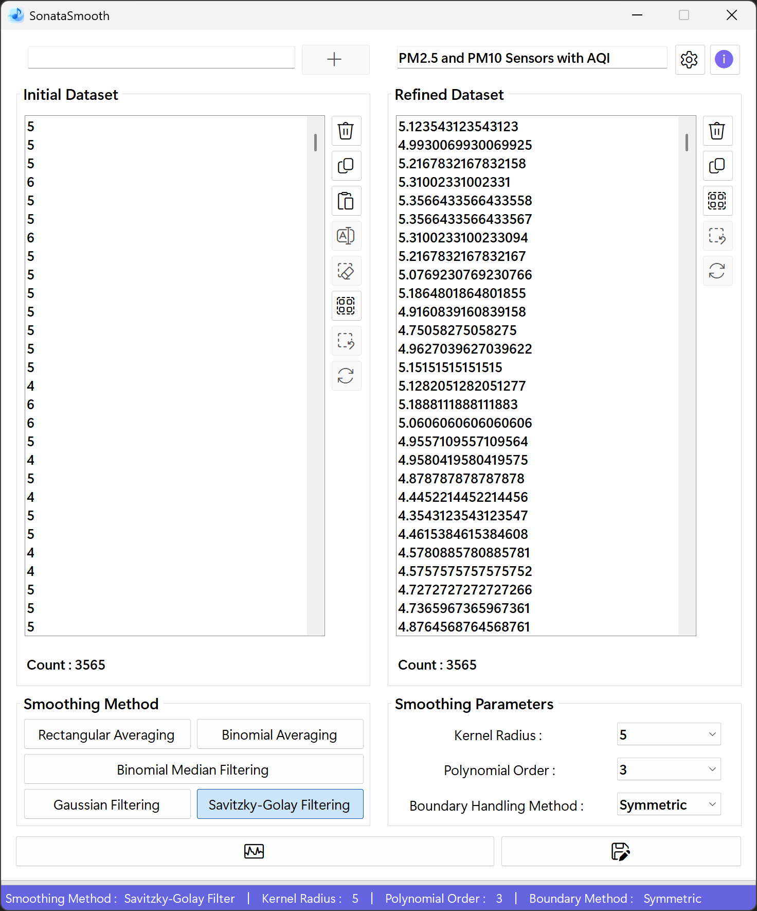
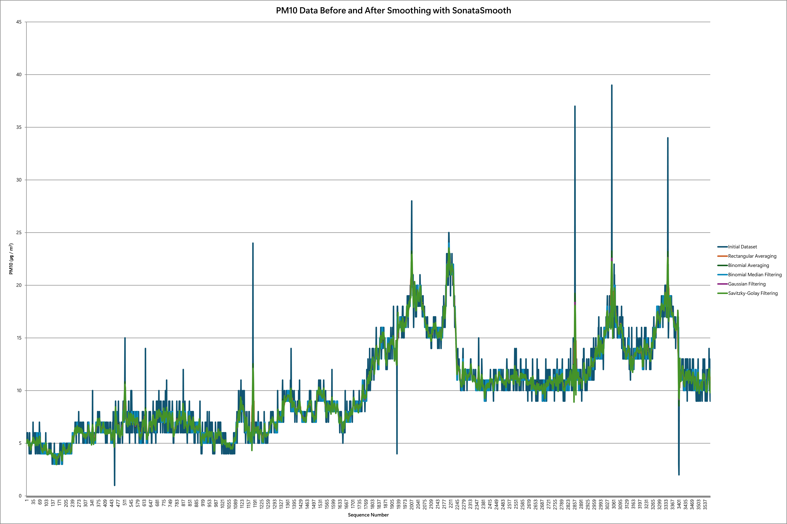

# SonataSmooth
## A Harmonious Approach to Data Smoothing
SonataSmooth is a compound of "sonata" and "smooth". A sonata is a musical form in which multiple movements blend into a single, harmonious whole-here serving as a metaphor for different smoothing algorithms working together in concert. "Smooth" highlights the sleek process of gently removing noise from data.

**Key components**
- **Sonata** : Evokes the idea of various movements (algorithms) uniting to produce a harmonious result
- **Smooth** : Emphasizes the smoothing function that gracefully eliminates data noise

True to its name, SonataSmooth embodies the philosophy of applying multiple techniques in harmony to process data as smoothly and clearly as a piece of music.

## Project Overview
**SonataSmooth** is a C# .NET Windows Forms application for efficient noise reduction and smoothing of numerical datasets. It supports multiple data input methods, including manual entry, clipboard paste, and drag-and-drop, with robust validation and parsing. Users can apply a variety of advanced filtering algorithms such as Rectangular Mean, Weighted Median, Binomial Average, Savitzky-Golay, and Gaussian filters, customizing parameters as needed. The application features a responsive, user-friendly interface with real-time progress feedback and batch editing capabilities. Designed for flexibility and performance.

## Use Cases
SonataSmooth is specialized for **1D data smoothing and noise reduction**.  
While limited to single‑dimension datasets, it can be applied across a wide range of domains where sequential numeric signals require pre-processing or refinement : 

- **Machine Learning / Deep Learning Pre-processing**  
  - Clean raw training data by removing spikes, jitter, or irregular noise  
  - Improve model accuracy by stabilizing time‑series inputs such as sensor readings or financial signals

- **IoT and Sensor Data Processing**  
  - Smooth noisy sensor outputs (temperature, humidity, vibration, etc.) for reliable monitoring  
  - Enhance anomaly detection by reducing false positives caused by random fluctuations

- **Financial and Economic Time Series**  
  - Filter out short‑term volatility in stock prices, currency exchange rates, or transaction volumes  
  - Prepare stable datasets for forecasting models

- **Scientific and Experimental Measurements**  
  - Refine laboratory or field data (e.g., spectroscopy, environmental monitoring) to highlight meaningful trends  
  - Reduce measurement noise without distorting underlying patterns

- **Signal Processing (1D only)**  
  - Smooth audio waveform amplitudes or other linear signals  
  - Preserve essential features while reducing background noise

- **Data Visualization & Reporting**  
  - Generate clearer charts and plots by removing distracting noise  
  - Provide stakeholders with more interpretable datasets
  
<br>

<div align="center">
 


</div>

## What's New
<details>
<summary>Click to Expand</summary>
  
### v1.0.0.0
#### January 19, 2025
>[Initial release.](https://github.com/happybono/SonataSmooth/commit/1c9911992e2b0ec6b984828519ac78cbcb5a0a51)

### v1.0.1.0
#### January 19, 2025
> [Minor bugs fixed.](https://github.com/happybono/SonataSmooth/commit/a8a9cfd481aa7616bdbc14e27d71a9a6616d171b)<br><br>
> [Explained NoiseReductionKernelWidth and updated algorithm details in README.md.](https://github.com/happybono/SonataSmooth/commit/dbad0337d5c7534902db7f22f6dc23ff60a54a4e)

### v1.0.2.0
#### January 20, 2025
> [Bugs fixed.](https://github.com/happybono/SonataSmooth/commit/f7d0568b4ebf30ed7868885a9bff92960e757b13)

### v2.0.0.0
#### July 08, 2025
> Async & Parallel Processing<br><br>
> Batch UI Updates<br><br>
> Stepwise ProgressBar Feedback<br><br>
> True Symmetric Binomial-Weighted Median Filter<br><br>
> ListBox Selection & Deletion Optimization<br><br>
> Regex Performance Tuning<br><br>
> UI-Thread Responsiveness<br><br>
> Median Filter Bias (Fixed the original code's one-sided kernel bug to correctly include both left and right neighbors in the weighted median.)<br><br>
> Binomial Coefficient Indexing (Resolved mis-mapping by removing unnecessary sort / reverse and using symmetric indexing (binom[k + w]).<br><br>
> UI Flicker Prevention (Added BeginUpdate / EndUpdate around all ListBox modifications to eliminate redraw artifacts.)

### v3.0.0.0
#### July 17, 2025
> Overhauled the graphical user interface.<br><br>
> Fixed an issue where the application became unresponsive when calibrating large datasets (over 100,000 entries) with the Noise Reduction Kernel Width set to 7 or higher using the Weighted Median method.<br><br>
> Fixed an issue where the txtVariable textbox was not being cleared after its contents were added to the ListBox.<br><br>
> Reimplemented and optimized the weighted-median calibration algorithm's procedures, reducing processing time by more than a factor of 16.<br><br>
> Fixed a bug in the median-based calibration algorithm that prevented it from producing correct corrected values.<br><br>
> Minor bugs fixed.

### v3.0.0.1
#### July 18, 2025
> [Fixed a bug in AddItemsInBatches where existing ListBox items were being cleared. (New items are now appended without removing the originals and the scroll position updates correctly.)](https://github.com/happybono/SonataSmooth/commit/670762bf268f750dac77bf901c05366fdd78f814)

### v3.1.0.0
#### July 19, 2025
> Added Gaussian Filter mode that computes and applies a normalized 1D Gaussian kernel with mirror-mode boundary handling in parallel.<br><br>
> Improved tooltips and labels : clarified filter options and renamed "Clear Selection" to "Deselect All".<br><br>
> Fixed ListBox2 update to clear old items before adding new results, ensuring the correct order and smooth refresh.<br><br>
> Repositioned the listbox control buttons and added descriptive icons to each button.<br><br>
> Added required font files to the Resources / Fonts directory.

### v3.5.0.0
#### July 19, 2025
> Added functionality to edit selected items in the Initial Dataset. (supports both single and multiple item edits)<br>
  (The number of selected items for editing is now displayed in the StatusBar.)<br><br>
> Updated copy behavior : even when items aren't fully selected, pressing the copy button or using the shortcut (Ctrl + C) will copy all entries.<br>
  (If only some items in the listbox are selected, only those selected items will be copied.)<br><br>
> Minor bugs fixed.

### v3.6.1.0
#### July 20, 2025
> Removed beep sound during various operations (such as adding or editing items) via keyboard input (e.g. Enter) in the listbox.<br><br>
> Improved processing and response speed when performing "Select All" followed by "Delete All".<br><br>
> Minor bugs fixed.

### v3.6.2.0
#### July 22, 2025
> Improved bulk deletion performance in ListBox by optimizing the deletion logic for full selection scenarios.<br><br>
> Added a fast path to instantly clear all items and reset the progress bar when all entries are selected.<br><br>
> Ensured the progress bar and UI remain responsive during partial deletions of large datasets.

### v3.6.5.0
#### July 22, 2025
> Refactored `frmModify`'s `OK_Button_Click` to apply ListBox updates in configurable batches (default 1000) for improved bulk-edit performance.<br><br>
> Added `await Task.Yield()` between batches and InvokeRequired / Invoke checks to ensure smooth, thread-safe UI responsiveness during large updates.<br><br>
> Collapsed final reselection, EndUpdate, focus shift, progress-bar reset, and dialog close into a single synchronized UI call.

### v4.0.0.0
#### July 26, 2025
> Renamed all code elements, file names, and app metadata to reflect the 'SonataSmooth' project name.

### v4.1.2.0
#### August 01, 2025
> Implemented structured export initialization with improved parameter validation and error handling for both `.CSV` and `Excel (.xlsx)` modes.<br><br>
> Enhanced export logic to support large dataset segmentation and metadata embedding (title, kernel width, polynomial order, timestamp).<br><br>
> Integrated parallel filtering for all export modes using `Parallel.For`, significantly improving performance for large datasets.<br><br>
> Added automatic chart generation in Excel export to visualize filter results across multiple smoothing algorithms.<br><br>
> Improved UI responsiveness during export operations using `Task.Yield()` and progress reporting.<br><br>
> Added support for mirrored boundary handling in Gaussian and Savitzky-Golay filters during export.<br><br>
> Minor improvements to input parsing, filter selection logic, and export configuration synchronization.<br><br>
> Added `FrmAbout` displaying app version and copyright information.<br><br>
> Added `Buy Me a Coffee` feature via PayPal, integrated directly into the `FrmAbout` to support the developer.<br><br>
> Added execution instructions and initial setup requirements to the README.md, including `.NET Framework` version, platform dependencies, and environment configuration.<br><br>
> Minor bugs fixed.

### v4.2.3.0
#### August 02, 2025
> All UI data is accessed only on the UI thread, heavy calculations and file writing are parallelized in the background, progress is safely reported to the UI, large exports are split automatically.<br><br>
> UI remains responsive, large data is processed quickly and safely, and all UI / COM access is thread-safe.<br><br>
> Synchronize selection and scroll position between the two listboxes. (**These buttons are only enabled when the Initial Dataset and Refined Dataset listboxes have the same number of items.**)

### v4.2.3.2
#### August 03, 2025
> Adjusted TabIndex to ensure controls are selected in the correct order.<br><br>
> Minor bugs fixed.

### v4.2.5.7
#### August 10, 2025
> A program selection screen appears when opening a saved file with no associated application.<br><br>
> Include an ARM64-native variant of the executable.

### v4.2.7.0
#### August 15, 2025
> Renamed "kernel width" to "kernel radius" throughout the UI and code, while still computing the actual width internally as `2 × {radius} + 1.`.<br><br>
> Refactored variable names and code references to use "Kernel Radius (r)" instead of "Kernel Width (w)".<br><br>
> Minor bugs fixed.

### v4.2.7.1
#### August 19, 2025
> Minor bugs fixed.

### v4.3.0.0
#### August 20, 2025
> Implemented explicit COM object cleanup (`Application`, `Workbook`, `Worksheet`) with `Marshal.ReleaseComObject` and forced GC to prevent memory leaks and lingering background Excel processes.<br><br>
> Minor bugs fixed.

### v4.3.1.0
#### August 21, 2025
> Unified "filter calculation" logic into a shared method used by both `ExportCsvAsync` and `ExportExcelAsync`.<br><br>
> Minor bugs fixed.

### v4.6.0.0
#### August 22, 2025
> Refactored UI controls and variable names across the application, applying clear naming conventions (e.g., `lblVersion` → `lblAppVersion`, `listBox1` → `lbInitData`, `ProgressBar1` → `pbModify`).<br><br> 
> Added mouse Hover / Leave event handlers to multiple forms (e.g., `FrmExportSettings`, `FrmModify`) to provide real-time tooltip descriptions for each option and button.<br><br>
> Improved DPI scaling support : dynamically adjusted ProgressBar and StatusLabel sizes in `FrmModify` using `Graphics.DpiX / Graphics.DpiY`.<br><br>
> Enhanced status display during multi-item modifications : status bar messages now update dynamically based on the number of selected items.<br><br>
> Optimized data modification logic : sorted selected item indices and improved UI update performance.<br><br>
> Fixed a bug where `PolyOrder` was incorrectly initialized with the `kernelRadius` value.<br><br>
> Cleaned up control metadata and resource key names in `.resx` files.<br><br>
> Added musical-themed metadata to Excel exports : document properties now include dynamic titles, categories, and keywords inspired by classical composition (e.g., "SonataSmooth Overture", "Concerto of smoothing movements").<br><br>
> Embedded randomized musical phrases in the Comments field (e.g., "Adagio in Data Minor", "Fugue of Filters") to enrich exported files with playful orchestral flair.<br><br>
> Introduced hidden Easter egg : when exactly four smoothing methods are applied, a special comment is added - "Hidden Movement Unlocked : The Quartet of Filters has performed in perfect harmony."<br><br>
> Expanded error handling for Excel interop and file export issues, including user-friendly messages and fallback guidance (e.g., Office download prompt on COMException).<br><br>
> Minor bug fixes and code cleanup.  

### v4.6.1.0
#### August 23, 2025
> Minor bugs fixed.

### v4.6.2.5
#### August 23, 2025
> Minor bugs fixed.

### v4.6.3.8
#### August 24, 2025
> Introduced an `isRefinedLoading` flag and bulk-disable logic in `btnCalibrate_Click` to lock out all data and export controls during asynchronous loading of the refined dataset, preventing flicker and invalid user actions<br><br>
> Defined `RecommendedMinRadius` / `RecommendedMaxRadius` and `RecommendedMinPolyOrder` / `RecommendedMaxPolyOrder` constants and displayed them in dynamic status-bar tooltips when hovering over radius and polynomial-order selectors.<br><br>
> Added a `ShowStatusMessage(string)` helper to simplify and unify status-bar updates from anywhere in the form.<br><br>
> Centralized all filter computations in a new `ApplySmoothing` method that produces rectangular, binomial, median, Gaussian, and Savitzky-Golay outputs in one pass, then refactored CSV export to reuse it and eliminate duplicate loops.<br><br>
> Minor bugs fixed.

### v4.6.3.9
#### August 26, 2025
> Refreshed the graphical user interface with subtle enhancements.<br><br>
> Improved status label messaging logic : Added dynamic singular / plural phrasing and corrected punctuation for clearer user feedback.<br><br>
> Minor bugs fixed.

### v4.7.0.0
#### August 27, 2025
> Enhanced `InvertMatrix` by adding partial pivoting and a dynamic, scale-based tolerance to safeguard Gauss-Jordan inversion against division-by-zero and severe rounding errors.<br><br>
> Refined singular-matrix handling to detect sub-threshold pivots (using `maxRow × 1e - 12` vs. `Double.Epsilon`) and emit a controlled zero matrix or exception instead of propagating NaN / ∞.<br><br>
> Retained mirror-padding in Savitzky-Golay filtering, ensuring exact central coefficients and smooth, distortion-free continuity at both ends.<br><br>
> Refactored inversion routine for clarity : consolidated row-swap, pivot selection, scale calculation, and error handling into a single coherent block, removing hard-coded thresholds.<br><br>
> Performed minor code cleanups to improve readability and enforce consistent formatting.<br><br>
> Minor bugs fixed.

### v4.7.1.1
#### August 28, 2025
>	Implemented dataset title validation : including checks for length, invalid characters, and reserved names. Alongside dynamic placeholder behavior and conditional enabling of the export button.<br><br>
>	Added KeyDown handler (`FrmExportSettings_KeyDown`) to close dialog on ESC; `KeyPreview` set to `true` in Designer.<br><br>
>	Minor bugs fixed.

### v4.7.1.5
#### August 30, 2025
> Implemented unified parameter sourcing for export (initial design used status labels); current implementation reads Kernel Radius / Polynomial Order directly from the ComboBoxes (`cbxKernelRadius`, `cbxPolyOrder`) at export time to avoid stale UI state. Future refactor may restore label sourcing.<br><br>
> Minor bugs fixed.

### v4.8.0.0
#### August 31, 2025
> Added boundary handling options for Savitzky-Golay filter : `Symmetric` (Mirror), `Replicate` (Nearest), `Zero-Pad`, `BoundaryMode` enum and `GetIndex` method updated to support all three modes.<br><br>
> ComboBox (`cbxBoundaryMethod`) selection now determines edge handling for Savitzky-Golay smoothing.<br><br>
> `ApplySmoothing` and calibration logic refactored to use `GetIndex` and `boundaryMode` for Savitzky-Golay filter, ensuring correct edge behavior per user selection.<br><br>
> Export routines (CSV / Excel) now display and save the selected boundary method for the Savitzky-Golay filter.<br><br>
> UI status label and ComboBox text synchronized for boundary method display.<br><br>
> Other smoothing methods remain unchanged; the boundary option applies only to the Savitzky-Golay filter.<br><br>
> Minor bug fixes and code cleanup.

### v4.8.1.0
#### September 02, 2025
> Boundary Handling Options can now be configured and applied to all Smoothing (Calibration) Methods.<br><br>
> Minor bug fixes and user interface enhancements.

### v4.8.2.0
#### September 07, 2025
> With the transition to ARM64 native based on `.NET Framework 4.8.1`, PCs running in this environment now deliver improved performance.

### v5.0.0.0
#### November 07, 2025
> Added support for `Adaptive` mode in Boundary Handling Method configuration.<br><br>
> `Derivative order` control is now available exclusively for the `Savitzky-Golay` smoothing method.<br><br>
> Minor bug fixes, performance improvements, and user interface enhancements.

### v5.0.1.0
#### November 09, 2025
> Revised and updated `README.md` documentation.<br><br>
> Minor bugs fixed.

### v5.0.2.0
#### November 10, 2025
> Minor bugs fixed.
</details>

### v5.1.3.0
#### November 30, 2025
> Added `Alpha Blend` to runtime smoothing and export pipelines (applies to Binomial Averaging, Binomial Median, Gaussian; excluded for Rectangular / Savitzky‑Golay). Alpha clamped to 0.00 - 1.00 and synchronized with Export Settings.<br><br>
> CSV / Excel exports updated : conditional "Alpha Blend" metadata, unified single‑pass filtering, large dataset segmentation, and chart generation preserved.<br><br>
> Excel export UX improved : progress bar switches to marquee while the Save dialog is open; SaveAs simulates progress to 95% and completes at 100%; opens an unsaved workbook for manual save when no path is chosen.<br><br>
> Ensured consistent Excel SaveFileDialog filter string : "Excel Workbook (*.xlsx)|*.xlsx".<br><br>
> Minor performance and UI responsiveness improvements.<br><br>
> Minor bugs fixed.

## Required Components & Setup
### Prerequisites
- [.NET Framework 4.8](https://dotnet.microsoft.com/en-us/download/dotnet-framework/net48) or [.NET Framework 4.8.1](https://dotnet.microsoft.com/en-us/download/dotnet-framework/net481) (target build uses 4.8.1; ARM64-compatible; earlier versions are not tested)
- Windows Operating System (Windows 10 or later recommended)
- [Visual Studio 2026](https://visualstudio.microsoft.com/) (for development)
- Development environment is recommended to use **Visual Studio 2022 or newer**
- [Microsoft Office (Excel)](https://www.microsoft.com/en/microsoft-365/) - **Required for Microsoft Excel export functionality** via `Interop`

### Dependencies
- `System.Windows.Forms`
- `System.Threading.Tasks`
- `System.Linq`
- `Microsoft.Office.Interop.Excel` (for Excel export)

### Initial Setup
- Clone or download the repository.
- Open the solution file (`.sln`) in Visual Studio.
- Add necessary references if required.
- Build the project.
- Run the application.

#### Dataset Title Validation
The export title (Excel sheet name & metadata) is validated : 
- Max length : 31 characters
- Disallowed characters : `: \ / ? * [ ]` and all OS-invalid filename characters
- Reserved DOS names rejected (CON, PRN, AUX, NUL, COM1 - COM9, LPT1 - LPT9)

Invalid input reverts to the placeholder and shows a warning dialog.
The placeholder text "Click here to enter a title for your dataset." is restored whenever validation fails or the field is cleared.
On invalid or cleared input the placeholder is restored with centered alignment and gray foreground; valid titles display left-aligned with normal system text color.

Export Enablement Rules : 
- Export button is enabled when the Initial Dataset contains at least one entry AND the title field is non‑placeholder. Full title validation runs when the field loses focus; invalid titles are reverted to the placeholder and export becomes disabled.
- Clearing all Initial Dataset items or reverting the title to the placeholder immediately disables export.

## Execution Instructions
1. **Launch the Application** : Run the compiled `.exe` file or start the project from Visual Studio.
2. **Input Data** : Enter numeric values manually, paste from clipboard, or drag-and-drop text / HTML.
3. **Select Filter** : Choose exactly one smoothing method for calibration using the radio buttons (`rbtnRect`, `rbtnAvg`, `rbtnMed`, `rbtnGauss`, `rbtnSG`). In the Export Settings dialog you can enable multiple methods (`chbRect`, `chbAvg`, `chbMed`, `chbGauss`, `chbSG`) for batch export.
4. **Calibrate** : Click the 'Calibrate' button (`btnCalibrate`) to apply the selected filter(s).
5. **Review Results** : View the smoothed output in the "Refined Dataset" listbox (`lbRefinedData`).
6. **Edit Data** : Use the "Modify Selected Entries" dialog (`btnInitEdit`) to batch-edit selected items in the initial dataset.
7. **Export** : Click Export (`btnExport`) to save results as `.CSV` or `Excel (.xlsx)`, with optional chart visualization. Configure export options in the "Export Configuration" dialog (`btnExportSettings`).

> Note : You do not need to run "Calibrate" before exporting. Both CSV and Excel exports recompute the selected filters directly from the Initial Dataset.

## UI Controls & Naming Conventions
- **Initial Dataset ListBox** : `lbInitData`
- **Refined Dataset ListBox** : `lbRefinedData`
- **Kernel Radius ComboBox** : `cbxKernelRadius`
- **Polynomial Order ComboBox** : `cbxPolyOrder`
- **Derivative Order ComboBox** : `cbxDerivOrder`
- **Boundary Method ComboBox** : `cbxBoundaryMethod`
- **Calibration Method CheckBoxes** : `chbRect`, `chbAvg`, `chbMed`, `chbGauss`, `chbSG`
- **Edit Button** : `btnInitEdit`
- **Initial ↔ Refined Selection Sync Buttons** : `btnInitSelectSync`, `btnRefSelectSync`
- **Dataset Title TextBox** : `txtDatasetTitle`
- **Export Buttons** : `btnExport`, `btnExportSettings`
- **ProgressBar** : `pbMain`, `pbModify`
- **Count Labels** : `lblInitCnt`, `lblRefCnt`
- **StatusStrip & Labels** : `statStripMain`, `slblCalibratedType`, `slblKernelRadius`, `tlblPolyOrder`, `slblPolyOrder`, `tlblDerivativeOrder`, `slblDerivativeOrder`, `tlblBoundaryMethod`, `slblBoundaryMethod`, `slblDesc`, `tlblSeparator1`, `tlblSeparator2`, `tlblSeparator3`, `tlblSeparator4`
- **Other Controls** : All controls use clear, descriptive names matching their function in the codebase.

Visibility : `tlblPolyOrder`, `slblPolyOrder`, `tlblDerivativeOrder`, `slblDerivativeOrder` are only shown when Savitzky-Golay is active.

## Noise Filter Comparison
This guide explains how different noise filters work with different types of signals. It also simply introduces Pascal's Triangle.

### Filter Comparison Table
| Signal Pattern                                          | Rectangular Averaging | Binomial Averaging | Binomial Median Filtering | Gaussian Filtering | Savitzky‑Golay Filtering |
|:--------------------------------------------------------|:---------------------:|:------------------:|:------------------------:|:------------------:|:------------------------:|
| Occasional random noise                                 | OK                    | Good               | **Very Good**                 | Good               | **Very Good**                |
| Frequent random noise                                   | Poor                  | Fair               | **Excellent**                 | Fair               | Fair                     |
| Large slow trend changes                                | Poor                  | Good               | Good                      | Good               | **Excellent**                |
| Sudden spikes (sharp single jumps)                      | Poor                  | Fair               | **Excellent**                 | Fair               | Fair                     |
| Regular large-amplitude waves                           | Poor                  | Fair               | Fair                      | Fair               | **Excellent**                |
| Step changes (sudden level shifts)                      | Poor                  | Fair               | **Good**                      | Fair               | Fair                     |
| Mixed-frequency oscillations                            | Poor                  | Good               | Fair                      | Good               | **Excellent**                |
| Periodic high-frequency noise (steady tone)             | **Excellent**             | Fair               | Fair                      | Good               | Good                     |
| Slowly drifting baseline with tiny jitter               | Good                  | Good               | **Very Good**                 | Good               | **Very Good**                |
| Natural signal flow with smooth curves & gentle noise   | Fair                  | Good               | Good                      | **Excellent**      | Very Good                |
| Stable periodic signal with moderate high-frequency noise | Fair           | **Excellent**      | Fair                      | Good               | Good                     |

### Verdict
- **Rectangular Averaging** is simple, but surprisingly effective for steady high-frequency noise.
- **Binomial Averaging** is a good middle ground : especially for periodic signals with moderate noise.
- **Binomial Median Filtering** is a powerhouse for handling spikes, frequent noise, and step changes : great for robustness.
- **Gaussian Filtering** offers smooth results but may not handle abrupt changes well.
- **Savitzky‑Golay Filtering** excels in preserving wave shapes, trends, and mixed frequencies : ideal for scientific data or smooth curves.

## What Is Pascal's Triangle?
Pascal's Triangle is a triangle of numbers built like this : 

- Start with `1` at the top.
- Each new row adds two numbers from the row above to get a new one.
- The edges of each row are always `1`.

### Example : 
Row 1 :　　　　　　1<br>
Row 2 :　　　　　1　 1<br>
Row 3 :　　　　1　 2　 1<br>
Row 4 :　　　1　 3　 3　 1<br>
Row 5 :　　1　 4 　6　 4　 1<br>

Filters like **Binomial Averaging** use rows from Pascal's Triangle as weights. Bigger numbers in the middle give more importance to center values when filtering.

## Filter Descriptions
- **Rectangular Averaging (Moving Average)**<br>
  Adds up a group of points and divides by how many there are. It's simple and fast. Best for removing constant buzz or small jitters.

- **Binomial Averaging**<br>
  Like a moving average, but with weights from Pascal's Triangle. The center gets more focus. Keeps the shape of your signal better while smoothing small noise.

- **Binomial Median Filtering**<br>
  Sorts nearby values and picks the middle one, using extra weight for the center. Removes sharp spikes while keeping the signal shape.
  
- **Gaussian Filtering**<br>
  Uses a bell-shaped curve for weights. Very smooth, but may let sharp jumps stay.

- **Savitzky‑Golay Filtering**<br>
  Fits tiny curves to chunks of data. Keeps wave shapes and slow changes almost perfectly, but not as strong for sudden spikes.

### Example of Using Pascal's Triangle in Filtering
Let's say we use the 5th row : `1 4 6 4 1`

1. **Total** = `1` + `4` + `6` + `4` + `1` = `16`
2. **Weights** = [`1 / 16`, `4 / 16`, `6 / 16`, `4 / 16`, `1 / 16`]
   → [`0.0625` , `0.25` , `0.375` , `0.25` , `0.0625`]
3. **Data Window** = [`2`, `5`, `1`, `3`, `4`]

Apply the weights :  
`2 × 0.0625 + 5 × 0.25 + 1 × 0.375 + 3 × 0.25 + 4 × 0.0625 = 2.75`

That final value (`2.75`) becomes your new filtered point.

## Boundary Handling Method
Edge handling determines which values are used when the kernel window extends beyond the first or last element.

### Boundary Handling Mode (ComboBox : `cbxBoundaryMethod`)
| Mode        | Also Known As | Formula / Mapping (index transform) | Behavior | Pros | Cons |
|-------------|---------------|-------------------------------------|----------|------|------|
| Symmetric   | Mirror        | i < 0 → -i - 1<br>i ≥ n → 2n - i - 1 | Reflects across boundary | Smooth continuity; preserves slope | Can amplify extreme edge values if outlier |
| Replicate   | Nearest       | i < 0 → 0<br>i ≥ n → n - 1          | Clamps to nearest endpoint | Stable on plateaus; simple | Flattens curvature; may bias means |
| Adaptive    | Edge-aware    | Window dynamically trimmed or shifted; index sampling in SG may be asymmetric | Uses only in-range samples (non-SG) or shifts asymmetric SG window to keep length | Removes artificial padding; minimizes bias; accurate near edges | Varies window support; derivative order may be limited at extreme edges |
| Zero Padding| Constant 0    | i < 0 or i ≥ n → 0                  | Outside treated as zero | Highlights decay / boundary contrast | Artificial dips; energy loss |

Display names in exports : 
- Symmetric → "Symmetric (Mirror)"
- Replicate → "Replicate (Nearest)"
- ZeroPad → "Zero Padding"
- Adaptive → "Adaptive"

### BoundaryMode Enum & Accessor
```csharp
public enum BoundaryMode { Symmetric, Replicate, Adaptive, ZeroPad }

private double GetValueWithBoundary(double[] data, int idx, BoundaryMode mode)
{
    int n = data.Length;

    switch (mode)
    {
        case BoundaryMode.Symmetric : 
            if (idx < 0)
                idx = -idx - 1;
            else if (idx >= n)
                idx = 2 * n - idx - 1;

            if (idx < 0)
                return 0;

            return data[idx];

        case BoundaryMode.Replicate : 
            if (idx < 0)
                idx = 0;
            else if (idx >= n)
                idx = n - 1;

            return data[idx];

        case BoundaryMode.ZeroPad : 
            if (idx < 0 || idx >= n)
                return 0.0;

            return data[idx];

        case BoundaryMode.Adaptive : 
            // Single-sample access : treat like symmetric (window logic handled separately)
            if (idx < 0)
                idx = -idx - 1;
            else if (idx >= n)
                idx = 2 * n - idx - 1;

            if (idx < 0)
                return 0;

            return data[idx];

        default : 
            if (idx < 0)
                idx = -idx - 1;
            else if (idx >= n)
                idx = 2 * n - idx - 1;

            if (idx < 0)
                return 0;

            return data[idx];
    }
}
```

Non‑Adaptive paths (Rect / Avg / Median / Gauss / SG) fetch samples via a unified accessor (`Sample(i + k)`) that calls `GetValueWithBoundary`. In Adaptive mode, filters that shrink the window (Rect / Avg / Median / Gauss) access only in‑range samples directly, and Savitzky-Golay shifts an asymmetric window; both avoid padding and match the intended edge semantics. `WeightedMedianAt`'s non‑Adaptive path also uses the accessor for consistency.  
  
Note : `GetIndex` remains only for compatibility; current code paths either use `GetValueWithBoundary` (non‑Adaptive) or direct in‑range indexing (Adaptive).

### Choosing a Mode
- Use **Symmetric** for smooth analytical signals (recommended default).
- Use **Replicate** for stepwise / plateau sensor data.
- Use **ZeroPad** when emphasizing decay or isolating interior structure.

Auto-switching behavior : 
- Rectangular (when selected) → Boundary Method automatically set to Replicate
- Binomial Average / Weighted Median / Gaussian (when selected) → Boundary Method automatically set to Symmetric
- Savitzky-Golay (when selected) → Boundary Method automatically set to Adaptive

### Adaptive Mode
Adaptive handling executes distinct logic per filter : 
- Rectangular (Moving Average) : At edges, window size W shrinks (W = left + right + 1) and only available samples are averaged (no zero / replicate bias).
- Binomial Average : Recomputes a fresh binomial coefficient row for the truncated W (NOT a slice of the full 2r + 1 row) ensuring proper central weighting.
- Weighted Median : Uses a recomputed binomial coefficient vector for truncated W, then performs weighted median over strictly in-range values.
- Gaussian : Recomputes a Gaussian kernel of length W with σ = W / 6.0 and normalizes; avoids distortion from padding.
- Savitzky-Golay (Smoothing or Derivative) : Attempts to retain full intended window size (2r + 1) by shifting window left / right when near boundaries. If the dataset cannot supply full support, effective polynomial order is clamped : effPoly = min(polyOrder, W - 1). Asymmetric coefficients are generated via least‑squares on the shifted grid (left / right adjusted so i + right ≤ n − 1) and cached for performance. 

When the Savitzky-Golay method is selected (radio button checked), the boundary method is automatically switched to Adaptive to enable asymmetric window logic and derivative edge stability.

## Features & Algorithms
### 1. Initialization & Input Processing
#### How it works
SonataSmooth provides a robust, user-friendly interface for entering and managing numerical datasets :  
-	**Manual Entry** : Users can type values directly into the input box and add them to the Initial Dataset with a button click or by pressing Enter.
-	**Clipboard Paste** : Numeric values can be pasted from the clipboard; the app uses optimized regular expressions to extract numbers, even from mixed or formatted text.
-	**Drag & Drop** : Supports dropping plain text, CSV, or HTML-formatted data; HTML tags are stripped and all valid numbers are parsed.
-	**Batch Addition** : Large datasets are added in batches to the ListBox, with real-time progress feedback and smooth UI updates. (Batch Addition detail : items are appended in chunks of 1000 per AddItemsInBatches to keep UI responsive.)
-	**Validation** : All input is validated for numeric format; errors are reported with clear messages and invalid entries are rejected.
-	**Selection & Editing** : Items can be selected, deselected, edited (single or multiple), deleted, or copied to the clipboard. Selection operations are optimized for large lists.
-   **Copy Behavior** : If no items (or all items) are selected, copying exports the entire list; if a partial selection exists, only the selected items are copied. (Applies to both Initial and Refined datasets.)
-   **Clear All Behavior** : Clearing all items in the Initial Dataset also clears the Refined Dataset and resets related status labels and placeholders.
-   **Delete Selected Behavior** : When deleting only selected items, the Initial Dataset removes those items and the Refined Dataset is preserved. If all items are selected (i.e., selected count equals total count), the operation behaves like Clear All : the Refined Dataset is cleared and the dataset title is reset to the placeholder (centered, gray).
-   **Selection Operation Cancellation** : "Select All" uses internal `CancellationTokenSource` instances (`_ctsInitSelectAll`, `_ctsRefSelectAll`) so starting a new selection immediately cancels any in‑progress selection. The UI remains responsive and can be retriggered to interrupt long operations.

When large batches are added (paste / drag-drop / bulk append), the list auto-scrolls to the newest appended item (TopIndex set to last) to provide immediate visual confirmation.

#### Smoothing Parameters
##### Kernel Radius (`r`)
-	Defines how many data points on each side of the target point are included in the smoothing window.
-	The kernel width is calculated as `(2 × radius) + 1`.
-	Recommended range : 3 to 7.
-	If the kernel window is larger than the dataset, the app will show an error and prevent calibration / export.

Kernel radius specifies how many data points on each side of the center element are included in the filtering window. The total window length (kernel width) is calculated as `2 × r + 1`.

The total window length (kernel width) is calculated as : 

$$
\[
\text{kernelWidth} = 2 \times r + 1
\]
$$

For example, if \(r = 2\) :

$$
\[
\text{kernelWidth} = 2 \times 2 + 1 = 5
\]
$$

This means your median (or any other sliding-window) filter will span 5 consecutive samples at each position.

##### Polynomial Order (`polyOrder`)
- Specifies the degree of the polynomial used to fit the data within each smoothing window (used only for Savitzky-Golay filtering).
-	Recommended range : 2 to 6.
-	Must be strictly less than the kernel window size; otherwise, an error is shown.

Polynomial order `polyOrder` specifies the highest degree of the polynomial fitted to the data within each smoothing window. A higher order can capture more complex curvature but may also overfit noise.
The polynomial order is defined as : 

`polyOrder` = degree of the polynomial

For example, if (`polyOrder` = 2) :

This means the filter will fit a 2nd-degree polynomial (a parabola) across each window of data points.

###### Tips for Choosing `polyOrder`
- `polyOrder` must be less than the window length (2 × `r` + 1) to ensure a well-posed fitting problem.
- Increasing `polyOrder` improves flexibility but risks ringing artifacts at the boundaries.
- Common practice is to start with `polyOrder` = 2 or 3 and adjust based on how well features are preserved versus noise reduction.
- Always validate smoothing performance on representative signal segments before batch processing.

##### Derivative Order (`derivOrder`)
(Displayed only when Savitzky-Golay is selected.)

- Defines which derivative of the fitted local polynomial is evaluated.
- Constraint : `derivOrder ≤ polyOrder`
- Effective clamp (Adaptive edges) : `effPoly = min(polyOrder, W - 1)`; runtime validation enforces `derivOrder ≤ effPoly`.
- Scaling : coefficients multiplied by `factorial(derivOrder) / delta^derivOrder` (delta = 1.0).
- Recommended range : 0 - 3 (higher orders amplify noise sharply).

Typical uses : 
- 0 : Smoothing (baseline SG)
- 1 : Slope estimation
- 2 : Curvature / peak detection
- 3 : Inflection diagnostics (only with sufficiently wide windows)

#### Validation Rules
- Window size : `windowSize = 2 × radius + 1`
- Constraint : `windowSize ≤ dataCount`
- Polynomial constraint (SG only) : `polyOrder < windowSize`
- Derivative constraint (SG only) : `derivOrder ≤ polyOrder`
- Adaptive SG edge constraint : if effPoly = min(polyOrder, W - 1) then `derivOrder ≤ effPoly`  
  
Failure triggers explicit error dialogs matching runtime validation.  
Caution : If the dataset count is smaller than the required window size ((2 × radius) + 1), calibration / export is aborted with a dialog instead of attempting partial smoothing.

#### Principle
-	**Regex-based Parsing** : Uses compiled regular expressions to efficiently extract numbers from any text source.
-	**Batch UI Updates** : ListBox modifications (add, delete, edit) are performed in batches to prevent flicker and maintain responsiveness.
-	**Progress Feedback** : ProgressBar and status labels provide immediate feedback during bulk operations.
-	**Error Handling** : All parsing and input errors are caught and reported to the user, preventing silent failures.
-	**Parameter Validation** : Kernel radius and polynomial order are validated before any smoothing operation.

#### Code Implementation
```csharp
// Manual entry
private void btnInitAdd_Click(object sender, EventArgs e)
{
    if (double.TryParse(txtInitAdd.Text, out double value))
    {
        lbInitData.Items.Add(value);
        lblInitCnt.Text = "Count : " + lbInitData.Items.Count;
        slblDesc.Visible = true;
        slblDesc.Text = $"Value '{value}' has been added to Initial Dataset.";
    }
    else
    {
        txtInitAdd.Focus();
        txtInitAdd.SelectAll();
    }
    UpdatelbInitDataBtnsState(null, EventArgs.Empty);
    UpdatelbRefinedDataBtnsState(null, EventArgs.Empty);
    txtInitAdd.Text = String.Empty;
}

// Clipboard paste
private async void btnInitPaste_Click(object sender, EventArgs e)
{
    string text = Clipboard.GetText();
    var matches = clipboardRegex.Matches(text)
        .Cast<Match>()
        .Where(m => !string.IsNullOrEmpty(m.Value))
        .ToArray();
    double[] values = await Task.Run(() =>
        matches.AsParallel()
            .WithDegreeOfParallelism(Environment.ProcessorCount)
            .Select(m => double.Parse(m.Value, NumberStyles.Any, CultureInfo.InvariantCulture))
            .ToArray()
    );
    lbInitData.BeginUpdate();
    lbInitData.Items.AddRange(values.Cast<object>().ToArray());
    lbInitData.EndUpdate();
    lblInitCnt.Text = $"Count : {lbInitData.Items.Count}";
    UpdateStatusLabel(beforeCount);
}

// Drag & drop
private async void lbInitData_DragDrop(object sender, DragEventArgs e)
{
    string raw = GetDropText(e);
    if (string.IsNullOrWhiteSpace(raw)) return;
    if (raw.IndexOf("<html", StringComparison.OrdinalIgnoreCase) >= 0)
        raw = await Task.Run(() => htmlTagRegex.Replace(raw, " "));
    double[] parsed = await Task.Run(() =>
        numberRegex.Matches(raw)
            .Cast<Match>()
            .AsParallel()
            .AsOrdered()
            .WithDegreeOfParallelism(Environment.ProcessorCount)
            .Select(m => double.TryParse(m.Value.Replace(",", "").Trim(), NumberStyles.Any, CultureInfo.InvariantCulture, out double d) ? d : double.NaN)
            .Where(d => !double.IsNaN(d))
            .ToArray()
    );
    await AddItemsInBatches(lbInitData, parsed, progressReporter, 60);
    lblInitCnt.Text = "Count : " + lbInitData.Items.Count;
    UpdateStatusLabel(beforeCount);
}

// Parameter validation
// Result wrapper (mirrors FrmMain.cs)
private struct OperationResult
{
    public bool Success { get; }
    public string Error { get; }

    private OperationResult(bool success, string error)
    {
        Success = success;
        Error = error;
    }

    public static OperationResult OK() => new OperationResult(true, null);

    public static OperationResult Fail(string error) => new OperationResult(false, error);
}

// Parameter validation
private OperationResult ValidateSmoothingParameters(int dataCount, int w, int polyOrder)
{
    int windowSize = 2 * w + 1;
    bool useSG = rbtnSG != null && rbtnSG.Checked;

    if (windowSize > dataCount)
    {
        var msg =
            "Kernel radius is too large.\n\n" +
            "Window size formula : (2 × radius) + 1\n" +
            $"Current : (2 × {w}) + 1 = {windowSize}\n" +
            $"Data count : {dataCount}\n\n" +
            "Rule : windowSize ≤ dataCount";

        return OperationResult.Fail(msg);
    }

    if (useSG && polyOrder >= windowSize)
    {
        var msg =
            "Polynomial order must be smaller than the window size.\n\n" +
            "Rule : polyOrder < windowSize\n" +
            $"Current polyOrder : {polyOrder}\n" +
            $"Window size : {windowSize}\n\n" +
            "Tip : windowSize = (2 × radius) + 1";

        return OperationResult.Fail(msg);
    }

    return OperationResult.OK();
}
```

##### Alpha Blend (Advanced)
Alpha `α` blends the original sample with the filtered output for selected methods : 
- Applicable to : Binomial Averaging, Binomial Median, Gaussian
- Not applied to : Rectangular, Savitzky-Golay (including derivatives)
- Formula per element i : `output[i] = α * filtered[i] + (1 - α) * input[i]`
- Range : 0.00 – 1.00 (clamped)
- UI binding : `cbxAlpha` and `lblAlpha` are enabled only for `rbtnAvg`, `rbtnMed`, `rbtnGauss`

Runtime usage in smoothing : 
```csharp
double a = alpha;

if (a < 0.0)
{
    a = 0.0;
}
else if (a > 1.0)
{
    a = 1.0;
}

// Binomial Average (blended)
binomAvg[i] = a * filtered + (1.0 - a) * input[i];

// Binomial Median (blended)
median[i] = a * filtered + (1.0 - a) * input[i];

// Gaussian (blended)
gauss[i] = a * filtered + (1.0 - a) * input[i];
```

Alpha enablement and synchronization with Export Settings : 
```csharp
private void UpdateAlphaEnablement()
{
    bool alphaRelevant = rbtnAvg.Checked || rbtnMed.Checked || rbtnGauss.Checked;

    lblAlpha.Enabled = alphaRelevant;
    cbxAlpha.Enabled = alphaRelevant;

    if (cbxAlpha.Enabled && string.IsNullOrWhiteSpace(cbxAlpha.Text))
    {
        cbxAlpha.Text = "1.00";
    }
}

private void cbxAlpha_SelectedIndexChanged(object sender, EventArgs e)
{
    double alpha = ParseAlphaOrDefault(cbxAlpha.Text, 1.0);

    cbxAlpha.Text = alpha.ToString("0.00", CultureInfo.InvariantCulture);

    if (settingsForm.cbxAlpha != null)
    {
        settingsForm.cbxAlpha.Text = cbxAlpha.Text;
    }

    UpdateAlphaEnablement();
}
```

Boundary-method auto-switching and Alpha enablement hooks : 
```csharp
private void rbtnAvg_CheckedChanged(object sender, EventArgs e)
{
    if (rbtnAvg.Checked)
    {
        SetAlphaEnabled(true);
        SetBoundaryMethod("Symmetric");
    }

    UpdateAlphaEnablement();
}

private void rbtnMed_CheckedChanged(object sender, EventArgs e)
{
    if (rbtnMed.Checked)
    {
        SetAlphaEnabled(true);
        SetBoundaryMethod("Symmetric");
    }

    UpdateAlphaEnablement();
}

private void rbtnGauss_CheckedChanged(object sender, EventArgs e)
{
    if (rbtnGauss.Checked)
    {
        SetAlphaEnabled(true);
        SetBoundaryMethod("Symmetric");
    }

    UpdateAlphaEnablement();
}
```

### 2. Parallel Kernel Filtering
#### How it works
Leverage all CPU cores without blocking the UI. The smoothing kernels are executed with Parallel.For (small arrays run serially), writing per-index results to distinct buffers. PLINQ is used only in input parsing (clipboard / drag-drop), not in the smoothing pass.

When the user clicks "Calibrate", the application processes the input data using the selected filter. The computation is parallelized using Parallel.For (falls back to serial for small n).

-	When the user calibrates or exports data, the selected filters are applied to each data point in parallel.
-	Each filter uses its own kernel (window) and boundary handling (selected boundary mode, including Adaptive).
-	All filter results are computed in a single pass, leveraging all available CPU cores.
-	The UI remains responsive, and progress is reported in real time.  
  
Adaptive mode introduces per-index dynamic window sizing or window shifting (Savitzky-Golay). Parallel execution remains safe because each index writes to distinct output arrays and uses only read-only input. Minimum size for parallel dispatch : if n < 2000 a serial loop is used to avoid Parallel.For overhead (threshold hard-coded in ApplySmoothing).

#### Principle
Leverage all CPU cores to avoid blocking the UI. PLINQ's `.AsOrdered()` preserves the original order, and `.WithDegreeOfParallelism` matches the number of logical processors.  
  
Note : The smoothing pass uses only `Parallel.For`; PLINQ is used solely for input parsing, not for kernel execution.

- **Parallelization** : Uses `Parallel.For` for the smoothing pass. PLINQ is used only for input parsing (clipboard / drag‑drop), not during kernel execution.
- **Single-Pass Multi-Filter** : All enabled filters are computed together, minimizing memory usage and maximizing throughput.
- **Boundary Handling** : Edge behavior is configurable (Symmetric / Replicate / Zero‑Pad / Adaptive) for every smoothing method.
- **Thread-Safe UI** : Progress bars and status labels are updated safely from background threads.

#### Code Implementation
```csharp
private (double[] Rect, double[] Binom, double[] Median, double[] Gauss, double[] SG) ApplySmoothing(
    double[] input,
    int r,
    int polyOrder,
    int derivOrder,
    double delta,
    BoundaryMode boundaryMode,
    bool doRect,
    bool doAvg,
    bool doMed,
    bool doGauss,
    bool doSG)
    {
    var vr = ValidateSmoothingParameters(input?.Length ?? 0, r, polyOrder);
    if (!vr.Success)
        throw new InvalidOperationException(vr.Error);

    if (doSG && derivOrder > polyOrder)
        throw new InvalidOperationException($"Derivative order must be ≤ polynomial order.");

    int n = input.Length;
    int windowSize = 2 * r + 1;

    long[] binom = (doAvg || doMed) ? CalcBinomialCoefficients(windowSize) : null;
    double[] gaussCoeffs = doGauss ? ComputeGaussianCoefficients(windowSize, (2.0 * r + 1) / 6.0) : null;

    // SG symmetric coefficients only when NOT Adaptive
    double[] sgSmoothCoeffs = (doSG && derivOrder == 0 && boundaryMode != BoundaryMode.Adaptive)
        ? ComputeSavitzkyGolayCoefficients(windowSize, polyOrder, 0, 1.0)
        : null;

    double[] sgDerivCoeffs = (doSG && derivOrder > 0 && boundaryMode != BoundaryMode.Adaptive)
        ? ComputeSavitzkyGolayCoefficients(windowSize, polyOrder, derivOrder, 1.0)
        : null;

    var rect = new double[n];
    var binomAvg = new double[n];
    var median = new double[n];
    var gauss = new double[n];
    var sg = new double[n];

    double invRectDiv = (doRect && windowSize > 0) ? 1.0 / windowSize : 0.0;
    double binomSum = 0.0;

    if (doAvg && binom != null)
    {
        for (int i = 0; i < binom.Length; i++)
            binomSum += binom[i];
    }

    double Sample(int idx) => GetValueWithBoundary(input, idx, boundaryMode);

    void GetAdaptiveWindow(int center, out int left, out int right, out int start)
    {
        left = Math.Min(r, center);
        right = Math.Min(r, n - 1 - center);
        start = center - left;
    }

    bool useParallel = n >= 2000;

    Action<int> act = i =>
    {
        // Rectangular
        if (doRect)
        {
            if (boundaryMode == BoundaryMode.Adaptive)
            {
                GetAdaptiveWindow(i, out int left, out int right, out int start);
                int W = left + right + 1;
                double sum = 0;
                for (int p = 0; p < W; p++)
                    sum += input[start + p];
                rect[i] = W > 0 ? sum / W : 0.0;
            }
            else
            {
                double sum = 0;
                for (int k = -r; k <= r; k++)
                    sum += Sample(i + k);
                rect[i] = sum * invRectDiv;
            }
        }

        // Binomial Average
        if (doAvg && binom != null)
        {
            if (boundaryMode == BoundaryMode.Adaptive)
            {
                GetAdaptiveWindow(i, out int left, out int right, out int start);
                int W = left + right + 1;
                if (W < 1)
                {
                    binomAvg[i] = 0.0;
                }
                else
                {
                    var localBinom = CalcBinomialCoefficients(W);
                    long localSum = 0;
                    for (int p = 0; p < W; p++)
                        localSum += localBinom[p];

                    double sum = 0;
                    for (int p = 0; p < W; p++)
                        sum += input[start + p] * localBinom[p];

                    binomAvg[i] = localSum > 0 ? sum / localSum : 0.0;
                }
            }
            else
            {
                double sum = 0;
                for (int k = -r; k <= r; k++)
                    sum += Sample(i + k) * binom[k + r];
                binomAvg[i] = binomSum > 0 ? sum / binomSum : 0.0;
            }
        }

        // Weighted Median
        if (doMed && binom != null)
        {
            if (boundaryMode == BoundaryMode.Adaptive)
            {
                GetAdaptiveWindow(i, out int left, out int right, out int start);
                int W = left + right + 1;
                if (W < 1)
                {
                    median[i] = 0.0;
                }
                else
                {
                    var localBinom = CalcBinomialCoefficients(W);
                    var pairs = new List<(double v, long w)>(W);
                    for (int p = 0; p < W; p++)
                        pairs.Add((input[start + p], localBinom[p]));

                    pairs.Sort((a, b) => a.v.CompareTo(b.v));

                    long total = 0;
                    foreach (var t in pairs)
                        total += t.w;

                    if (total <= 0)
                    {
                        median[i] = 0.0;
                    }
                    else
                    {
                        bool even = (total & 1L) == 0;
                        long half = total / 2;
                        long acc = 0;

                        for (int q = 0; q < pairs.Count; q++)
                        {
                            acc += pairs[q].w;
                            if (acc > half)
                            {
                                median[i] = pairs[q].v;
                                break;
                            }

                            if (even && acc == half)
                            {
                                double next = (q + 1 < pairs.Count) ? pairs[q + 1].v : pairs[q].v;
                                median[i] = (pairs[q].v + next) / 2.0;
                                break;
                            }
                        }
                    }
                }
            }
            else
            {
                median[i] = WeightedMedianAt(input, i, r, binom, boundaryMode);
            }
        }

        // Gaussian
        if (doGauss && gaussCoeffs != null)
        {
            if (boundaryMode == BoundaryMode.Adaptive)
            {
                GetAdaptiveWindow(i, out int left, out int right, out int start);
                int W = left + right + 1;
                if (W < 1)
                {
                    gauss[i] = 0.0;
                }
                else
                {
                    double sigma = W / 6.0;
                    var local = ComputeGaussianCoefficients(W, sigma);
                    double sum = 0;
                    for (int p = 0; p < W; p++)
                        sum += local[p] * input[start + p];
                    gauss[i] = sum;
                }
            }
            else
            {
                double sum = 0;
                for (int k = -r; k <= r; k++)
                    sum += gaussCoeffs[k + r] * Sample(i + k);
                gauss[i] = sum;
            }
        }

        // Savitzky-Golay (smoothing or derivative)
        if (doSG)
        {
            if (boundaryMode == BoundaryMode.Adaptive)
            {
                int desiredW = windowSize;
                int left = Math.Min(r, i);
                int right = desiredW - 1 - left;

                if (i + right > n - 1)
                {
                    int shift = (i + right) - (n - 1);
                    right -= shift;
                    left += shift;
                }

                if (left < 0) left = 0;
                if (right < 0) right = 0;

                double sum = 0;
                if (derivOrder == 0)
                {
                    var coeffs = ComputeSGCoefficientsAsymmetric(left, right, polyOrder);
                    for (int k = -left; k <= right; k++)
                        sum += coeffs[k + left] * input[i + k];
                    sg[i] = sum;
                }
                else
                {
                    int W = left + right + 1;
                    int effPoly = Math.Min(polyOrder, W - 1);
                    if (derivOrder > effPoly)
                        throw new InvalidOperationException(
                            $"Edge-adaptive window too small for derivative (W={W}, effPoly={effPoly}, d={derivOrder}).");

                    var coeffs = ComputeSGCoefficientsAsymmetricDerivative(left, right, effPoly, derivOrder, delta);
                    for (int k = -left; k <= right; k++)
                        sum += coeffs[k + left] * input[i + k];
                    sg[i] = sum;
                }
            }
        }
    };

    // Dispatch
    if (useParallel)
    {
        Parallel.For(0, n, act);
    }
    else
    {
        for (int i = 0; i < n; i++)
            act(i);
    }

    // Return results
    return (rect, binomAvg, median, gauss, sg);
```

Note : Derivative support and adaptive asymmetric SG handling are integrated into this unified pass. Parallelization is skipped for very small arrays (`n < 2000`) to avoid overhead.

### 3. Rectangular (Uniform) Mean Filter
#### How it works
A simple sliding-window average over 2 × r + 1 points honoring the selected Boundary Mode (Symmetric, Replicate, Zero‑Pad). In Adaptive mode the window shrinks at edges and averages only in‑range samples.

#### Principle
Every neighbor contributes equally (uniform weights).

-	**Uniform Weights** : Each value in the window contributes equally.
-	**Noise Reduction** : Smooths out short-term fluctuations.

#### Code Implementation
```csharp
if (useRect)
{
    double Sample(int idx) => GetValueWithBoundary(input, idx, boundaryMode);
    double invRectDiv = 1.0 / (2 * r + 1);
    
    for (int i = 0; i < input.Length; i++)
    {
        double sum = 0.0;
        for (int k = -r; k <= r; k++)
        {
            sum += Sample(i + k);
        }
        rectFiltered[i] = sum * invRectDiv;
    }
}
```

### 4. Binomial (Weighted) Median Filter
#### How it works
Computes the median of values in the window, weighted by binomial coefficients, to reduce noise while preserving edges.  
  
Note : Labeled internally as "Weighted Median" (using binomial weights). README refers to it as "Binomial Median Filtering" - both denote the same weighted-median operation.

#### Principle
Median filtering is robust against outliers; binomial weights bias the median toward center points.

-	**Weighted Median** : Each value's influence is determined by its weight.
-	**Edge Preservation** : More robust to outliers than mean filters.

#### Code Implementation
```csharp
else if (useMed)
{
    long[] binom = CalcBinomialCoefficients(2 * r + 1);
    double Sample(int idx) => GetValueWithBoundary(input, idx, boundaryMode);
    
    for (int i = 0; i < input.Length; i++)
    {
        var pairs = new List<(double Value, long Weight)>();
        for (int k = -r; k <= r; k++)
        {
            pairs.Add((Sample(i + k), binom[k + r]));
        }
    
        pairs.Sort((a, b) => a.Value.CompareTo(b.Value));
        long totalWeight = pairs.Sum(p => p.Weight);
        long half = totalWeight / 2;
        bool even = (totalWeight & 1) == 0;
    
        long acc = 0;
        for (int j = 0; j < pairs.Count; j++)
        {
            acc += pairs[j].Weight;
            if (acc > half)
            {
                medianFiltered[i] = pairs[j].Value;
                break;
            }
            if (even && acc == half)
            {
                double next = (j + 1 < pairs.Count) ? pairs[j + 1].Value : pairs[j].Value;
                medianFiltered[i] = (pairs[j].Value + next) / 2.0;
                break;
            }
        }
    }
}
```

#### Weighted Median - Adaptive Note
Adaptive recalculates local binomial weights for truncated W and performs weighted median over only in-range samples - removing edge padding bias.
(Implementation detail : An adaptive path also exists inside `WeightedMedianAt` that keeps full window length by sliding; `ApplySmoothing` intentionally bypasses it and uses the truncated‑recompute strategy documented above.)

### 5. Binomial (Weighted) Average Filter
#### How it works
Averages values in the window, but each value is weighted according to binomial coefficients, giving more importance to central values.

#### Principle
A discrete approximation of Gaussian smoothing (binomial coefficients approximate a normal distribution).

-	**Binomial Weights** : Central values have higher influence.
-	**Smoother Output** : Reduces noise while maintaining signal shape.

#### Code Implementation
```csharp
else if (useAvg)
{
    long[] binom = CalcBinomialCoefficients(2 * r + 1);
    double binomSum = binom.Sum();
    double Sample(int idx) => GetValueWithBoundary(input, idx, boundaryMode);
    
    for (int i = 0; i < input.Length; i++)
    {
        double sum = 0.0;
        for (int k = -r; k <= r; k++)
        {
            sum += Sample(i + k) * binom[k + r];
        }
        binomFiltered[i] = sum / binomSum;
    }
}
```

#### Binomial (Weighted) Average - Adaptive Note
In Adaptive mode, the kernel width shrinks at edges and a NEW binomial row of length W is computed (`CalcBinomialCoefficients(W)`), ensuring correct symmetric weighting rather than truncating the full-length coefficients.

### 6. Gaussian Filter
#### How it works
Applies a normalized 1D Gaussian kernel honoring the selected Boundary Mode (Symmetric, Replicate, ZeroPad, Adaptive). In Adaptive mode the kernel length W shrinks and σ = W / 6.0 is recomputed.

#### Principle
Gaussian weights emphasize central values, producing smooth results.

#### Code Implementation
```csharp
if (useGauss)
{
    double sigma = (2.0 * r + 1) / 6.0;
    double[] gaussCoeffs = ComputeGaussianCoefficients(2 * r + 1, sigma);
    double Sample(int idx) => GetValueWithBoundary(input, idx, boundaryMode);

    for (int i = 0; i < input.Length; i++)
    {
        double sum = 0.0;
        for (int k = -r; k <= r; k++)
        {
            sum += gaussCoeffs[k + r] * Sample(i + k);
        }
        gaussFiltered[i] = sum;
    }
}
```

#### Gaussian Filter - Adaptive Note
Adaptive recomputes a Gaussian kernel of length W with σ = W / 6.0. This keeps relative spread consistent across varying window sizes and avoids artificial flattening.
Sigma recomputation uses σ = W / 6.0 (same formula used initially for full symmetric kernels), keeping relative spread consistent.

### 7. Savitzky‑Golay Filter
#### How it works
A fixed-size window of length **2 × r + 1** slides over the 1D signal.  

At each position : 

1. Out‑of‑bounds indices are handled according to the selected Boundary Mode. With Adaptive (auto‑selected when SG is chosen), the window is shifted asymmetrically near edges to maintain length without artificial padding; non‑Adaptive modes map indices using Mirror (Symmetric), Replicate (Nearest), or Zero‑Pad.
2. Each sample in the window is multiplied by its **precomputed Savitzky‑Golay coefficient** (derived from polynomial least‑squares fitting), and the weighted sum gives the smoothed output at the central point. (When Adaptive is selected, the window is shifted asymmetrically near edges and coefficients are recomputed from edge-specific least‑squares fits with caching.)

This method preserves important features such as peaks and edges better than simple moving averages.

#### Principle
Savitzky‑Golay filtering performs a **least‑squares fit** of a low‑degree polynomial to the samples in the window, then evaluates the polynomial at the center.  
Unlike Gaussian filtering, the weights are **not** based on a bell‑shaped curve, but are determined analytically to minimize the mean‑squared error for the chosen polynomial degree.

- **Polynomial Fitting** : Fits a polynomial of specified degree within the window.
- **Feature Preservation** : Retains higher‑order moments (e.g., slope, curvature) while reducing high‑frequency noise.

#### Code Implementation
```csharp
else if (useSG)
{
    double[] sgCoeffs = ComputeSavitzkyGolayCoefficients(2 * r + 1, polyOrder, derivOrder : 0, delta : 1.0);
    double Sample(int idx) => GetValueWithBoundary(input, idx, boundaryMode);
    
    for (int i = 0; i < input.Length; i++)
    {
        double sum = 0.0;
        for (int k = -r; k <= r; k++)
        {
            sum += sgCoeffs[k + r] * Sample(i + k);
        }
        sgFiltered[i] = sum;
    }
}
```

Note : This snippet shows the non‑Adaptive, smoothing‑only path. Runtime uses the derivative‑capable overload and switches to asymmetric coefficients near edges when Adaptive is selected.

#### Derivative Order (`derivOrder`)
Used only when Savitzky-Golay is selected.

| Value | Meaning | Typical Use |
|-------|---------|-------------|
| 0     | Smoothing (original SG) | Noise reduction while preserving shape |
| 1     | First derivative (slope) | Trend / rate-of-change detection |
| 2     | Second derivative (curvature) | Peak / inflectioN/Acceleration analysis |
| 3     | Third derivative | Specialized scientific diagnostics (use cautiously) |

Rules & Validation : 
- `derivOrder ≤ polyOrder` (enforced during calibration & export).
- In adaptive edge windows : effective polynomial `effPoly = min(polyOrder, W - 1)`; if `derivOrder > effPoly`, an error is raised.
- Coefficient scaling : derivative coefficients are multiplied by `factorial(derivOrder) / delta^derivOrder` (`delta = 1.0` in current implementation).
- For `derivOrder == 0`, coefficients are normalized to sum to 1 (DC preservation). For `derivOrder > 0`, no DC normalization (derivative sums ≠ 1 by design).

Guidance : 
- Start with 0 (smoothing) or 1 (slope).  
- Higher orders rapidly amplify noise - ensure sufficient radius (larger window) before using 2 or 3.  
- Avoid derivative orders close to polyOrder when the dataset is short or radius is minimal.
- For Adaptive edge windows, the effective polynomial order is clamped : effPoly = min(polyOrder, W - 1). Derivative coefficients are scaled by factorial(derivOrder) / delta^derivOrder after construction, matching the symmetric path.

#### Asymmetric Savitzky-Golay Coefficient Caching
To avoid recomputing edge-specific polynomial fits repeatedly, two in-memory caches are maintained : 

- `_sgAsymCoeffCache` keyed by `(left, right, effectivePolyOrder)` for smoothing (derivOrder = 0)
- `_sgAsymDerivCoeffCache` keyed by `(left, right, effectivePolyOrder, derivOrder, deltaBits)` for derivatives

Cache keys : 
- Smoothing : (left, right, effPoly)
- Derivative : (left, right, effPoly, derivOrder, deltaBits) where deltaBits = BitConverter.DoubleToInt64Bits(delta)

These caches drastically reduce overhead on large datasets with repeated edge window shapes.

### 8. Results Aggregation & UI Update
#### How it works
After filtering, the results array is handed to `AddItemsInBatches`, which inserts items into lbRefinedData in chunks. This avoids freezing the UI and allows incremental progress updates. Finally, controls are reset.

#### Principle
Batch updates and progress reporting keep the UI responsive. A finally block ensures the progressbar always resets on completion or error.

-	**Batch UI Update** : Efficiently updates the list box.
-	**Progress Feedback** : Shows operation progress to the user.
-	**Status Reporting** : Updates labels and enables / disables controls.

#### Code Implementation
```csharp
lbRefinedData.BeginUpdate();
lbRefinedData.Items.Clear();

await AddItemsInBatches(lbRefinedData, results, progressReporter, 60);

lbRefinedData.EndUpdate();
lblRefCnt.Text = $"Count : {lbRefinedData.Items.Count}";

slblCalibratedType.Text = useRect ? "Rectangular Average"
                     : useMed ? "Weighted Median"
                     : useAvg ? "Binomial Average"
                     : useSG ? "Savitzky-Golay Filter"
                     : useGauss ? "Gaussian Filter"
                                : "Unknown";

slblKernelRadius.Text = r.ToString();
```
### 8.1 Selection Synchronization
Buttons `btnInitSelectSync` and `btnRefSelectSync` synchronize selected indices and scroll positions between Initial and Refined datasets.
  
Enablement rule : 
- Both listboxes must contain the same number of items.
- At least one item is selected in the source listbox.  
   
Behavior : 
- Clears target selection.
- Copies all selected indices.
- Sets `TopIndex` of target to match source for scroll alignment.
Status label displays a synchronized item count message.

#### 8.2 Progressive Selection & Deselect Feedback
- Select All : updates `pbMain` from 0% - 100% using dynamic intervals
  - Report interval : `reportInterval = max(1, count / 100)`
  - UI yield interval : `yieldInterval = max(1, count / 1000)` with `await Task.Yield()`
  - Cancelable : a new Select All starts cancels the previous via `_ctsInitSelectAll` / `_ctsRefSelectAll`
  - Completion : briefly holds 100%, then resets to 0  
  
- Deselect All : step‑based progress (0 → selectedCount)
  - Increments the progress bar per deselected item with a small delay (`await Task.Delay(10)`)
  - Resets to 0 on completion

This keeps very large list operations smooth and clearly communicated without blocking the UI thread.

#### 8.3 Refined Clear Behavior
Clicking "Clear Refined" removes all entries from the Refined Dataset and resets status indicators : 
- `slblCalibratedType` → "--"
- `slblKernelRadius` → "--"
- SG parameter labels hidden : `tlblPolyOrder`, `slblPolyOrder`, and the separator label; `slblPolyOrder` text is set to "--"  
  
The progress bar briefly shows 100% and then returns to 0% to signal completion.

### 9. Pascal's Triangle (Binomial Coefficient Calculation)
#### How it works
Calculates binomial coefficients for a given window size, which are used as weights in the binomial average and weighted median filters.

#### Principle
-	**Pascal's Triangle** : Each coefficient is the sum of the two above it, or mathematically, C(n, k) = n! / (k!(n - k)!).
-	**Symmetry** : The coefficients are symmetric and always sum to a power of two.

#### Code Implementation
```csharp
private static long[] CalcBinomialCoefficients(int length)
{
    if (length < 1)
        throw new ArgumentException("length must be ≥ 1", nameof(length));

    // Limit 'length' to ensure the sum can be safely calculated within the 64-bit long range
    // (Condition : 2 ^ (length - 1) ≤ 2 ^ 62)
    if (length > 63)
        throw new ArgumentOutOfRangeException(nameof(length),
            "length must be ≤ 63 to avoid 64-bit weight sum overflow (2 ^ (length - 1) <= 2 ^ 62). Reduce kernel radius.");

    var c = new long[length];
    c[0] = 1; // The first coefficient is always 1

    try
    {
        checked // Throw an exception if an overflow occurs
        {
            for (int i = 1; i < length; i++)
                c[i] = c[i - 1] * (length - i) / i;
        }
    }
    catch (OverflowException ex)
    {
        throw new InvalidOperationException(
            $"Binomial coefficient overflow for length = {length}. Try a smaller kernel radius.", ex);
    }
    return c;
}
```
- This function generates the coefficients for the (length - 1) th row of Pascal's triangle, which are used as weights for the filters. 
- Maximum supported window length for binomial weighting is 63 (length ≤ 63) to prevent 64‑bit overflow of the cumulative weight (2^(length − 1) ≤ 2^62). Attempts above this throw an exception.

### 10. Savitzky-Golay Coefficients Computation
#### How it works
Constructs a Vandermonde matrix for the window, computes its normal equations, inverts the Gram matrix, and multiplies back by the transposed design matrix. The first row of the resulting "smoother matrix" yields the filter coefficients.

#### Principle
Savitzky-Golay filters derive from least‐squares polynomial fitting.
- Build matrix A where each row contains powers of the relative offset within the window.
- Form the normal equations (AᵀA), invert them, and multiply by Aᵀ to get the pseudoinverse.
- The convolution coefficients for smoothing (value at central point) are the first row of this pseudoinverse.


#### Code Implementation
```csharp
private static double[] ComputeSavitzkyGolayCoefficients(
    int windowSize,
    int polyOrder,
    int derivOrder,
    double delta)
{
    if (windowSize <= 0)
        throw new ArgumentOutOfRangeException(nameof(windowSize), "windowSize must be > 0.");

    if ((windowSize & 1) == 0)
        throw new ArgumentException("windowSize must be odd (2 * r + 1).", nameof(windowSize));

    if (polyOrder < 0)
        throw new ArgumentOutOfRangeException(nameof(polyOrder), "polyOrder must be ≥ 0.");

    if (polyOrder >= windowSize)
        throw new ArgumentException("polyOrder must be < windowSize.", nameof(polyOrder));

    if (derivOrder < 0)
        throw new ArgumentOutOfRangeException(nameof(derivOrder), "derivOrder must be ≥ 0.");

    if (derivOrder > polyOrder)
        throw new ArgumentException("derivOrder must be ≤ polyOrder.");

    if (delta <= 0)
        throw new ArgumentOutOfRangeException(nameof(delta), "delta must be > 0.");

    int m = polyOrder;
    int half = windowSize / 2;

    // Design matrix
    var A = new double[windowSize, m + 1];
    for (int i = -half; i <= half; i++)
    {
        double x = i;
        double p = 1.0;
        for (int j = 0; j <= m; j++)
        {
            A[i + half, j] = p;
            p *= x;
        }
    }

    // Normal equations (A^T A)
    var ATA = new double[m + 1, m + 1];
    for (int i = 0; i <= m; i++)
    {
        for (int j = 0; j <= m; j++)
        {
            double s = 0;
            for (int k = 0; k < windowSize; k++)
                s += A[k, i] * A[k, j];
            ATA[i, j] = s;
        }
    }

    var invATA = InvertMatrixStrict(ATA);

    // A^T
    var AT = new double[m + 1, windowSize];
    for (int i = 0; i <= m; i++)
    {
        for (int k = 0; k < windowSize; k++)
            AT[i, k] = A[k, i];
    }

    // Coefficient row for derivOrder
    var h = new double[windowSize];
    for (int k = 0; k < windowSize; k++)
    {
        double sum = 0;
        for (int j = 0; j <= m; j++)
            sum += invATA[derivOrder, j] * AT[j, k];
        h[k] = sum;
    }

    if (derivOrder == 0)
    {
        // DC normalization for smoothing
        double total = 0;
        for (int i = 0; i < windowSize; i++)
            total += h[i];

        if (Math.Abs(total) < 1e-20)
            throw new InvalidOperationException("Computed Savitzky-Golay coefficients sum to ~ 0.");

        for (int i = 0; i < windowSize; i++)
            h[i] /= total;
    }
    else
    {
        // Derivative scaling : factorial(d) / Δ^d
        double scale = FactorialAsDouble(derivOrder) / Math.Pow(delta, derivOrder);
        for (int i = 0; i < windowSize; i++)
            h[i] *= scale;
    }

    return h;
}
```
(Implementation uses InvertMatrixStrict with partial pivoting and a dynamic tolerance 1e - 14 × rowScale for stability.)
(Derivative-capable version in runtime adds derivOrder & delta parameters; see full adaptive + derivative implementation in the unified ApplySmoothing section above.)

### 11. Numerical Pivot Calculation (Matrix Inversion)
#### How it Works
SonataSmooth uses a robust numerical matrix inversion routine for Savitzky-Golay filter coefficient calculation.  
This routine applies **Gauss-Jordan elimination with partial pivoting** and a **dynamic, scale-based tolerance** to ensure numerical stability and prevent division-by-zero or propagation of NaN / Infinity values.

- For each column, the row with the largest absolute value is selected as the pivot and swapped to the top.
- The pivot row is normalized, and all other rows are updated to eliminate the current column.
- If the pivot is below a dynamic threshold (based on the row's scale and machine epsilon), the matrix is considered singular and an InvalidOperationException is thrown.

#### Principle
- **Partial Pivoting** : Improves numerical stability by always using the largest available pivot.
- **Dynamic Tolerance** : Prevents catastrophic errors by comparing the pivot to a scaled threshold, not a fixed value.
- **Singular Matrix Handling** : If the matrix cannot be inverted (pivot too small), an InvalidOperationException is thrown to prevent propagating errors.

This approach ensures that Savitzky-Golay and other matrix-based filters remain stable and reliable, even for ill-conditioned or nearly singular matrices.

#### Code Implementation
```csharp
private static double[,] InvertMatrixStrict(double[,] a)
{
    int n = a.GetLength(0);
    if (a.GetLength(1) != n)
        throw new ArgumentException("Matrix must be square.", nameof(a));

    var aug = new double[n, 2 * n];
    for (int i = 0; i < n; i++)
    {
        for (int j = 0; j < n; j++)
            aug[i, j] = a[i, j];
        aug[i, n + i] = 1.0;
    }

    for (int i = 0; i < n; i++)
    {
        int maxRow = i;
        double maxVal = Math.Abs(aug[i, i]);
        for (int r = i + 1; r < n; r++)
        {
            double v = Math.Abs(aug[r, i]);
            if (v > maxVal) { maxVal = v; maxRow = r; }
        }

        if (maxRow != i)
        {
            for (int c = 0; c < 2 * n; c++)
            {
                double tmp = aug[i, c];
                aug[i, c] = aug[maxRow, c];
                aug[maxRow, c] = tmp;
            }
        }

        double pivot = aug[i, i];
        double rowScale = 0;
        for (int c = i; c < n; c++)
            rowScale = Math.Max(rowScale, Math.Abs(aug[i, c]));
        double tol = Math.Max(rowScale * 1e-14, double.Epsilon);
        if (Math.Abs(pivot) < tol)
            throw new InvalidOperationException("Matrix is singular or ill-conditioned for inversion.");

        for (int c = 0; c < 2 * n; c++)
            aug[i, c] /= pivot;

        for (int r = 0; r < n; r++)
        {
            if (r == i) continue;
            double factor = aug[r, i];
            if (Math.Abs(factor) < 1e-20) continue;
            for (int c = 0; c < 2 * n; c++)
                aug[r, c] -= factor * aug[i, c];
        }
    }

    var inv = new double[n, n];
    for (int i = 0; i < n; i++)
        for (int j = 0; j < n; j++)
            inv[i, j] = aug[i, j + n];

    return inv;
}
```

- This function is used internally for Savitzky-Golay coefficient calculation and any other matrix inversion needs in the application.
- It is robust against singular and ill-conditioned matrices, ensuring reliable filter performance.

#### Additional Notes
- All UI controls and code elements use clear, descriptive names for maintainability.
- All heavy computations and file operations are performed asynchronously and in parallel for maximum responsiveness.
- All UI updates and COM object accesses are performed on the UI thread for safety.
- Status messages and tooltips are dynamically updated to guide the user through each operation.

### 12. CSV Export Functionality
#### How it works
When the user selects the CSV export option and clicks Export, the application : 

- Reads the initial dataset and selected smoothing parameters (Radius, Polynomial / Derivative for SG, Boundary Method, Alpha).
- Applies all enabled filters (Rectangular, Binomial Average, Weighted Median, Gaussian, Savitzky‑Golay) in a single `ApplySmoothing` pass that includes the `alpha` parameter for blending.
- Splits the output into multiple CSV files if the dataset exceeds Excel’s row limit.
- Writes metadata, parameters, and results to each file in a structured format.
- When output is split, files are named using the pattern : {baseName}_Part{X}.csv.
- The SaveFileDialog defaults the file name to the dataset title : "{DatasetTitle}.csv".
- While the SaveFileDialog is open, the main progress bar switches to marquee mode; it is restored afterward.

All enabled filter outputs are computed in one `ApplySmoothing` call (no per‑filter recomputation), then written.

- Alpha blend usage : applied only to Binomial Averaging, Binomial Median, and Gaussian; not applied to Rectangular or Savitzky‑Golay.
  - Formula per element i : output[i] = α × filtered[i] + (1 − α) × input[i]

#### Principle
- Modular columns per filter, scalable multi‑part output, and embedded metadata for reproducibility.
- Conditional header rows include "Alpha Blend" only when it is relevant (Binomial Average / Binomial Median / Gaussian selected).

#### Code Implementation (exact runtime)
Compute with Alpha (single pass) :
```csharp
var (rectAvgResult,
     binomAvgResult,
     medianResult,
     gaussResult,
     sgResult) = ApplySmoothing(
        initialData,
        r,
        polyOrder,
        derivOrder,
        delta,
        boundaryMode,
        doRect,
        doAvg,
        doMed,
        doGauss,
        doSG,
        alpha
    );
```

Header layout per part (Alpha row is conditional) :
```
await sw.WriteLineAsync(excelTitle);
await sw.WriteLineAsync($"Part {part + 1} of {partCount}");
await sw.WriteLineAsync(string.Empty);

await sw.WriteLineAsync("Smoothing Parameters");
await sw.WriteLineAsync($"Kernel Radius : {r}");
await sw.WriteLineAsync($"Kernel Width : {kernelWidth}");
await sw.WriteLineAsync($"Boundary Method : {GetBoundaryMethodText(boundaryMode)}");

if (doAvg || doMed || doGauss)
{
    await sw.WriteLineAsync($"Alpha Blend : {alpha}");
}

if (doSG)
{
    await sw.WriteLineAsync($"Polynomial Order : {polyOrder}");
    await sw.WriteLineAsync($"Derivative Order : {derivOrder}");
}

await sw.WriteLineAsync(string.Empty);
await sw.WriteLineAsync($"Generated : {DateTime.Now.ToString("G", CultureInfo.CurrentCulture)}");
await sw.WriteLineAsync(string.Empty);

// Column headers
await sw.WriteLineAsync(string.Join(",", columns.Select(c => c.Header)));
```

```csharp
// Internal CSV export (collects UI state; no external parameters)
private async Task ExportCsvAsync()
{
    // 1. Initialize progress bar (pbMain).
    // 2. Parse UI values : radius (r), polyOrder, derivOrder (if SG), boundaryMode.
    // 3. Validate with ValidateSmoothingParameters (OperationResult).
    // 4. Enforce derivative rule (derivOrder ≤ polyOrder if SG).
    // 5. Compute all enabled filters in one pass : 
    //      var (rect, binomAvg, median, gauss, sg) = ApplySmoothing(...);
    // 6. Prepare columns list : 
    //      ("Initial Dataset"), plus each enabled filter.
    // 7. Multi-part writing logic (splits if row threshold exceeded):
    //      Header layout per part : 
    //          Title
    //          Part X of Y
    //          (blank)
    //          Smoothing Parameters
    //          Kernel Radius : r
    //          Kernel Width : (2 * r + 1)
    //          Boundary Method : {Adaptive|Symmetric|Replicate|Zero Padding}
    // 	        [Alpha Blend : alpha] (if Binomial Average / Binomial Median / Gaussian)
    //          [Polynomial Order : polyOrder] (if SG)
    //          [Derivative Order : derivOrder] (if SG)
    //          (blank)
    //          Generated : timestamp
    //          (blank)
    //          CSV header row : Initial Dataset, then enabled filter column headers
    //      Data rows : ONLY numeric values per column (no index)
    // 8. Progress reported (0 - 100) as rows flush.
    // 9. Optional auto-open of generated file(s).
    // CSV export always prompts for a target file via a SaveFileDialog; the base file name is used for all parts when the dataset is split.
}
```

Columns include : 
- Initial Dataset
- Rectangular Averaging
- Binomial Averaging (alpha‑blended)
- Binomial Median Filtering (alpha‑blended)
- Gaussian Filtering (alpha‑blended)
- Savitzky–Golay Filtering (no alpha blend)

Progress is reported 0 - 100 as rows are written; the bar resets to 0 when done. Optional auto‑open for generated file(s) is supported.


### 13. Excel Export Functionality
#### How it works
When the user selects Excel export and clicks Export, the application : 

- Reads the initial dataset and all selected parameters from the UI.
- Applies all enabled filters in one pass with `ApplySmoothing` (Alpha is applied only to Binomial Average / Binomial Median / Gaussian).
- Writes each filter result to its own column in a new worksheet.
- Embeds metadata at the top : title, kernel radius, kernel width, boundary method, alpha (conditional), polynomial / derivative (for SG).
- Automatically generates a line chart across the written columns.
- Cleans up all COM objects and runs GC to avoid lingering Excel processes.

Save behavior and progress : 
- If "Open file after save" is unchecked, a SaveFileDialog is shown. While it is open, the main progress bar switches to marquee mode (restored afterward).
- If a path is chosen, SaveAs is executed. During SaveAs, the progress bar is simulated to 95% using a timer, then set to 100% on completion, and the workbook is closed without showing Excel.
- If no path is chosen (or saving is skipped), Excel is shown with the unsaved workbook (`excel.Visible = true`) so the user can save manually.
- A previously considered "open as temporary file" path is currently commented out; the active behavior is "open in Excel without saving."

Additional details : 
- Worksheet name is set to the dataset title (txtDatasetTitle.Text).
- Line chart axes are titled "Value" (Y) and "Sequence Number" (X) for clearer interpretation.
- Excel export opens an interactive Excel instance with the new workbook; the application does not auto‑save a .xlsx file. Save the workbook from Excel when ready.

#### Principle
-	**Parallel Filtering** : All smoothing algorithms are applied in parallel for speed and consistency.
-	**Structured Output** : Each filter result is placed in its own column, with clear headers and parameter info.
-	**Musical Metadata** : Excel document properties and comments are dynamically set with musical phrases and filter info for a unique, playful touch.
-	**Chart Generation** : A line chart is automatically created to compare all filter outputs visually.
-	**Robust COM Cleanup** : All Excel interop objects are released and garbage collected to avoid memory leaks.
-   **Metadata Rows** : A1 Title, A3 label, A4 Radius, A5 Width, A6 Boundary, A7 Alpha Blend, A8 Polynomial (or N/A), A9 Derivative (or N/A). (Note : The "Generated" timestamp row is written in CSV export; it is not written as a worksheet row in Excel export.)
-   **Excel Built-in Document Properties set** : Title, Category, Author, Last Author, Keywords, Subject, Comments (random musical phrase + quartet Easter egg when exactly four methods are enabled).
    
#### Code Implementation
Alpha metadata row : 
```csharp
ws.Cells[7, 1] = (doAvg || doMed || doGauss)
    ? $"Alpha Blend : {alpha.ToString("0.00", CultureInfo.InvariantCulture)}"
    : "Alpha Blend : N/A";

ws.Cells[8, 1] = doSG
    ? $"Polynomial Order : {polyOrder}"
    : "Polynomial Order : N/A";

ws.Cells[9, 1] = doSG
    ? $"Derivative Order : {derivOrder}"
    : "Derivative Order : N/A";
```

SaveFileDialog with marquee while open : 
```csharp
var prevStyle = pbMain.Style;
var prevValue = pbMain.Value;
int prevMarquee = pbMain.MarqueeAnimationSpeed;

pbMain.Style = ProgressBarStyle.Marquee;
pbMain.MarqueeAnimationSpeed = 30;

try
{
    using (var sfd = new SaveFileDialog()
    {
        Title = "Save Excel Workbook",
        Filter = "Excel Workbook (*.xlsx)|*.xlsx",
        FileName = $"{txtDatasetTitle.Text}.xlsx",
        AddExtension = true,
        DefaultExt = "xlsx",
        OverwritePrompt = true
    })
    {
        if (sfd.ShowDialog(this) == DialogResult.OK)
        {
            savePath = sfd.FileName;
        }
    }
}
finally
{
    pbMain.MarqueeAnimationSpeed = prevMarquee;
    pbMain.Style = prevStyle;
    pbMain.Value = prevValue;
}
```

Save‑or‑open workflow : 
```csharp
bool promptForSave = settingsForm.chbOpenFile != null 
                     && !settingsForm.chbOpenFile.Checked;

string savePath = null;

// SaveFileDialog (marquee) shown only when promptForSave is true…
bool willShowExcel = string.IsNullOrWhiteSpace(savePath);

if (!string.IsNullOrWhiteSpace(savePath))
{
    var prevStyle = pbMain.Style;
    var prevValue = pbMain.Value;

    pbMain.Style = ProgressBarStyle.Continuous;
    pbMain.Minimum = 0;
    pbMain.Maximum = 100;
    pbMain.Value = 0;

    var saveProgressTimer = new System.Windows.Forms.Timer { Interval = 120 };
    saveProgressTimer.Tick += (s, e) =>
    {
        try
        {
            if (pbMain.Value < 95)
            {
                pbMain.Value = Math.Min(95, pbMain.Value + 3);
            }
        }
        catch
        {
            // Ignore UI race
        }
    };
    saveProgressTimer.Start();

    try
    {
        excel.DisplayAlerts = false;
        wb.SaveAs(savePath, Excel.XlFileFormat.xlOpenXMLWorkbook);
        wb.Saved = true;

        saveProgressTimer.Stop();
        pbMain.Value = 100;
        willShowExcel = false;
    }
    catch (Exception sx)
    {
        saveProgressTimer.Stop();
        MessageBox.Show(
            $"Failed to save workbook : \n{sx.Message}",
            "Save Error",
            MessageBoxButtons.OK,
            MessageBoxIcon.Warning
        );

        pbMain.Value = 0;
        // Previously considered : willShowExcel = true; (currently commented out)
    }
    finally
    {
        excel.DisplayAlerts = true;
        await Task.Delay(150);

        pbMain.Style = prevStyle;
        pbMain.Value = 0;
    }
}

if (willShowExcel)
{
    excel.Visible = true; // user saves manually
}
else
{
    try
    {
        wb.Close(false);
    }
    catch
    {
        // ignore
    }

    try
    {
        excel.Quit();
    }
    catch
    {
        // ignore
    }
}
```

(Note : The code sample omits the BuiltinDocumentProperties musical metadata and Easter egg block for brevity; runtime sets Title, Category, Author, Subject, Keywords, Comments with randomized phrases and quartet unlock message when exactly four methods are enabled.)
```csharp
private async void ExportExcelAsync()
{
    // Parse UI
    int r = int.TryParse(cbxKernelRadius.Text, out var rr) ? rr : 2;
    int polyOrder = int.TryParse(cbxPolyOrder.Text, out var po) ? po : 2;
    int derivOrder = (cbxDerivOrder != null && int.TryParse(cbxDerivOrder.Text, out var d)) ? d : 0;
    var boundaryMode = GetBoundaryMode();

    bool doRect = settingsForm.chbRect.Checked;
    bool doAvg = settingsForm.chbAvg.Checked;
    bool doMed = settingsForm.chbMed.Checked;
    bool doGauss = settingsForm.chbGauss.Checked;
    bool doSG = settingsForm.chbSG.Checked;

    var initialData = lbInitData.Items
        .Cast<object>()
        .Select(x => double.TryParse(x?.ToString(), NumberStyles.Any, CultureInfo.InvariantCulture, out var v) ? v : 0.0)
        .ToArray();

    // Validate
    var vr = ValidateSmoothingParameters(initialData.Length, r, polyOrder);
    if (!vr.Success)
    {
        ShowError("Export Parameter Error", vr.Error);
        return;
    }

    if (doSG && derivOrder > polyOrder)
    {
        ShowError("Export Parameter Error", "Derivative order must be ≤ polynomial order.");
        return;
    }

    // Compute filters
    var (rect, binomAvg, median, gauss, sg) =
        ApplySmoothing(initialData, r, polyOrder, derivOrder, delta, boundaryMode, doRect, doAvg, doMed, doGauss, doSG);

    // Start Excel
    Excel.Application excel = null;
    Excel.Workbook wb = null;
    Excel.Worksheet ws = null;
    var comStack = new Stack<object>();

    try
    {
        excel = new Excel.Application();
        comStack.Push(excel);

        wb = excel.Workbooks.Add();
        comStack.Push(wb);

        ws = (Excel.Worksheet)wb.Worksheets[1];
        comStack.Push(ws);

        // Metadata
        ws.Cells[1, 1] = txtDatasetTitle.Text;
        ws.Cells[3, 1] = "Smoothing Parameters";
        ws.Cells[4, 1] = $"Kernel Radius : {r}";
        ws.Cells[5, 1] = $"Kernel Width : {2 * r + 1}";
        ws.Cells[6, 1] = $"Boundary Method : {GetBoundaryMethodText(boundaryMode)}";
        ws.Cells[7, 1] = (doAvg || doMed || doGauss)
            ? $"Alpha Blend : {alpha.ToString("0.00", CultureInfo.InvariantCulture)}"
            : "Alpha Blend : N/A";
        ws.Cells[8, 1] = doSG
            ? $"Polynomial Order : {polyOrder}"
            : "Polynomial Order : N/A";
        ws.Cells[9, 1] = doSG
            ? $"Derivative Order : {derivOrder}"
            : "Derivative Order : N/A";

        // Sections (C column base)
        int col = 3;

        async Task WriteSection(string title, double[] data, bool enabled)
        {
            if (!enabled) return;

            ws.Cells[3, col] = title;
            for (int i = 0; i < data.Length; i++)
                ws.Cells[4 + i, col] = data[i];

            col += 2;
            await Task.Yield();
        }

        await WriteSection("Initial Dataset", initialData, true);
        await WriteSection("Rectangular Averaging", rect, doRect);
        await WriteSection("Binomial Averaging", binomAvg, doAvg);
        await WriteSection("Binomial Median Filtering", median, doMed);
        await WriteSection("Gaussian Filtering", gauss, doGauss);
        await WriteSection("Savitzky-Golay Filtering", sg, doSG);

        // Chart (simplified)
        var charts = (Excel.ChartObjects)ws.ChartObjects();
        comStack.Push(charts);

        var chartObj = charts.Add(ws.Cells[3, col + 1].Left, ws.Cells[3, col + 1].Top, 900, 600);
        comStack.Push(chartObj);

        var chart = chartObj.Chart;
        comStack.Push(chart);

        chart.ChartType = Excel.XlChartType.xlLine;
        chart.HasTitle = true;
        chart.ChartTitle.Text = txtDatasetTitle.Text;

        // (Series union logic omitted for brevity)
        excel.Visible = true;
    }
    catch (Exception ex)
    {
        ShowError("Export Error", ex.Message);
    }
    finally
    {
        while (comStack.Count > 0)
        {
            var o = comStack.Pop();
            try
            {
                if (o != null && System.Runtime.InteropServices.Marshal.IsComObject(o))
                    System.Runtime.InteropServices.Marshal.FinalReleaseComObject(o);
            }
            catch
            {
            }
        }

        GC.Collect();
        GC.WaitForPendingFinalizers();
        GC.Collect();
        GC.WaitForPendingFinalizers();
    }
}
```

COM cleanup and Office guidance (unchanged):
- All COM RCWs released via `FinalReleaseComObject` + double GC waits.
- On `COMException`, the user is prompted to open the Microsoft 365 download page.

This behavior ensures : 
- Alpha is calculated and documented consistently in both CSV and Excel exports.
- The SaveFileDialog uses marquee mode while open; SaveAs simulates progress deterministically.
- If not saved, Excel opens interactively with the unsaved workbook.
- The temporary‑file open path is noted as currently commented out in the code.


#### Export Metadata Enhancements
Both CSV and Excel exports now include :  
  
- Kernel Radius and computed Kernel Width
- Polynomial Order (if SG selected)
- Derivative Order (if SG selected)
- Boundary Method (reflects selected mode, including Adaptive)
- Timestamp  
  
Excel additionally embeds musical-themed properties and (if four methods selected) the hidden "Quartet" comment.

##### Excel Interop Error Handling
Specific exception handling paths :  
  
- COMException : Excel not installed / interop failure → guidance dialog.
- ArgumentException / InvalidCastException : malformed property assignments.
- UnauthorizedAccessException : insufficient file or registry permission.
- PathTooLongException, DirectoryNotFoundException, IOException, OutOfMemoryException, BadImageFormatException : environment and file-system issues.
  
All COM RCWs are released via FinalRelease and followed by dual GC cycles to prevent orphaned Excel processes.

### Implementation Details
#### Input Handling
- **Manual Entry** : Users can type numeric values into a textbox and press Enter or click the Add button to insert them into the dataset.
- **Clipboard Paste** : Pressing Ctrl + V or clicking the Paste button automatically parses and adds numeric values from the clipboard.
- **Drag & Drop** : Users can drag HTML or plain text into the list box; the application extracts and adds valid numeric entries.
- **Regex-Based Filtering** : Regular expressions are used to clean HTML tags and extract numbers, allowing flexible input formats.

#### Smoothing Workflow
When the user clicks **Calibrate** Button : 
- All input values are converted to a double[] array.
- Kernel radius and polynomial order are parsed from combo-boxes.
- The selected filter is applied via Parallel.For (falls back to serial for small datasets).
- Results are added to the output list box in batches, with progress feedback.
- ProgressBar (`pbMain`) is reused across smoothing and export operations (0 - 100), reset to 0 after completion or cancellation.
- If no items exist in the Initial Dataset, calibration / export handlers exit immediately after resetting progress.
- During calibration the following controls are temporarily disabled and restored afterward : btnCalibrate, btnInitClear, btnInitEdit, btnInitPaste, btnInitDelete, btnInitSelectAll, btnInitSelectSync, btnRefClear, btnRefSelectSync, btnRefSelectAll.

#### Filter Algorithm Implementation
- **Rectangular Mean** : Computes the average of values within a fixed-size window.
- **Weighted Median** : Uses binomial coefficients as weights to compute a robust median.
- **Binomial Average** : Applies Pascal's triangle coefficients for a Gaussian-like smoothing.
- **Savitzky-Golay** : Constructs a Vandermonde matrix and performs least-squares polynomial fitting.
- **Gaussian Filter** : Generates a normalized Gaussian kernel and applies it honoring the selected Boundary Mode (Adaptive recomputes σ with the truncated window).

#### Parallel Processing & UI Responsiveness
- All filtering operations are executed using `Parallel.For` to utilize all CPU cores. PLINQ is used only during input parsing (clipboard / drag‑drop), not in the smoothing pass.
- `Progress<T>` is used to update the UI progress bar in real-time.
- `BeginUpdate` / `EndUpdate` prevent flickering during listbox updates.
- `Task.Yield()` ensures the UI thread remains responsive during long operations.

#### Export Functionality
##### CSV & Excel Export
- Filtered results are saved in separate columns.
- Excel export includes automatic chart generation.
- Large datasets are split into multiple files if needed.

##### Export Settings
- Users can configure filters, kernel radius, polynomial order, and automatically open the file after save options.

#### Keyboard Shortcuts
- **`Ctrl` + `C`** : Copy
- **`Ctrl` + `V`** : Paste
- **`Ctrl` + `A`** : Select All
- **`Ctrl` + `Delete`** : Delete All
- **`Delete`** : Delete selected items
- **`F2`** : Edit selected item(s)
- **`Esc`** : Deselect all
  
### Data Handling and Processing
-	Supports data input via manual entry, clipboard paste, and drag-and-drop.
-	Automatically parses and validates numeric data, removing non-numeric content (e.g., HTML tags).
-	Stores data as high-precision double values for accurate processing.
-	Implements multiple noise reduction algorithms : Rectangular Mean, Weighted Median, Binomial Average, Savitzky-Golay, and Gaussian filters.
-   Utilizes Parallel.For for smoothing (and PLINQ only for parsing large text inputs).
-	Calculates binomial coefficients using Pascal's Triangle for weighted filters.
-	Displays processed results in a separate output list for further use.

### User Interface and Interaction
-	Intuitive Windows Forms interface with controls for data entry, editing, and deletion.
-	Provides options to select noise reduction algorithm and configure parameters (kernel radius, polynomial order).
-	Supports keyboard shortcuts for common actions (delete, copy, paste, select all, etc.).
-	Real-time feedback through progress bars and status labels during operations.
-	Allows batch selection, editing, and clearing of data points.
-	Responsive UI with asynchronous updates to maintain smooth user experience.

### Customization and Configuration
-	Users can choose the filter type and adjust kernel radius and polynomial order via combo boxes.
-	Input validation prevents invalid parameter configurations.
-	Modular code structure allows easy addition or extension of filters and configuration options.
-	UI is designed to accommodate future enhancements and custom settings.

### Conclusion
This application provides a robust and user-friendly environment for noise reduction analysis on numerical datasets. By combining flexible data input methods, a responsive and informative user interface, and efficient parallel processing of advanced filtering algorithms, it enables users to quickly and accurately process their data. The use of Pascal's Triangle for binomial weighting, along with support for a variety of filters, ensures both mathematical rigor and practical versatility. 

In particular : 
- Uniform mean filtering provides a fast, simple way to suppress random fluctuations.  
- Weighted median filtering adds robustness against outliers by privileging central values.  
- Binomial averaging approximates a Gaussian blur, yielding gentle, natural-looking smoothing.  
- Savitzky-Golay smoothing fits a local low-order polynomial via least-squares, preserving peaks and higher-order signal characteristics while reducing noise.

Beyond the choice of filter, the implementation harnesses Parallel.For for smoothing (and PLINQ only for large-text parsing), and incremental batch updates with a progress reporter keep the application responsive even on large datasets. The adjustable kernel radius and polynomial order give users fine-grained control over the degree and nature of smoothing.

Together, these design decisions ensure that noisy inputs are transformed into clearer, more consistent signals, empowering downstream analysis, visualization, or automated decision-making with higher confidence in the results.

## Demonstration
<br><br>
<br><br>  
<br><br>  
<br><br>  
<br><br>  
<br><br>  
<br><br>


## License
This project is licensed under the MIT License. See the `LICENSE` file for details.

## Copyright 
Copyright ⓒ HappyBono 2025. All Rights Reserved.
