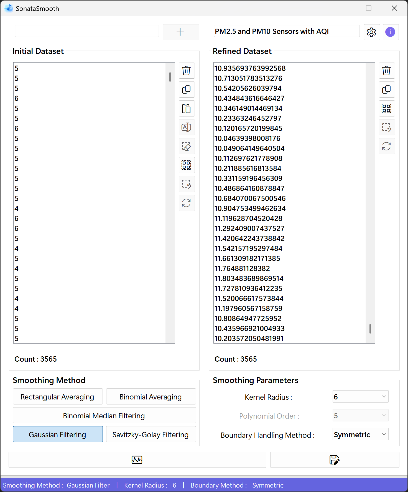
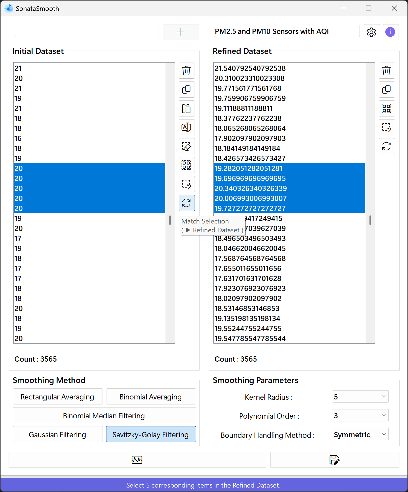
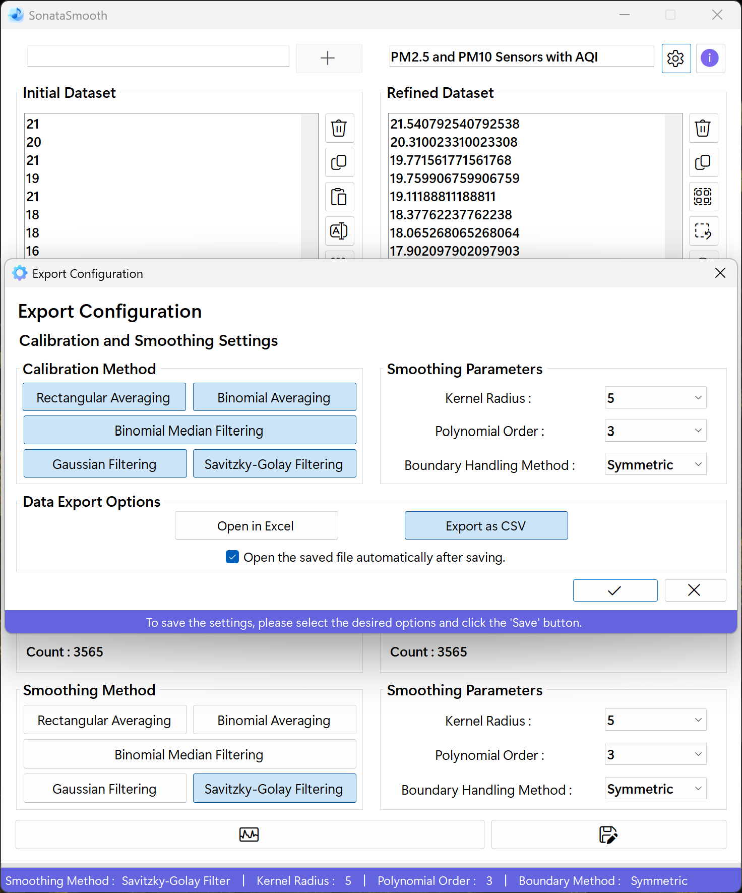

# SonataSmooth
## A Harmonious Approach to Data Smoothing
SonataSmooth is a compound of "sonata" and "smooth". A sonata is a musical form in which multiple movements blend into a single, harmonious whole-here serving as a metaphor for different smoothing algorithms working together in concert. "Smooth" highlights the sleek process of gently removing noise from data.

**Key components**
- **Sonata** : Evokes the idea of various movements (algorithms) uniting to produce a harmonious result
- **Smooth** : Emphasizes the smoothing function that gracefully eliminates data noise

True to its name, SonataSmooth embodies the philosophy of applying multiple techniques in harmony to process data as smoothly and clearly as a piece of music.

## Project Overview
**SonataSmooth** is a C# .NET Windows Forms application for efficient noise reduction and smoothing of numerical datasets. It supports multiple data input methods, including manual entry, clipboard paste, and drag-and-drop, with robust validation and parsing. Users can apply a variety of advanced filtering algorithms such as Rectangular Mean, Weighted Median, Binomial Average, Savitzky-Golay, and Gaussian filters, customizing parameters as needed. The application features a responsive, user-friendly interface with real-time progress feedback and batch editing capabilities. Designed for flexibility and performance.<br><br>

<div align="center">
 


</div>

## What's New
<details>
<summary>Click to Expand</summary>
  
### v1.0.0.0
#### January 19, 2025
>[Initial release.](https://github.com/happybono/SonataSmooth/commit/1c9911992e2b0ec6b984828519ac78cbcb5a0a51)

### v1.0.1.0
#### January 19, 2025
> [Minor bugs fixed.](https://github.com/happybono/SonataSmooth/commit/a8a9cfd481aa7616bdbc14e27d71a9a6616d171b)<br><br>
> [Explained NoiseReductionKernelWidth and updated algorithm details in README.md.](https://github.com/happybono/SonataSmooth/commit/dbad0337d5c7534902db7f22f6dc23ff60a54a4e)

### v1.0.2.0
#### January 20, 2025
> [Bugs fixed.](https://github.com/happybono/SonataSmooth/commit/f7d0568b4ebf30ed7868885a9bff92960e757b13)

### v2.0.0.0
#### July 08, 2025
> Async & Parallel Processing<br><br>
> Batch UI Updates<br><br>
> Stepwise ProgressBar Feedback<br><br>
> True Symmetric Binomial-Weighted Median Filter<br><br>
> ListBox Selection & Deletion Optimization<br><br>
> Regex Performance Tuning<br><br>
> UI-Thread Responsiveness<br><br>
> Median Filter Bias (Fixed the original code's one-sided kernel bug to correctly include both left and right neighbors in the weighted median.)<br><br>
> Binomial Coefficient Indexing (Resolved mis-mapping by removing unnecessary sort / reverse and using symmetric indexing (binom[k + w]).<br><br>
> UI Flicker Prevention (Added BeginUpdate / EndUpdate around all ListBox modifications to eliminate redraw artifacts.)

### v3.0.0.0
#### July 17, 2025
> Overhauled the graphical user interface.<br><br>
> Fixed an issue where the application became unresponsive when calibrating large datasets (over 100,000 entries) with the Noise Reduction Kernel Width set to 7 or higher using the Weighted Median method.<br><br>
> Fixed an issue where the txtVariable textbox was not being cleared after its contents were added to the ListBox.<br><br>
> Reimplemented and optimized the weighted-median calibration algorithm's procedures, reducing processing time by more than a factor of 16.<br><br>
> Fixed a bug in the median-based calibration algorithm that prevented it from producing correct corrected values.<br><br>
> Minor bugs fixed.

### v3.0.0.1
#### July 18, 2025
> [Fixed a bug in AddItemsInBatches where existing ListBox items were being cleared. (New items are now appended without removing the originals and the scroll position updates correctly.)](https://github.com/happybono/SonataSmooth/commit/670762bf268f750dac77bf901c05366fdd78f814)

### v3.1.0.0
#### July 19, 2025
> Added Gaussian Filter mode that computes and applies a normalized 1D Gaussian kernel with mirror-mode boundary handling in parallel.<br><br>
> Improved tooltips and labels: clarified filter options and renamed "Clear Selection" to "Deselect All".<br><br>
> Fixed ListBox2 update to clear old items before adding new results, ensuring the correct order and smooth refresh.<br><br>
> Repositioned the listbox control buttons and added descriptive icons to each button.<br><br>
> Added required font files to the Resources / Fonts directory.

### v3.5.0.0
#### July 19, 2025
> Added functionality to edit selected items in the Initial Dataset. (supports both single and multiple item edits)<br>
  (The number of selected items for editing is now displayed in the StatusBar.)<br><br>
> Updated copy behavior : even when items aren't fully selected, pressing the copy button or using the shortcut (Ctrl + C) will copy all entries.<br>
  (If only some items in the listbox are selected, only those selected items will be copied.)<br><br>
> Minor bugs fixed.

### v3.6.1.0
#### July 20, 2025
> Removed beep sound during various operations (such as adding or editing items) via keyboard input (e.g. Enter) in the listbox.<br><br>
> Improved processing and response speed when performing "Select All" followed by "Delete All".<br><br>
> Minor bugs fixed.

### v3.6.2.0
#### July 22, 2025
> Improved bulk deletion performance in ListBox by optimizing the deletion logic for full selection scenarios.<br><br>
> Added a fast path to instantly clear all items and reset the progress bar when all entries are selected.<br><br>
> Ensured the progress bar and UI remain responsive during partial deletions of large datasets.

### v3.6.5.0
#### July 22, 2025
> Refactored `frmModify`'s `OK_Button_Click` to apply ListBox updates in configurable batches (default 1000) for improved bulk-edit performance.<br><br>
> Added `await Task.Yield()` between batches and InvokeRequired / Invoke checks to ensure smooth, thread-safe UI responsiveness during large updates.<br><br>
> Collapsed final reselection, EndUpdate, focus shift, progress-bar reset, and dialog close into a single synchronized UI call.

### v4.0.0.0
#### July 26, 2025
> Renamed all code elements, file names, and app metadata to reflect the 'SonataSmooth' project name.

### v4.1.2.0
#### August 01, 2025
> Implemented structured export initialization with improved parameter validation and error handling for both `.CSV` and `Excel (.xlsx)` modes.<br><br>
> Enhanced export logic to support large dataset segmentation and metadata embedding (title, kernel width, polynomial order, timestamp).<br><br>
> Integrated parallel filtering for all export modes using `Parallel.For`, significantly improving performance for large datasets.<br><br>
> Added automatic chart generation in Excel export to visualize filter results across multiple smoothing algorithms.<br><br>
> Improved UI responsiveness during export operations using `Task.Yield()` and progress reporting.<br><br>
> Added support for mirrored boundary handling in Gaussian and Savitzky-Golay filters during export.<br><br>
> Minor improvements to input parsing, filter selection logic, and export configuration synchronization.<br><br>
> Added `FrmAbout` displaying app version and copyright information.<br><br>
> Added `Buy Me a Coffee` feature via PayPal, integrated directly into the `FrmAbout` to support the developer.<br><br>
> Added execution instructions and initial setup requirements to the README.md, including `.NET Framework` version, platform dependencies, and environment configuration.<br><br>
> Minor bugs fixed.

### v4.2.3.0
#### August 02, 2025
> All UI data is accessed only on the UI thread, heavy calculations and file writing are parallelized in the background, progress is safely reported to the UI, large exports are split automatically.<br><br>
> UI remains responsive, large data is processed quickly and safely, and all UI / COM access is thread-safe.<br><br>
> Synchronize selection and scroll position between the two listboxes. (**These buttons are only enabled when the Initial Dataset and Refined Dataset listboxes have the same number of items.**)

### v4.2.3.2
#### August 03, 2025
> Adjusted TabIndex to ensure controls are selected in the correct order.<br><br>
> Minor bugs fixed.

### v4.2.5.7
#### August 10, 2025
> A program selection screen appears when opening a saved file with no associated application.<br><br>
> Include an ARM64-native variant of the executable.

### v4.2.7.0
#### August 15, 2025
> Renamed “kernel width” to “kernel radius” throughout the UI and code, while still computing the actual width internally as `2 × {radius} + 1.`.<br><br>
> Refactored variable names and code references to use "Kernel Radius (r)" instead of "Kernel Width (w)".<br><br>
> Minor bugs fixed.

### v4.2.7.1
#### August 19, 2025
> Minor bugs fixed.

### v4.3.0.0
#### August 20, 2025
> Implemented explicit COM object cleanup (`Application`, `Workbook`, `Worksheet`) with `Marshal.ReleaseComObject` and forced GC to prevent memory leaks and lingering background Excel processes.<br><br>
> Minor bugs fixed.

### v4.3.1.0
#### August 21, 2025
> Unified "filter calculation" logic into a shared method used by both `ExportCsvAsync` and `ExportExcelAsync`.<br><br>
> Minor bugs fixed.

### v4.6.0.0
#### August 22, 2025
> Refactored UI controls and variable names across the application, applying clear naming conventions (e.g., `lblVersion` → `lblAppVersion`, `listBox1` → `lbInitData`, `ProgressBar1` → `pbModify`).<br><br> 
> Added mouse Hover / Leave event handlers to multiple forms (e.g., `FrmExportSettings`, `FrmModify`) to provide real-time tooltip descriptions for each option and button.<br><br>
> Improved DPI scaling support : dynamically adjusted ProgressBar and StatusLabel sizes in `FrmModify` using `Graphics.DpiX / Graphics.DpiY`.<br><br>
> Enhanced status display during multi-item modifications : status bar messages now update dynamically based on the number of selected items.<br><br>
> Optimized data modification logic : sorted selected item indices and improved UI update performance.<br><br>
> Fixed a bug where `PolyOrder` was incorrectly initialized with the `kernelRadius` value.<br><br>
> Cleaned up control metadata and resource key names in `.resx` files.<br><br>
> Added musical-themed metadata to Excel exports : document properties now include dynamic titles, categories, and keywords inspired by classical composition (e.g., "SonataSmooth Overture", "Concerto of smoothing movements").<br><br>
> Embedded randomized musical phrases in the Comments field (e.g., "Adagio in Data Minor", "Fugue of Filters") to enrich exported files with playful orchestral flair.<br><br>
> Introduced hidden Easter egg : when exactly four smoothing methods are applied, a special comment is added - "Hidden Movement Unlocked : The Quartet of Filters has performed in perfect harmony."<br><br>
> Expanded error handling for Excel interop and file export issues, including user-friendly messages and fallback guidance (e.g., Office download prompt on COMException).<br><br>
> Minor bug fixes and code cleanup.  

### v4.6.1.0
#### August 23, 2025
> Minor bugs fixed.

### v4.6.2.5
#### August 23, 2025
> Minor bugs fixed.

### v4.6.3.8
#### August 24, 2025
> Introduced an `isRefinedLoading` flag and bulk-disable logic in `btnCalibrate_Click` to lock out all data and export controls during asynchronous loading of the refined dataset, preventing flicker and invalid user actions<br><br>
> Defined `RecommendedMinRadius` / `RecommendedMaxRadius` and `RecommendedMinPolyOrder` / `RecommendedMaxPolyOrder` constants and displayed them in dynamic status-bar tooltips when hovering over radius and polynomial-order selectors.<br><br>
> Added a `ShowStatusMessage(string)` helper to simplify and unify status-bar updates from anywhere in the form.<br><br>
> Centralized all filter computations in a new `ApplySmoothing` method that produces rectangular, binomial, median, Gaussian, and Savitzky-Golay outputs in one pass, then refactored CSV export to reuse it and eliminate duplicate loops.<br><br>
> Minor bugs fixed.

### v4.6.3.9
#### August 26, 2025
> Refreshed the graphical user interface with subtle enhancements.<br><br>
> Improved status label messaging logic : Added dynamic singular / plural phrasing and corrected punctuation for clearer user feedback.<br><br>
> Minor bugs fixed.

### v4.7.0.0
#### August 27, 2025
> Enhanced `InvertMatrix` by adding partial pivoting and a dynamic, scale-based tolerance to safeguard Gauss–Jordan inversion against division-by-zero and severe rounding errors.<br><br>
> Refined singular-matrix handling to detect sub-threshold pivots (using `maxRow × 1e - 12` vs. `Double.Epsilon`) and emit a controlled zero matrix or exception instead of propagating NaN / ∞.<br><br>
> Retained mirror-padding in Savitzky-Golay filtering, ensuring exact central coefficients and smooth, distortion-free continuity at both ends.<br><br>
> Refactored inversion routine for clarity : consolidated row-swap, pivot selection, scale calculation, and error handling into a single coherent block, removing hard-coded thresholds.<br><br>
> Performed minor code cleanups to improve readability and enforce consistent formatting.<br><br>
> Minor bugs fixed.

### v4.7.1.1
#### August 28, 2025
>	Implemented dataset title validation : including checks for length, invalid characters, and reserved names. Alongside dynamic placeholder behavior and conditional enabling of the export button.<br><br>
>	Added KeyDown handler (`FrmExportSettings_KeyDown`) to close dialog on ESC; `KeyPreview` set to `true` in Designer.<br><br>
>	Minor bugs fixed.

### v4.7.1.5
#### August 30, 2025
>	Implemented unified parameter sourcing for export : `ExportCsvAsync` and `ExportExcelAsync` now read Kernel Radius / Polynomial Order from the applied status labels (`slblKernelRadius`, `slblPolyOrder`) instead of the settings dialog ComboBoxes : ensuring exports always reflect the last calibrated parameters, preventing use of stale or unsaved values, avoiding unintended field mutation, and tightening variable scope.<br><br>
> Minor bugs fixed.
</details>

### v4.8.0.0
#### August 31, 2025
> Added boundary handling options for Savitzky-Golay filter : Symmetric (Mirror), Replicate (Nearest), Zero-Pad.  
  `BoundaryMode` enum and `GetIndex` method updated to support all three modes.  
  ComboBox (`cbxBoundaryMethod`) selection now determines edge handling for Savitzky-Golay smoothing.  
> `ApplySmoothing` and calibration logic refactored to use `GetIndex` and `boundaryMode` for Savitzky-Golay filter, ensuring correct edge behavior per user selection.<br><br>
> Export routines (CSV / Excel) now display and save the selected boundary method for the Savitzky-Golay filter.<br><br>
> UI status label and ComboBox text synchronized for boundary method display.<br><br>
> Other smoothing methods remain unchanged; the boundary option applies only to the Savitzky-Golay filter.<br><br>
> Minor bug fixes and code cleanup.

## Required Components & Setup
### Prerequisites
- [.NET Framework 4.7.2](https://dotnet.microsoft.com/en-us/download/dotnet-framework/net472) or later ([.NET Framework 4.8](https://dotnet.microsoft.com/en-us/download/dotnet-framework/net48) recommended)
- Windows Operating System (Windows 10 or later recommended)
- [Visual Studio 2019 or newer](https://visualstudio.microsoft.com/) (for development)
- [Microsoft Office (Excel)](https://www.microsoft.com/en/microsoft-365/) - **Required for Microsoft Excel export functionality** via `Interop`

### Dependencies
- `System.Windows.Forms`
- `System.Threading.Tasks`
- `System.Linq`
- `Microsoft.Office.Interop.Excel` (for Excel export)

### Initial Setup
- Clone or download the repository.
- Open the solution file (`.sln`) in Visual Studio.
- Add necessary references if required.
- Build the project.
- Run the application.

## Execution Instructions
1. **Launch the Application** : Run the compiled `.exe` file or start the project from Visual Studio.
2. **Input Data** : Enter numeric values manually, paste from clipboard, or drag-and-drop text / HTML.
3. **Select Filter** : Choose one or more smoothing algorithms using the checkboxes in the "Calibration Method" group (`chbRect`, `chbAvg`, `chbMed`, `chbGauss`, `chbSG`). Configure kernel radius and polynomial order using the combo boxes (`cbxKernelRadius`, `cbxPolyOrder`).
4. **Calibrate** : Click the 'Calibrate' button (`btnCalibrate`) to apply the selected filter(s).
5. **Review Results** : View the smoothed output in the "Refined Dataset" listbox (`lbRefinedData`).
6. **Edit Data** : Use the "Modify Selected Entries" dialog (`btnInitEdit`) to batch-edit selected items in the initial dataset.
7. **Export** : Click Export (`btnExport`) to save results as `.CSV` or `Excel (.xlsx)`, with optional chart visualization. Configure export options in the "Export Configuration" dialog (`btnExportSettings`).

## UI Controls & Naming Conventions
- **Initial Dataset ListBox** : `lbInitData`
- **Refined Dataset ListBox** : `lbRefinedData`
- **Kernel Radius ComboBox** : `cbxKernelRadius`
- **Polynomial Order ComboBox** : `cbxPolyOrder`
- **Boundary Method ComboBox** : `cbxBoundaryMethod`
- **Calibration Method CheckBoxes** : `chbRect`, `chbAvg`, `chbMed`, `chbGauss`, `chbSG`
- **Export Buttons** : `btnExport`, `btnExportSettings`
- **Edit Button** : `btnInitEdit`
- **ProgressBar** : `pbMain`, `pbModify`
- **StatusStrip & Labels** : `statStripMain`, `slblCalibratedType`, `slblKernelRadius`, `slblPolyOrder`, `slblBoundaryMethod`, `slblDesc`
- **Other Controls** : All controls use clear, descriptive names matching their function in the codebase.

## Noise Filter Comparison
This guide explains how different noise filters work with different types of signals. It also simply introduces Pascal's Triangle.

### Filter Comparison Table
| Signal Pattern                                          | Rectangular Averaging | Binomial Averaging | Binomial Median Filtering | Gaussian Filtering | Savitzky‑Golay Filtering |
|:--------------------------------------------------------|:---------------------:|:------------------:|:------------------------:|:------------------:|:------------------------:|
| Occasional random noise                                 | OK                    | Good               | **Very Good**                 | Good               | **Very Good**                |
| Frequent random noise                                   | Poor                  | Fair               | **Excellent**                 | Fair               | Fair                     |
| Large slow trend changes                                | Poor                  | Good               | Good                      | Good               | **Excellent**                |
| Sudden spikes (sharp single jumps)                      | Poor                  | Fair               | **Excellent**                 | Fair               | Fair                     |
| Regular large-amplitude waves                           | Poor                  | Fair               | Fair                      | Fair               | **Excellent**                |
| Step changes (sudden level shifts)                      | Poor                  | Fair               | **Good**                      | Fair               | Fair                     |
| Mixed-frequency oscillations                            | Poor                  | Good               | Fair                      | Good               | **Excellent**                |
| Periodic high-frequency noise (steady tone)             | **Excellent**             | Fair               | Fair                      | Good               | Good                     |
| Slowly drifting baseline with tiny jitter               | Good                  | Good               | **Very Good**                 | Good               | **Very Good**                |
| Natural signal flow with smooth curves & gentle noise   | Fair                  | Good               | Good                      | **Excellent**      | Very Good                |
| Stable periodic signal with moderate high-frequency noise | Fair           | **Excellent**      | Fair                      | Good               | Good                     |

### Verdict
- **Rectangular Averaging** is simple, but surprisingly effective for steady high-frequency noise.
- **Binomial Averaging** is a good middle ground : especially for periodic signals with moderate noise.
- **Binomial Median Filtering** is a powerhouse for handling spikes, frequent noise, and step changes : great for robustness.
- **Gaussian Filtering** offers smooth results but may not handle abrupt changes well.
- **Savitzky‑Golay Filtering** excels in preserving wave shapes, trends, and mixed frequencies : ideal for scientific data or smooth curves.

## What Is Pascal's Triangle?
Pascal’s Triangle is a triangle of numbers built like this :

- Start with `1` at the top.
- Each new row adds two numbers from the row above to get a new one.
- The edges of each row are always `1`.

### Example :
Row 1 :　　　　　　1<br>
Row 2 :　　　　　1　 1<br>
Row 3 :　　　　1　 2　 1<br>
Row 4 :　　　1　 3　 3　 1<br>
Row 5 :　　1　 4 　6　 4　 1<br>

Filters like **Binomial Averaging** use rows from Pascal's Triangle as weights. Bigger numbers in the middle give more importance to center values when filtering.

## Filter Descriptions
- **Rectangular Averaging (Moving Average)**<br>
  Adds up a group of points and divides by how many there are. It's simple and fast. Best for removing constant buzz or small jitters.

- **Binomial Averaging**<br>
  Like a moving average, but with weights from Pascal’s Triangle. The center gets more focus. Keeps the shape of your signal better while smoothing small noise.

- **Binomial Median Filtering**<br>
  Sorts nearby values and picks the middle one, using extra weight for the center. Removes sharp spikes while keeping the signal shape.
  
- **Gaussian Filtering**<br>
  Uses a bell-shaped curve for weights. Very smooth, but may let sharp jumps stay.

- **Savitzky‑Golay Filtering**<br>
  Fits tiny curves to chunks of data. Keeps wave shapes and slow changes almost perfectly, but not as strong for sudden spikes.

### Example of Using Pascal's Triangle in Filtering
Let’s say we use the 5th row : `1 4 6 4 1`

1. **Total** = `1` + `4` + `6` + `4` + `1` = `16`
2. **Weights** = [`1 / 16`, `4 / 16`, `6 / 16`, `4 / 16`, `1 / 16`]
   → [`0.0625` , `0.25` , `0.375` , `0.25` , `0.0625`]
3. **Data Window** = [`2`, `5`, `1`, `3`, `4`]

Apply the weights :  
`2 × 0.0625 + 5 × 0.25 + 1 × 0.375 + 3 × 0.25 + 4 × 0.0625 = 2.75`

That final value (`2.75`) becomes your new filtered point.

## Boundary Handling Method
Edge handling determines which values are used when the kernel window extends beyond the first or last element.


### Available Modes (ComboBox: `cbxBoundaryMethod`)

| Mode        | Also Known As               | Formula / Mapping                                      | Behavior                        | Pros                                      | Cons                                                              |
|-------------|-----------------------------|--------------------------------------------------------|----------------------------------|-------------------------------------------|-------------------------------------------------------------------|
| Symmetric   | Mirror, Reflect             | `i < 0`<br>`→ -i - 1`,<br>`i ≥ n`<br>`→ 2n - i - 1`                  | Reflects across edge             | Smooth continuity, preserves slope        | May exaggerate boundary extrema if edge is extreme                |
| Replicate   | Nearest, Clamp,             | `i < 0 → 0`,<br>`i ≥ n`<br>`→ n - 1`                            | Uses closest endpoint            | Simple, stable under plateaus             | Can flatten curvature at edges                                    |
| Zero Padding| Constant 0,                 | `i < 0` or <br>`i ≥ n → 0`                                    | Outside values become zero       | Highlights edge contrast, explicit decay | Artificial dips at ends; energy loss                              |

### Core Enum & Accessor
```csharp
public enum BoundaryMode { Symmetric, Replicate, ZeroPad }

private double GetValueWithBoundary(double[] data, int idx, BoundaryMode mode)
{
    int n = data.Length;
    switch (mode)
    {
        case BoundaryMode.Symmetric:
            // Symmetric : Mirror reflection based on the boundary point
            if (idx < 0) idx = -idx - 1;
            else if (idx >= n) idx = 2 * n - idx - 1;
            if (idx < 0) return 0; 
            return data[idx];

        case BoundaryMode.Replicate:
            // Replicate : Use the edge value when the index is out of range
            if (idx < 0) idx = 0;
            else if (idx >= n) idx = n - 1;
            return data[idx];

        case BoundaryMode.ZeroPad:
            // Zero Padding : Return 0 when the index is out of range
            if (idx < 0 || idx >= n) return 0.0;
            return data[idx];

        default:
            // If the mode is unknown, handle it the same as mirror reflection
            if (idx < 0) idx = -idx - 1;
            else if (idx >= n) idx = 2 * n - idx - 1;
            if (idx < 0) return 0;
            return data[idx];
    }
}
```

### Integration
All convolution / window operations now fetch samples through a unified accessor (`Sample(i + k)`) that calls `GetValueWithBoundary`. The weighted median reuses the same accessor ensuring consistent semantics across filters and exports.

### Choosing a Mode
- Use **Symmetric** for smooth analytical signals (default).
- Use **Replicate** for stepwise / plateau sensor data.
- Use **ZeroPad** when emphasizing decay or isolating interior structure.

## Features & Algorithms
### 1. Initialization & Input Processing
#### How it works
SonataSmooth provides a robust, user-friendly interface for entering and managing numerical datasets :  

-	**Manual Entry** : Users can type values directly into the input box and add them to the Initial Dataset with a button click or by pressing Enter.
-	**Clipboard Paste** : Numeric values can be pasted from the clipboard; the app uses optimized regular expressions to extract numbers, even from mixed or formatted text.
-	**Drag & Drop** : Supports dropping plain text, CSV, or HTML-formatted data; HTML tags are stripped and all valid numbers are parsed.
-	**Batch Addition** : Large datasets are added in batches to the ListBox, with real-time progress feedback and smooth UI updates.
-	**Validation** : All input is validated for numeric format; errors are reported with clear messages and invalid entries are rejected.
-	**Selection & Editing** : Items can be selected, deselected, edited (single or multiple), deleted, or copied to the clipboard. Selection operations are optimized for large lists.

#### Smoothing Parameters
##### Kernel Radius (`r`)
-	Defines how many data points on each side of the target point are included in the smoothing window.
-	The kernel width is calculated as `(2 × radius) + 1`.
-	Recommended range : 3 to 7.
-	If the kernel window is larger than the dataset, the app will show an error and prevent calibration / export.

Kernel radius specifies how many data points on each side of the center element are included in the filtering window. The total window length (kernel width) is calculated as `2 × r + 1`.

The total window length (kernel width) is calculated as :

$$
\[
\text{kernelWidth} = 2 \times r + 1
\]
$$

For example, if \(r = 2\) :

$$
\[
\text{kernelWidth} = 2 \times 2 + 1 = 5
\]
$$

This means your median (or any other sliding-window) filter will span 5 consecutive samples at each position.

##### Polynomial Order (`polyOrder`)
- Specifies the degree of the polynomial used to fit the data within each smoothing window (used only for Savitzky-Golay filtering).
-	Recommended range : 2 to 6.
-	Must be strictly less than the kernel window size; otherwise, an error is shown.

Polynomial order `polyOrder` specifies the highest degree of the polynomial fitted to the data within each smoothing window. A higher order can capture more complex curvature but may also overfit noise.
The polynomial order is defined as :

`polyOrder` = degree of the polynomial

For example, if (`polyOrder` = 2) :

This means the filter will fit a 2nd-degree polynomial (a parabola) across each window of data points.

#### Tips for Choosing `polyOrder`
- `polyOrder` must be less than the window length (2 × `r` + 1) to ensure a well-posed fitting problem.
- Increasing `polyOrder` improves flexibility but risks ringing artifacts at the boundaries.
- Common practice is to start with `polyOrder` = 2 or 3 and adjust based on how well features are preserved versus noise reduction.
- Always validate smoothing performance on representative signal segments before batch processing.

#### Principle
-	**Regex-based Parsing** : Uses compiled regular expressions to efficiently extract numbers from any text source.
-	**Batch UI Updates** : ListBox modifications (add, delete, edit) are performed in batches to prevent flicker and maintain responsiveness.
-	**Progress Feedback** : ProgressBar and status labels provide immediate feedback during bulk operations.
-	**Error Handling** : All parsing and input errors are caught and reported to the user, preventing silent failures.
-	**Parameter Validation** : Kernel radius and polynomial order are validated before any smoothing operation.

#### Code Implementation
```csharp
// Manual entry
private void btnInitAdd_Click(object sender, EventArgs e)
{
    if (double.TryParse(txtInitAdd.Text, out double value))
    {
        lbInitData.Items.Add(value);
        lblInitCnt.Text = "Count : " + lbInitData.Items.Count;
        slblDesc.Visible = true;
        slblDesc.Text = $"Value '{value}' has been added to Initial Dataset.";
    }
    else
    {
        txtInitAdd.Focus();
        txtInitAdd.SelectAll();
    }
    UpdatelbInitDataBtnsState(null, EventArgs.Empty);
    UpdatelbRefinedDataBtnsState(null, EventArgs.Empty);
    txtInitAdd.Text = String.Empty;
}

// Clipboard paste
private async void btnInitPaste_Click(object sender, EventArgs e)
{
    string text = Clipboard.GetText();
    var matches = clipboardRegex.Matches(text)
        .Cast<Match>()
        .Where(m => !string.IsNullOrEmpty(m.Value))
        .ToArray();
    double[] values = await Task.Run(() =>
        matches.AsParallel()
            .WithDegreeOfParallelism(Environment.ProcessorCount)
            .Select(m => double.Parse(m.Value, NumberStyles.Any, CultureInfo.InvariantCulture))
            .ToArray()
    );
    lbInitData.BeginUpdate();
    lbInitData.Items.AddRange(values.Cast<object>().ToArray());
    lbInitData.EndUpdate();
    lblInitCnt.Text = $"Count : {lbInitData.Items.Count}";
    UpdateStatusLabel(beforeCount);
}

// Drag & drop
private async void lbInitData_DragDrop(object sender, DragEventArgs e)
{
    string raw = GetDropText(e);
    if (string.IsNullOrWhiteSpace(raw)) return;
    if (raw.IndexOf("<html", StringComparison.OrdinalIgnoreCase) >= 0)
        raw = await Task.Run(() => htmlTagRegex.Replace(raw, " "));
    double[] parsed = await Task.Run(() =>
        numberRegex.Matches(raw)
            .Cast<Match>()
            .AsParallel()
            .AsOrdered()
            .WithDegreeOfParallelism(Environment.ProcessorCount)
            .Select(m => double.TryParse(m.Value.Replace(",", "").Trim(), NumberStyles.Any, CultureInfo.InvariantCulture, out double d) ? d : double.NaN)
            .Where(d => !double.IsNaN(d))
            .ToArray()
    );
    await AddItemsInBatches(lbInitData, parsed, progressReporter, 60);
    lblInitCnt.Text = "Count : " + lbInitData.Items.Count;
    UpdateStatusLabel(beforeCount);
}

// Parameter validation
private bool ValidateSmoothingParameters(int dataCount, int radius, int polyOrder)
{
    int windowSize = 2 * radius + 1;
    if (windowSize > dataCount)
    {
        MessageBox.Show("Kernel radius is too large for the dataset.", "Parameter Error", MessageBoxButtons.OK, MessageBoxIcon.Error);
        return false;
    }
    if (rbtnSG.Checked && polyOrder >= windowSize)
    {
        MessageBox.Show("Polynomial order must be smaller than the window size.", "Parameter Error", MessageBoxButtons.OK, MessageBoxIcon.Error);
        return false;
    }
    return true;
}
```

### 2. Parallel Kernel Filtering
#### How it works
All array indices [0 … n - 1] are processed in parallel using PLINQ. For each position `i`, the code checks which radio button is selected (rectangular average, weighted median, or binomial average) and computes a filtered value.

When the user clicks "Calibrate", the application processes the input data using the selected filter. The computation is parallelized for performance using PLINQ.

-	When the user calibrates or exports data, the selected filters are applied to each data point in parallel.
-	Each filter uses its own kernel (window) and boundary handling (mirror-padding).
-	All filter results are computed in a single pass, leveraging all available CPU cores.
-	The UI remains responsive, and progress is reported in real time.

#### Principle
Leverage all CPU cores to avoid blocking the UI. PLINQ's `.AsOrdered()` preserves the original order, and `.WithDegreeOfParallelism` matches the number of logical processors.

-	**Parallelization** : Uses Parallel.For and ParallelEnumerable to process large datasets efficiently.
-	**Single-Pass Multi-Filter** : All enabled filters are computed together, minimizing memory usage and maximizing throughput.
-	**Boundary Handling**: Edge behavior is configurable (Symmetric / Replicate / Zero-Pad) for every smoothing method
-	**Thread-Safe UI** : Progress bars and status labels are updated safely from background threads.

-	**Parallel Processing** : Uses all available CPU cores for fast computation.
-	**Kernel Filtering** : Applies the selected filter to each data point using a moving window.

#### Code Implementation
```csharp
        private (double[] Rect, double[] Binom, double[] Median, double[] Gauss, double[] SG)
           ApplySmoothing(double[] input, int r, int polyOrder, BoundaryMode boundaryMode,
                          bool doRect, bool doAvg, bool doMed, bool doGauss, bool doSG)
        {
            int n = input.Length;
            int windowSize = 2 * r + 1;

            long[] binom = (doAvg || doMed) ? CalcBinomialCoefficients(windowSize) : null;
            double[] gaussCoeffs = doGauss ? ComputeGaussianCoefficients(windowSize, (2.0 * r + 1) / 6.0) : null;
            double[] sgCoeffs = doSG ? ComputeSavitzkyGolayCoefficients(windowSize, polyOrder) : null;

            var rect = new double[n];
            var binomAvg = new double[n];
            var median = new double[n];
            var gauss = new double[n];
            var sg = new double[n];

           // Precompute division factor for Rectangular and sum of coefficients for Binomial Average
            double invRectDiv = doRect ? 1.0 / windowSize : 0.0;
            double binomSum = 0.0;
            if (doAvg && binom != null)
            {
                for (int i = 0; i < binom.Length; i++) binomSum += binom[i];
            }

            double Sample(int idx) => GetValueWithBoundary(input, idx, boundaryMode);

            // For small datasets, serial execution is faster due to parallel overhead
            bool useParallel = n >= 2000;

            Action<int> smoothingAction = i =>
            {
                // Rectangular
                if (doRect)
                {
                    double sum = 0.0;
                    for (int k = -r; k <= r; k++)
                        sum += Sample(i + k);
                    rect[i] = sum * invRectDiv;
                }

                // Binomial Average
                if (doAvg && binom != null)
                {
                    double sum = 0.0;
                    for (int k = -r; k <= r; k++)
                        sum += Sample(i + k) * binom[k + r];
                    binomAvg[i] = binomSum > 0 ? sum / binomSum : 0.0;
                }

                // Weighted Median
                if (doMed && binom != null)
                {
                    median[i] = WeightedMedianAt(input, i, r, binom, boundaryMode);
                }

                // Gaussian
                if (doGauss && gaussCoeffs != null)
                {
                    double sum = 0.0;
                    for (int k = -r; k <= r; k++)
                        sum += gaussCoeffs[k + r] * Sample(i + k);
                    gauss[i] = sum;
                }

                // Savitzky-Golay
                if (doSG && sgCoeffs != null)
                {
                    // The `Sample` function correctly handles all boundary modes (including ZeroPad),
                    // so no separate branching is needed here.
                    double sum = 0.0;
                    for (int k = -r; k <= r; k++)
                        sum += sgCoeffs[k + r] * Sample(i + k);
                    sg[i] = sum;
                }
            };

            if (useParallel)
            {
                Parallel.For(0, n, smoothingAction);
            }
            else
            {
                for (int i = 0; i < n; i++)
                {
                    smoothingAction(i);
                }
            }

            return (rect, binomAvg, median, gauss, sg);
        }
```

### 3. Rectangular (Uniform) Mean Filter
#### How it works
A simple sliding-window average over 2 × r + 1 points, ignoring out-of-bounds indices.

#### Principle
Every neighbor contributes equally (uniform weights).

-	**Uniform Weights** : Each value in the window contributes equally.
-	**Noise Reduction** : Smooths out short-term fluctuations.

#### Code Implementation
```csharp
if (useRect)
{
    double sum = 0;
    int cnt = 0;
    for (int k = -r; k <= r; k++)
    {
        int idx = i + k;
        if (idx >= 0 && idx < n)
        {
            sum += input[idx];
            cnt++;
        }
    }
    return cnt > 0 ? sum / cnt : 0;
}
```

### 4. Weighted Median Filter
#### How it works
Computes the median of values in the window, weighted by binomial coefficients, to reduce noise while preserving edges.

#### Principle
Median filtering is robust against outliers; binomial weights bias the median toward center points.

-	**Weighted Median** : Each value's influence is determined by its weight.
-	**Edge Preservation** : More robust to outliers than mean filters.

#### Code Implementation
```csharp
else if (useMed)
{
    return WeightedMedianAt(input, i, r, binom);
}

// WeightedMedianAt implementation :
private double WeightedMedianAt(double[] data, int center, int w, long[] binom, BoundaryMode mode)
{
    // Collect (value, weight) pairs for the window centered at 'center'
    var pairs = new List<(double Value, long Weight)>(2 * w + 1);
    for (int k = -w; k <= w; k++)
    {
        double v = GetValueWithBoundary(data, center + k, mode);
        pairs.Add((v, binom[k + w]));
    }

    // Sort pairs by value (ascending)
    pairs.Sort((a, b) => a.Value.CompareTo(b.Value));

    // Compute total weight
    long total = 0;
    foreach (var p in pairs) total += p.Weight;
    if (total <= 0) return 0;

    // Determine if total weight is even
    bool even = (total & 1L) == 0;
    long half = total / 2;

    // Accumulate weights until reaching the median position
    long acc = 0;
    for (int i = 0; i < pairs.Count; i++)
    {
        acc += pairs[i].Weight;

        // If we've passed the halfway point, this value is the median
        if (acc > half) return pairs[i].Value;

        // If total weight is even and we land exactly on the halfway point,
        // the median is the average of this value and the next one
        if (even && acc == half)
        {
            double next = (i + 1 < pairs.Count) ? pairs[i + 1].Value : pairs[i].Value;
            return (pairs[i].Value + next) / 2.0;
        }
    }

    // Fallback: return the largest value
    return pairs[^1].Value;
}
```

### 5. Binomial (Weighted) Average Filter
#### How it works
Averages values in the window, but each value is weighted according to binomial coefficients, giving more importance to central values.

#### Principle
A discrete approximation of Gaussian smoothing (binomial coefficients approximate a normal distribution).

-	**Binomial Weights** : Central values have higher influence.
-	**Smoother Output** : Reduces noise while maintaining signal shape.

#### Code Implementation
```csharp
else if (useAvg)
{
    double sum = 0;
    int cs = 0;
    for (int k = -r; k <= r; k++)
    {
        int idx = i + k;
        if (idx < 0 || idx >= n) continue;
        sum += input[idx] * binom[k + r];
        cs += binom[k + r];
    }
    return cs > 0 ? sum / cs : 0;
}
```

### 6. Gaussian Filter
#### How it works
Applies a normalized 1D Gaussian kernel to the data, using mirror-mode boundary handling.

#### Principle
Gaussian weights emphasize central values, producing smooth results.

#### Code Implementation
```csharp
if (useGauss)
{
    double[] gaussCoeffs = ComputeGaussianCoefficients(2 * r + 1, sigma);
    double sum = 0;

    for (int k = -r; k <= r; k++)
    {
        int mi = Mirror(i + k);
        sum += gaussCoeffs[k + r] * input[mi];
    }

    return sum;
}
```

### 7. Savitzky‑Golay Filter
#### How it works
A fixed-size window of length **2 × r + 1** slides over the 1D signal.  

At each position :

1. Out‑of‑bounds indices are "mirrored" back into the valid range to handle boundaries smoothly.
2. Each sample in the window is multiplied by its **precomputed Savitzky‑Golay coefficient** (derived from polynomial least‑squares fitting), and the weighted sum gives the smoothed output at the central point.

This method preserves important features such as peaks and edges better than simple moving averages.

#### Principle
Savitzky‑Golay filtering performs a **least‑squares fit** of a low‑degree polynomial to the samples in the window, then evaluates the polynomial at the center.  
Unlike Gaussian filtering, the weights are **not** based on a bell‑shaped curve, but are determined analytically to minimize the mean‑squared error for the chosen polynomial degree.

- **Polynomial Fitting** : Fits a polynomial of specified degree within the window.
- **Feature Preservation** : Retains higher‑order moments (e.g., slope, curvature) while reducing high‑frequency noise.

#### Code Implementation
```csharp
else if (useSG)
{
    double sum = 0;
    for (int k = -r; k <= r; k++)
    {
        int mi = Mirror(i + k);
        sum += sgCoeffs[k + r] * input[mi];
    }
    return sum;
}

// Coefficient calculation :
private static double[] ComputeSavitzkyGolayCoefficients(int windowSize, int polyOrder)
{
    // ... (matrix construction and inversion)
}
```

### 8. Results Aggregation & UI Update
#### How it works
After filtering, the results array is handed to `AddItemsInBatches`, which inserts items into lbRefinedData in chunks. This avoids freezing the UI and allows incremental progress updates. Finally, controls are reset.

#### Principle
Batch updates and progress reporting keep the UI responsive. A finally block ensures the progressbar always resets on completion or error.

-	**Batch UI Update** : Efficiently updates the list box.
-	**Progress Feedback** : Shows operation progress to the user.
-	**Status Reporting** : Updates labels and enables / disables controls.

#### Code Implementation
```csharp
lbRefinedData.BeginUpdate();
lbRefinedData.Items.Clear();

await AddItemsInBatches(lbRefinedData, results, progressReporter);

lbRefinedData.EndUpdate();
lblRefCnt.Text = $"Count : {lbRefinedData.Items.Count}";

slblCalibratedType.Text = useRect ? "Rectangular Average"
                     : useMed ? "Weighted Median"
                     : useAvg ? "Binomial Average"
                     : useSG ? "Savitzky-Golay Filter"
                     : useGauss ? "Gaussian Filter"
                                : "Unknown";

slblKernelRadius.Text = r.ToString();
```

### 9. Pascal's Triangle (Binomial Coefficient Calculation)
#### How it works
Calculates binomial coefficients for a given window size, which are used as weights in the binomial average and weighted median filters.

#### Principle
-	**Pascal's Triangle** : Each coefficient is the sum of the two above it, or mathematically, C(n, k) = n! / (k!(n - k)!).
-	**Symmetry** : The coefficients are symmetric and always sum to a power of two.

#### Code Implementation
```csharp
private static long[] CalcBinomialCoefficients(int length)
{
    if (length < 1)
        throw new ArgumentException("length must be ≥ 1", nameof(length));

    // Limit 'length' to ensure the sum can be safely calculated within the 64-bit long range
    // (Condition: 2 ^ (length - 1) ≤ 2 ^ 62)
    if (length > 63)
        throw new ArgumentOutOfRangeException(nameof(length),
            "length must be ≤ 63 to avoid 64-bit weight sum overflow (2 ^ (length - 1) <= 2 ^ 62). Reduce kernel radius.");

    var c = new long[length];
    c[0] = 1; // The first coefficient is always 1

    try
    {
        checked // Throw an exception if an overflow occurs
        {
            for (int i = 1; i < length; i++)
                c[i] = c[i - 1] * (length - i) / i;
        }
    }
    catch (OverflowException ex)
    {
        throw new InvalidOperationException(
            $"Binomial coefficient overflow for length = {length}. Try a smaller kernel radius.", ex);
    }
    return c;
}
```
-	This function generates the coefficients for the (length - 1) th row of Pascal's triangle, which are used as weights for the filters.

### 10. Savitzky-Golay Coefficients Computation
#### How it works
Constructs a Vandermonde matrix for the window, computes its normal equations, inverts the Gram matrix, and multiplies back by the transposed design matrix. The first row of the resulting "smoother matrix" yields the filter coefficients.

#### Principle
Savitzky-Golay filters derive from least‐squares polynomial fitting.
- Build matrix A where each row contains powers of the relative offset within the window.
- Form the normal equations (AᵀA), invert them, and multiply by Aᵀ to get the pseudoinverse.
- The convolution coefficients for smoothing (value at central point) are the first row of this pseudoinverse.

#### Code Implementation
```csharp
private static double[] ComputeSavitzkyGolayCoefficients(int windowSize, int polyOrder)
{
    int m = polyOrder;
    int half = windowSize / 2;
    double[,] A = new double[windowSize, m + 1];

    for (int i = -half; i <= half; i++)
        for (int j = 0; j <= m; j++)
            A[i + half, j] = Math.Pow(i, j);

    var ATA = new double[m + 1, m + 1];
    for (int i = 0; i <= m; i++)
        for (int j = 0; j <= m; j++)
            for (int k = 0; k < windowSize; k++)
                ATA[i, j] += A[k, i] * A[k, j];

    var invATA = InvertMatrix(ATA);

    var AT = new double[m + 1, windowSize];
    for (int i = 0; i <= m; i++)
        for (int k = 0; k < windowSize; k++)
            AT[i, k] = A[k, i];

    var h = new double[windowSize];
    for (int k = 0; k < windowSize; k++)
    {
        double sum = 0;
        for (int j = 0; j <= m; j++)
            sum += invATA[0, j] * AT[j, k];
        h[k] = sum;
    }

    return h;
}
```

### 11. Numerical Pivot Calculation (Matrix Inversion)
#### How it Works
SonataSmooth uses a robust numerical matrix inversion routine for Savitzky-Golay filter coefficient calculation.  
This routine applies **Gauss-Jordan elimination with partial pivoting** and a **dynamic, scale-based tolerance** to ensure numerical stability and prevent division-by-zero or propagation of NaN / Infinity values.

- For each column, the row with the largest absolute value is selected as the pivot and swapped to the top.
- The pivot row is normalized, and all other rows are updated to eliminate the current column.
- If the pivot is below a dynamic threshold (based on the row's scale and machine epsilon), the matrix is considered singular and a zero matrix is returned.

#### Principle
- **Partial Pivoting** : Improves numerical stability by always using the largest available pivot.
- **Dynamic Tolerance** : Prevents catastrophic errors by comparing the pivot to a scaled threshold, not a fixed value.
- **Singular Matrix Handling** : If the matrix cannot be inverted (pivot too small), a zero matrix is returned instead of propagating errors.

This approach ensures that Savitzky-Golay and other matrix-based filters remain stable and reliable, even for ill-conditioned or nearly singular matrices.

#### Code Implementation
```csharp
private static double[,] InvertMatrix(double[,] a)
{
    int n = a.GetLength(0);
    var aug = new double[n, 2 * n];

    // Initialize augmented matrix [A | I]
    for (int i = 0; i < n; i++)
    {
        for (int j = 0; j < n; j++)
            aug[i, j] = a[i, j];
        aug[i, n + i] = 1;
    }

    for (int i = 0; i < n; i++)
    {
        // Partial pivoting : find row with largest absolute value in column i
        int maxRow = i;
        for (int k = i + 1; k < n; k++)
            if (Math.Abs(aug[k, i]) > Math.Abs(aug[maxRow, i]))
                maxRow = k;

        // Swap rows if needed
        if (maxRow != i)
        {
            for (int k = 0; k < 2 * n; k++)
            {
                double temp = aug[i, k];
                aug[i, k] = aug[maxRow, k];
                aug[maxRow, k] = temp;
            }
        }

        double pivot = aug[i, i];
        double rowScale = 0.0;
        for (int j = i; j < n; j++)
            rowScale = Math.Max(rowScale, Math.Abs(aug[i, j]));
        double tol = Math.Max(rowScale * 1e-12, Double.Epsilon);

        if (Math.Abs(pivot) < tol)
        {
            // Singular matrix : return zero matrix
            return new double[n, n];
        }

        // Normalize pivot row
        for (int j = 0; j < 2 * n; j++)
            aug[i, j] /= pivot;

        // Eliminate current column from other rows
        for (int r = 0; r < n; r++)
        {
            if (r == i) continue;
            double factor = aug[r, i];
            for (int c = 0; c < 2 * n; c++)
                aug[r, c] -= factor * aug[i, c];
        }
    }

    // Extract inverse matrix
    var inv = new double[n, n];
    for (int i = 0; i < n; i++)
        for (int j = 0; j < n; j++)
            inv[i, j] = aug[i, j + n];

    return inv;
}
```

- This function is used internally for Savitzky-Golay coefficient calculation and any other matrix inversion needs in the application.
- It is robust against singular and ill-conditioned matrices, ensuring reliable filter performance.

#### Additional Notes
- All UI controls and code elements use clear, descriptive names for maintainability.
- All heavy computations and file operations are performed asynchronously and in parallel for maximum responsiveness.
- All UI updates and COM object accesses are performed on the UI thread for safety.
- Status messages and tooltips are dynamically updated to guide the user through each operation.

### 12. CSV Export Functionality
#### How it works
When the user selects the CSV export option and clicks Export, the application :

- Reads the initial dataset and selected smoothing parameters.
- Applies all enabled filters (Rectangular, Binomial Average, Weighted Median, Gaussian, Savitzky-Golay).
- Splits the output into multiple CSV files if the dataset exceeds Excel's row limit.
- Writes metadata, parameters, and results to each file in a structured format.

#### Principle
- **Modular Export** : Each filter result is stored in a separate column.
- **Scalable Output** : Automatically splits large datasets across multiple files.
- **Metadata Embedding** : Includes kernel radius, polynomial order, and timestamp for reproducibility.

#### Code Implementation
```csharp
public async Task ExportCsvAsync(
    string filePath,
    double[] initialData,
    IDictionary<string, double[]> filterResults,
    int kernelRadius,
    int? polyOrder,
    IProgress<int> progress = null)
{
    // Create and open the CSV file for writing
    using var sw = new StreamWriter(filePath, false, Encoding.UTF8);

    // Write metadata header
    await sw.WriteLineAsync($"SonataSmooth Export – {DateTime.Now:yyyy-MM-dd HH:mm}");
    await sw.WriteLineAsync($"Kernel Radius: {kernelRadius}");
    if (polyOrder.HasValue)
        await sw.WriteLineAsync($"Polynomial Order: {polyOrder.Value}");
    await sw.WriteLineAsync();

    // Write column headers (Index, Original, then each filter)
    var headers = new List<string> { "Index", "Original" };
    headers.AddRange(filterResults.Keys);
    await sw.WriteLineAsync(string.Join(",", headers));

    // Write each row and report progress
    int n = initialData.Length;
    for (int i = 0; i < n; i++)
    {
        var row = new List<string>
        {
            i.ToString(),
            initialData[i].ToString(CultureInfo.InvariantCulture)
        };

        foreach (var result in filterResults.Values)
            row.Add(result[i].ToString(CultureInfo.InvariantCulture));

        await sw.WriteLineAsync(string.Join(",", row));
        progress?.Report((i + 1) * 100 / n);
    }

    progress?.Report(100);
}
```
```csharp
private async void btnExportCsv_Click(object sender, EventArgs e)
{
    // Build the file path
    string desktop = Environment.GetFolderPath(Environment.SpecialFolder.Desktop);
    string filePath = Path.Combine(desktop, "SonataSmooth_Output.csv");

    // Grab the original data from lbInitData
    double[] originalData = lbInitData.Items
        .Cast<object>()
        .Select(item => double.Parse(item.ToString(), CultureInfo.InvariantCulture))
        .ToArray();

    // Prepare your computed filter results (assume these arrays already exist)
    var filterResults = new Dictionary<string, double[]>();
    if (rbtnRect.Checked)    filterResults["Rectangular"]       = rectAvg;
    if (rbtnAvg.Checked)     filterResults["Binomial"]          = binomAvg;
    if (rbtnMed.Checked)     filterResults["WeightedMedian"]    = medFiltered;
    if (rbtnGauss.Checked)   filterResults["Gaussian"]          = gaussFiltered;
    if (rbtnSG.Checked)      filterResults["SavitzkyGolay"]     = sgFiltered;

    // Read smoothing parameters from the UI
    int kernelRadius = int.Parse(slblKernelRadius.Text, CultureInfo.InvariantCulture);
    int? polyOrder   = rbtnSG.Checked
                      ? (int?)int.Parse(slblPolyOrder.Text, CultureInfo.InvariantCulture)
                      : null;

    // Create a progress reporter to update your ProgressBar (pbMain)
    var progressReporter = new Progress<int>(percent =>
    {
        pbMain.Value = Math.Clamp(percent, pbMain.Minimum, pbMain.Maximum);
    });

    // Invoke the async CSV exporter
    await ExportCsvAsync(
        filePath,
        originalData,
        filterResults,
        kernelRadius,
        polyOrder,
        progressReporter
    );

    // Notify the user
    MessageBox.Show("CSV export completed:\n" + filePath,
                    "Export Complete",
                    MessageBoxButtons.OK,
                    MessageBoxIcon.Information);
}
```

### 13. Excel Export Functionality
#### How it works
When the user selects Excel export and clicks Export, the application :

-	Reads the initial dataset and all selected smoothing parameters from the UI.
-	Applies all enabled filters (Rectangular, Binomial Average, Weighted Median, Gaussian, Savitzky-Golay) in parallel.
-	Writes each filter result to a separate column in a new Excel worksheet.
-	Embeds metadata at the top of the sheet : dataset title, kernel radius, kernel width, polynomial order, and timestamp.
-	Sets musical-themed document properties (Title, Category, Author, Keywords, Subject, Comments) for the exported file.
-	Automatically generates a line chart visualizing all filter results.
-	Handles large datasets by splitting across multiple columns if needed.
-	Cleans up all COM objects and forces garbage collection to prevent lingering Excel processes.

#### Principle
-	**Parallel Filtering** : All smoothing algorithms are applied in parallel for speed and consistency.
-	**Structured Output** : Each filter result is placed in its own column, with clear headers and parameter info.
-	**Musical Metadata** : Excel document properties and comments are dynamically set with musical phrases and filter info for a unique, playful touch.
-	**Chart Generation** : A line chart is automatically created to compare all filter outputs visually.
-	**Robust COM Cleanup** : All Excel interop objects are released and garbage collected to avoid memory leaks.

#### Code Implemenation
```csharp
public async Task ExportExcelAsync(
    string filePath,
    double[] initialData,
    IDictionary<string, double[]> filterResults,
    int kernelRadius,
    int? polyOrder)
{
    await Task.Run(() =>
    {
        // Start Excel in background
        var excelApp = new Excel.Application { Visible = false };
        var wb = excelApp.Workbooks.Add();
        var ws = (Excel.Worksheet)wb.Worksheets[1];
        ws.Name = "SonataSmooth";

        // Write metadata cells
        ws.Cells[1, 1] = "SonataSmooth Export";
        ws.Cells[2, 1] = $"Generated: {DateTime.Now:G}";
        ws.Cells[3, 1] = $"Kernel Radius: {kernelRadius}";
        if (polyOrder.HasValue)
            ws.Cells[4, 1] = $"Polynomial Order: {polyOrder.Value}";

        // Write headers in row 6
        var headers = new List<string> { "Index", "Original" };
        headers.AddRange(filterResults.Keys);
        for (int c = 0; c < headers.Count; c++)
            ws.Cells[6, c + 1] = headers[c];

        // Write data starting at row 7
        int n = initialData.Length;
        for (int i = 0; i < n; i++)
        {
            ws.Cells[7 + i, 1] = i;
            ws.Cells[7 + i, 2] = initialData[i];
            int col = 3;
            foreach (var result in filterResults.Values)
                ws.Cells[7 + i, col++] = result[i];
        }

        // Add a line chart under data
        var chartObj = (Excel.ChartObject)ws.ChartObjects(Type.Missing).Add(
            Left: 300, Top: 10, Width: 600, Height: 300);
        var chart = chartObj.Chart;
        chart.ChartType = Excel.XlChartType.xlLine;
        var startCell = ws.Cells[6, 1];
        var endCell = ws.Cells[6 + n, headers.Count];
        chart.SetSourceData(ws.Range[startCell, endCell]);
        chart.HasTitle = true;
        chart.ChartTitle.Text = "Filter Comparison";

        // Save, close and quit
        wb.SaveAs(filePath);
        wb.Close();
        excelApp.Quit();

        // Release all COM objects to avoid Excel hanging
        Marshal.ReleaseComObject(chart);
        Marshal.ReleaseComObject(chartObj);
        Marshal.ReleaseComObject(ws);
        Marshal.ReleaseComObject(wb);
        Marshal.ReleaseComObject(excelApp);

        GC.Collect();
        GC.WaitForPendingFinalizers();
    });
}
```

### Implementation Details
#### Input Handling
- **Manual Entry** : Users can type numeric values into a textbox and press Enter or click the Add button to insert them into the dataset.
- **Clipboard Paste** : Pressing Ctrl + V or clicking the Paste button automatically parses and adds numeric values from the clipboard.
- **Drag & Drop** : Users can drag HTML or plain text into the list box; the application extracts and adds valid numeric entries.
- **Regex-Based Filtering** : Regular expressions are used to clean HTML tags and extract numbers, allowing flexible input formats.

#### Smoothing Workflow
When the user clicks **Calibrate** Button :
- All input values are converted to a double[] array.
- Kernel radius and polynomial order are parsed from combo-boxes.
- The selected filter is applied using parallel processing (PLINQ).
- Results are added to the output list box in batches, with progress feedback.

#### Filter Algorithm Implementation
- **Rectangular Mean** : Computes the average of values within a fixed-size window.
- **Weighted Median** : Uses binomial coefficients as weights to compute a robust median.
- **Binomial Average** : Applies Pascal's triangle coefficients for a Gaussian-like smoothing.
- **Savitzky-Golay** : Constructs a Vandermonde matrix and performs least-squares polynomial fitting.
- **Gaussian Filter** : Generates a normalized Gaussian kernel and applies it with mirrored boundary handling.

#### Parallel Processing & UI Responsiveness
- All filtering operations are executed using `ParallelEnumerable` or `Parallel.For` to utilize all CPU cores.
- `Progress<T>` is used to update the UI progress bar in real-time.
- `BeginUpdate` / `EndUpdate` prevent flickering during listbox updates.
- `Task.Yield()` ensures the UI thread remains responsive during long operations.

#### Export Functionality
##### CSV & Excel Export
- Filtered results are saved in separate columns.
- Excel export includes automatic chart generation.
- Large datasets are split into multiple files if needed.

##### Export Settings
- Users can configure filters, kernel radius, polynomial order, and automatically open the file after save options.

#### Keyboard Shortcuts
- **`Ctrl` + `C`** : Copy
- **`Ctrl` + `V`** : Paste
- **`Ctrl` + `A`** : Select All
- **`Ctrl` + `Delete`** : Delete All
- **`Delete`** : Delete selected items
- **`F2`** : Edit selected item(s)
- **`Esc`** : Deselect all
  
### Data Handling and Processing
-	Supports data input via manual entry, clipboard paste, and drag-and-drop.
-	Automatically parses and validates numeric data, removing non-numeric content (e.g., HTML tags).
-	Stores data as high-precision double values for accurate processing.
-	Implements multiple noise reduction algorithms: Rectangular Mean, Weighted Median, Binomial Average, Savitzky-Golay, and Gaussian filters.
-	Utilizes parallel processing (PLINQ) for efficient computation on large datasets.
-	Calculates binomial coefficients using Pascal's Triangle for weighted filters.
-	Displays processed results in a separate output list for further use.

### User Interface and Interaction
-	Intuitive Windows Forms interface with controls for data entry, editing, and deletion.
-	Provides options to select noise reduction algorithm and configure parameters (kernel radius, polynomial order).
-	Supports keyboard shortcuts for common actions (delete, copy, paste, select all, etc.).
-	Real-time feedback through progress bars and status labels during operations.
-	Allows batch selection, editing, and clearing of data points.
-	Responsive UI with asynchronous updates to maintain smooth user experience.

### Customization and Configuration
-	Users can choose the filter type and adjust kernel radius and polynomial order via combo boxes.
-	Input validation prevents invalid parameter configurations.
-	Modular code structure allows easy addition or extension of filters and configuration options.
-	UI is designed to accommodate future enhancements and custom settings.

### Conclusion
This application provides a robust and user-friendly environment for noise reduction analysis on numerical datasets. By combining flexible data input methods, a responsive and informative user interface, and efficient parallel processing of advanced filtering algorithms, it enables users to quickly and accurately process their data. The use of Pascal's Triangle for binomial weighting, along with support for a variety of filters, ensures both mathematical rigor and practical versatility. 

In particular :
- Uniform mean filtering provides a fast, simple way to suppress random fluctuations.  
- Weighted median filtering adds robustness against outliers by privileging central values.  
- Binomial averaging approximates a Gaussian blur, yielding gentle, natural-looking smoothing.  
- Savitzky-Golay smoothing fits a local low-order polynomial via least-squares, preserving peaks and higher-order signal characteristics while reducing noise.

Beyond the choice of filter, the implementation harnesses parallel processing (PLINQ) to maximize CPU utilization without blocking the UI, incremental batch updates with a progress reporter keep the application responsive even on large datasets. The adjustable kernel radius and polynomial order give users fine-grained control over the degree and nature of smoothing.

Together, these design decisions ensure that noisy inputs are transformed into clearer, more consistent signals, empowering downstream analysis, visualization, or automated decision-making with higher confidence in the results.

## Demonstration
<br><br>  
<br><br>  
<br><br>  
<br><br>  
<br><br>  


## License
This project is licensed under the MIT License. See the `LICENSE` file for details.

## Copyright 
Copyright ⓒ HappyBono 2025. All Rights Reserved.
